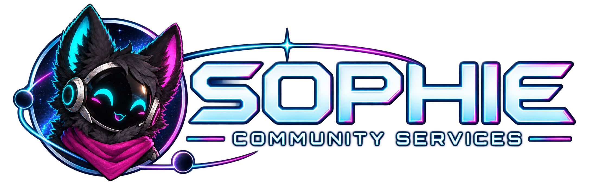

# Sophie — Master Implementation Plan

**Version:** 1.1 · **Prepared:** 18 September 2026  
**Identity:** Sophie (she/her), Community Services, neon chibi protogen.

This is the consolidated reader for the editable source plans. The WUFF hardware addendum is retained unchanged as a separate, clearly labelled overlay within this master. Its proposed host settings take precedence over generic defaults during evaluation; no production approval is implied. Artwork links resolve from the extracted planning-pack root.


---

<a id="doc-00-start-here"></a>

# Sophie — Aphelion community-services bot

## Implementation handoff

**Plan version:** 1.1 · **Prepared:** 18 September 2026 · **Target:** Windows Server 2022

**Status:** Implementation plan, not a deployed application or completed security audit. No repository, Discord configuration, production service, or existing bot has been changed by preparing this pack.

## Version 1.1: identity and assets

The bot is **Sophie** (she/her), designated **Community Services**. Her selected visual identity is the **neon chibi protogen** in the four bundled images. It replaces the earlier human character design. Read `12-SOPHIE-IDENTITY-AND-ASSETS.md` for naming, presentation, asset placement and proposed editorial guidance.

This revision updates the editable plans, agent instructions, configuration sketch, tasks, tests, master document and offline reader. It does not add AI to any ticket, alter access rules, approve software licences, or deploy anything. Original v1.0 files outside this versioned pack are untouched.

The existing `Aphelion-Bot-WUFF-Hardware-Addendum.md` is included unchanged and remains the shared-host deployment overlay for this revision. Its proposed resource settings take precedence over the generic v1.0 runtime defaults retained in the core plan/configuration sketch. This branding revision does not silently merge or approve those hardware proposals; see `CHANGELOG.md`.

## The decision

Build one self-hosted administrative application with one production Discord identity, a staff web dashboard, and independently testable feature modules. Replace the current Carl.Bot and Tickets Bot responsibilities. Keep Discord/BYOND integration with the existing separate bot.

Move The Shuttle into a persistent, private, interactive onboarding ticket. Provide separate community AI chat, knowledge answers, and read-only service lookups. Start with MediaWiki and a local CPU model; do not wait for Wagtail.

**There is no AI in tickets.** This supersedes all earlier proposals for AI ticket replies, explanations, drafting, summaries, classification, triage, sentiment analysis, or case retrieval. The prohibition includes support, reports, staff-created tickets, and The Shuttle. Ticket messages, forms, attachments, transcripts, and staff notes are excluded from AI ingestion and model context. This is a product invariant, not an administrator-toggleable setting.

## Read this pack in order

| File | Purpose |
|---|---|
| `01-REQUIREMENTS-AND-DECISIONS.md` | Scope, settled decisions, missing deployment inputs, and release gates |
| `02-ARCHITECTURE-AND-DATA.md` | Module boundaries, process isolation, contracts, persistence, and recovery |
| `03-TICKETS-SHUTTLE-AND-ROLES.md` | Human-run ticketing, deterministic onboarding, role restoration, and chat automation |
| `04-KNOWLEDGE-AND-LOCAL-AI.md` | MediaWiki connector, local model, retrieval, non-ticket chat, and future integrations |
| `05-DASHBOARD-AND-DESIGN.md` | Staff screens, commands, permissions, Meridian-inspired visual specification |
| `06-SECURITY-PRIVACY-AND-LICENSING.md` | Threat controls, data separation, retention, and MIT dependency policy |
| `07-WINDOWS-OPERATIONS-AND-CUTOVER.md` | Native services, health, backups, installation gates, and migration/rollback |
| `08-IMPLEMENTATION-WORKPLAN.md` | Sequencing, agent responsibilities, task definitions, and useful later features |
| `09-ACCEPTANCE-AND-TESTS.md` | Test cases, release criteria, recovery and AI-exclusion tests |
| `10-AGENT-HANDOFF.md` | Copy-ready lead-agent brief and contribution rules |
| `11-SOURCES.md` | Primary-source research and verification limitations |
| `12-SOPHIE-IDENTITY-AND-ASSETS.md` | Selected protogen identity, supplied asset catalogue, placement and voice guidance |
| `Aphelion-Bot-WUFF-Hardware-Addendum.md` | Existing shared-host refinements; retained as the deployment overlay |
| `asset-manifest.json` / `brand-profile.json` | Measured asset metadata, stable references and bounded identity guidance |
| `assets/sophie/neon-chibi-v1/` | Four original PNG assets, copied without alteration |
| `CHANGELOG.md` | Revision scope, precedence and handoff notes |
| `backlog.json` | Machine-readable tasks, dependencies, deliverables, and test links |
| `test-cases.json` | Machine-readable acceptance cases; these are specifications, not executed results |
| `config.example.json` | Non-executable configuration sketch with safe defaults and unresolved fields |
| `dependency-register.json` | Candidate dependencies, licence evidence, and approval status |
| `AGENTS.md` | Repository instructions to use when creating the implementation repository |

The offline HTML reader contains the complete plan and task/test specifications. Markdown files are the editable source of truth; regenerate the reader after changing them.

## First release boundaries

**Administration release:** Dashboard, normal support/report tickets, staff-initiated cases, Shuttle progression, join roles, conservative role restoration, approved canned responses, simple reactions/responses, audit and recovery.

**Knowledge release:** Exact and lexical lookup over approved MediaWiki content, followed by a local model answering from that evidence in dedicated non-ticket channels. AI failure must not impair administration. AI can launch after administration rather than delay the replacement bots.

**Later, gated additions:** Allowlisted website/GitHub/status connectors, semantic retrieval if evaluation warrants it, suggestions, scheduled announcements, and other community utilities. Every external connector is opt-in. Wagtail is a future adapter, not a migration task in this project.

## Decisions that are fixed

- Sophie, she/her, Community Services; use the supplied neon chibi protogen assets, not the former human design.
- Single production guild and bot identity; separate staging credentials are permitted and never used in production.
- Native Windows Server 2022 deployment, no required Linux VM or Docker Desktop.
- MediaWiki is the live knowledge source supplied by the owner.
- Initial model selection: Phi-4-mini-instruct, Q4_K_M GGUF, via llama.cpp, subject to artifact verification and CPU evaluation.
- New directly reused FOSS application projects must be MIT. A non-MIT component is not approved merely because it was suggested earlier.
- No external AI provider or cloud embedding fallback at launch.
- Dashboard visual direction follows the Meridian website brief: space framing, restrained neon, cassette-futurist surfaces, and readable working panels.
- No historical ticket migration; existing membership eligibility still needs a controlled baseline.

## What the first agent does

Read `AGENTS.md` and the requirement file. Produce the discovery and licensing evidence for tasks P00–P03. Work only in the implementation repository or an authorised staging environment. Start the repository, contract tests, and synthetic fixtures without pretending production credentials, current load measurements, or licence approvals are available. The sanitised WUFF inventory and Sophie artwork are already supplied; verify their integration rather than requesting them again.

Do not silently choose PostgreSQL, a TypeScript compiler, or another non-MIT component. Do not replace reliable persistence with an improvised database merely to evade the approval question. The storage choice is a deliberately visible gate. A logical transaction/outbox design is supplied so the architecture work can proceed.

## Unverified inputs—not reasons to restart planning

The WUFF inventory snapshot and the four Sophie assets are supplied. Current representative-load measurements, service-account verification, actual Discord IDs/permissions, exact Shuttle copy, ticket forms, exact website tokens/additional assets, database approval, and retention policy still require discovery. Do not invent them.

Both supplied websites failed to load in this planning environment. The connector endpoint, wiki version/extensions, and website CSS/assets remain unverified. This does not establish that the public services are down. Use an authorised accessible environment or an owner-provided export to finish those checks.

## Completion means evidence

Deliver small reviewable changes with tests, licence provenance, rollback notes, and updated documentation. A planning checkbox is not proof of a passing test. The release ledger must identify the build, model hash, configuration version, tester, results, and unresolved defects.


---

<a id="doc-01-requirements-and-decisions"></a>

# 01 · Requirements and decision register

## Scope contract

The words **must**, **must not**, and **release gate** define acceptance conditions. Numeric defaults marked **proposed** require testing or owner approval; they are not measured service guarantees.

| ID | Requirement | Acceptance location |
|---|---|---|
| R01 | One self-hosted bot identity for the production Aphelion guild; native Windows Server 2022 | T01, T38 |
| R02 | Support, player reports, staff-created tickets, forms, category-specific permissions | T06–T12 |
| R03 | Shuttle is a private, persistent, interactive ticket; no channel-unlocking chain | T13–T19 |
| R04 | No AI in any ticket or any ticket-derived data pipeline | T22–T26 |
| R05 | Join roles and allowlisted role restoration; no privilege resurrection | T18–T21 |
| R06 | Simple configured reactions/responses and manually approved canned answers | T45 |
| R07 | Web dashboard plus Discord commands calling the same application operations | T03–T05, T42 |
| R08 | Separate AI chat, knowledge and lookup in explicitly approved non-ticket contexts | T22, T27–T34 |
| R09 | MediaWiki connector now; Wagtail only a future adapter | T27–T30 |
| R10 | Local CPU inference initially; no cloud fallback or telemetry containing prompts | T31–T34 |
| R11 | Newly adopted application projects are MIT; unresolved licensing is not silently approved | T02 |
| R12 | Extensible feature modules and external-service adapters without a microservice platform | T46 |
| R13 | Leave Discord/BYOND integration and its role ownership with the existing bot | T21 |
| R14 | No historical ticket import, but preserve current member eligibility during cutover | T40–T41 |
| R15 | Meridian visual direction, accessibility, reduced effects, and no unverified asset copying | T42–T43 |
| R16 | Backups, deletion propagation, auditing, service recovery, and rollback | T35–T41, T44 |
| R17 | Sophie (she/her), Community Services, with the latest neon chibi protogen asset set; no legacy human artwork in active branding | T49–T50 |
| R18 | Branding is independent of AI; static assets/templates never create ticket or Shuttle AI paths | T22–T26, T51–T52 |

## Authoritative changes from earlier discussion

The earlier AI-in-ticket and staff case-summary proposals are withdrawn. No AI handoff states, AI reply editor, auto-triage, ticket semantic search, transcript ingestion, or ticket-to-knowledge automation should be implemented. Human staff may use ordinary case tools and static canned answers. A support-entry button in a separate AI chat opens a blank ordinary form; it transfers no conversation, AI-generated description, or proposed classification.

TypeScript, discord.js, the Vercel AI SDK, and PostgreSQL were previously suggested. They are not implicitly accepted under the later MIT condition. The provisional code baseline is JavaScript ESM with JSDoc and runtime schema validation. Strong contracts remain required. TypeScript is optional only after an explicit build-tool licence approval. [S15](#s15)

## Sophie identity decision

Sophie is the chosen name, not an acronym. The latest user-directed neon chibi protogen image set is the visual reference. It does not establish new game lore, staff permissions, a voice/audio feature, or AI inside tickets. See `12-SOPHIE-IDENTITY-AND-ASSETS.md` and the versioned asset manifest. Proposed tone and layout rules are editorial/implementation recommendations, not additional user-supplied lore.

Keep `aphelion-bot` and existing technical identifiers stable unless an explicit migration is approved. Changing display branding does not authorise renaming Windows services, folders, database schemas, OAuth callbacks, or a live Discord application.

## Candidate technology decisions

| Decision | Status | Instruction |
|---|---|---|
| JavaScript ESM, explicit contracts, dependency injection | Planned | Do not install the TypeScript compiler by default |
| Oceanic.js for Discord | MIT candidate | Pin a released version, omit optional voice support, run compatibility tests [S01](#s01) |
| Fastify backend and React dashboard | MIT candidates | Review full resolved dependency tree; top-level licences alone are insufficient [S02](#s02); [S03](#s03) |
| llama.cpp + Phi-4-mini-instruct | MIT candidates | Verify binary, model and quantisation licences independently [S04](#s04); [S05](#s05); [S06](#s06) |
| Native Node.js LTS | Runtime gate | Node 24 is an LTS line at research time; verify patch/platform support and bundled notices [S12](#s12); [S14](#s14) |
| WinSW service wrapper | MIT candidate | Pin a supported compatible release; do not select a prerelease merely because it is on the default branch [S13](#s13) |
| PostgreSQL + pg-boss | Conditional only | PostgreSQL is not MIT. pg-boss being MIT does not approve the database [S16](#s16); [S17](#s17); [S18](#s18) |
| Storage engine and indexing implementation | Open gate | Choose once licence scope is recorded; keep one production backend, not multiple adapters without a need |
| Hosted AI SDK/cloud inference | Excluded from launch | Use a small direct local HTTP adapter |

These are candidate selections, not an assertion that the full installation is MIT-only or already vetted.

## Release gates

**G0 — Environment and licence decision.** Record CPU/RAM/storage headroom; production/test guild IDs; required roles; source access; owner-approved scope for platform tooling and indirect licences. Choose and approve one transactional storage implementation. No deployment or unapproved dependency installation passes this gate.

**G1 — Foundation.** Configuration validation, role-based authorisation, durable state, migrations, outbox recovery, service health, and dashboard login pass using synthetic fixtures and staging credentials.

**G2 — Human administration.** Ticket ACLs, Shuttle progression, revocation-safe membership, transcripts, and operational recovery pass. The whole release functions with inference absent.

**G3 — Knowledge.** The approved MediaWiki snapshot/index and direct lookup pass attribution, permission, deletion, template-change, and source-authority tests. No live AI is required.

**G4 — Local AI.** Model provenance, host resource limits, evaluation, no-ticket boundary, no cloud egress, and public-output controls pass. AI is still separately disableable.

**G5 — Production cutover.** Restore drill, retention approval, existing-member baseline, bot-responsibility transfer, and operator sign-off are complete. G2 may cut over independently of G4.

## Discovery inputs

| Input | How to obtain it | Safe behaviour until known |
|---|---|---|
| CPU, RAM, other host workloads | Sanitised WUFF snapshot supplied in the hardware addendum; verify current load and topology | No latency promise; AI disabled until tested |
| Guild, channel and role IDs | Authorised Discord configuration review | Empty allowlists; deny activation |
| Admission prerequisite | Confirm the existing age/interview status signal and its owner | Never infer eligibility from old s1–s5 roles |
| Whitelist role ownership | Agree boundary with the existing BYOND bot | No writes to externally owned roles |
| Shuttle text and ticket forms | Use owner-provided final copy/configuration | Fixtures clearly marked non-production |
| Role restoration baseline | Review current members and approved role list | No bulk restore or blanket re-onboarding |
| MediaWiki endpoint/version | API discovery in an accessible authorised environment | Endpoint unset; source disabled |
| Sophie name/artwork | Supplied identity chapter and four hash-recorded PNGs | Use the selected protogen; test crops/readability before release |
| Website design/assets | Read actual stylesheet/assets or approved export | Exact site tokens remain unverified; Sophie artwork is not a CSS/site-asset export |
| Privacy/retention | Owner and appropriate policy reviewer | Production ticket storage blocked until approved |
| Dashboard hostname/TLS | Existing hosting inventory and operator approval | Loopback staging only |

## Decision log to complete in discovery

D01: Does MIT-only cover platform runtimes, development tooling, and all indirect components? Record exact scope and any named exceptions; silence is not approval.

D02: Approved storage engine, driver, queue library, search method, migration tool, and backup method.

D03: Required staff access groups per ticket type; human reporter, reported subject, and case participant are distinct concepts.

D04: Admission prerequisite, final membership role, revocation behaviour, and policy for grandfathered members.

D05: Retention periods, maximum attachments/storage, case export policy, and backup expiry.

D06: Sophie name and four selected reference assets are supplied. Exact website tokens, additional artwork rights, production asset placement/crops, permitted AI channels, public knowledge collections, and service connector inventory remain to be recorded.

D07: Tested CPU limits and owner-approved usability thresholds for AI activation. Apply the existing WUFF addendum as the proposed shared-host overlay.

D08 (identity fixed; implementation review open): Sophie, she/her, Community Services, neon chibi protogen. Owner review of production copy, asset placement and publication details remains part of the release process.

## Out of scope

AI inside tickets, automatic moderation decisions, age assessment by models, training on Discord messages, unrestricted code tools, arbitrary plugin upload, historical ticket migration, a new wiki, game account linking, multi-guild SaaS, economy/levelling, and a visual programming platform.


---

<a id="doc-02-architecture-and-data"></a>

# 02 · Architecture and data contracts

## Shape of the application

Use a modular monolith in one repository, with a separate knowledge worker and inference process for resource and access isolation. This is not a network of general-purpose microservices. The separation serves a concrete purpose: the code that reads cases must not be the code that constructs model prompts.

```text
Discord events / staff browser
            |
       core service
     /              \
case + onboarding    approved non-ticket AI request
+ membership rules           |
     |                knowledge worker
administrative store     /          \
+ durable outbox    knowledge store   local inference
     |                    |
Discord delivery     MediaWiki / approved read-only connectors
```

**Only the core service holds the Discord bot token.** The knowledge worker has no case-store credential, transcript-directory access, or generic Discord history client. The inference process has no connector credential, bot token, or case filesystem access. Any local administrator controlling the entire host can bypass process-level isolation; this design reduces application mistakes and blast radius, not trust in the host operator.

Core administrative jobs and knowledge jobs have separate capacity budgets. A model queue must never block ticket creation or role operations. Core alone sends Discord output, after rechecking the destination.

## Repository organisation

```text
apps/
  core/                    Discord gateway, staff HTTP API, admin job pump
  dashboard/               React staff interface; static production build
  knowledge-worker/        Approved ingestion, lookup, model orchestration
modules/
  tickets/                 Cases, participants, forms, transcripts
  onboarding/              Versioned Shuttle workflow
  membership/              Role policies, grants, revocations, reconciliation
  automation/              Static responses/reactions and approved scheduling
  knowledge/               Sources, documents, search, citations
  assistant/               Non-ticket chat policy, model request lifecycle
  integrations/            Allowlisted external adapters
platform/
  authorization/           Shared actor/capability checks
  configuration/           Validated, versioned settings
  persistence/             Approved database driver and transaction unit
  jobs/                    Durable delivery, leases, retries
  audit/                   Structured security/operational events
contracts/                 Runtime schemas and documented JS/JSDoc interfaces
tests/                     Unit, contract, integration, recovery, evaluation
ops/windows/               Installation, services, health, backup, restore
legal/                     Dependency inventory, notices, approvals
assets/                    Approved local brand assets and provenance
docs/decisions/            Architectural decisions and migration notes
```

Within a module, keep rules, use cases, and adapters distinct. Avoid one file per trivial wrapper, a global service locator, broad `utils` folders, and singleton managers with hidden mutable state. Depend on narrow injected interfaces. Fastify's plugin encapsulation supports route/hook organisation; it is not a security sandbox for untrusted code. [S28](#s28)

## Ownership and allowed dependencies

Tickets may call membership/onboarding through explicit use cases where necessary. Onboarding owns progress; membership owns all access-role writes. The assistant may invoke knowledge lookups, never ticket repositories or role operations. Integrations produce approved records; they cannot directly update another module's tables.

The composition root wires modules. No feature imports another feature's internal storage adapter. Enforce these boundaries in automated architecture tests. Share small contracts and stable identifiers, not a universal domain-object hierarchy.

## Identity is presentation data, not an assistant dependency

`brand-profile.json` defines Sophie's display identity; `asset-manifest.json` maps stable asset IDs to versioned local files. A narrow presentation adapter reads those fields for Discord notices and dashboard branding. Core and dashboard rendering do not call `AssistantService` to obtain a name, avatar, image, message template or status label.

Resolve asset IDs only inside an approved static-artwork root. Ticket files, transcripts and knowledge-source attachments never enter that root. Configuration uses validated IDs rather than arbitrary URLs or filesystem paths. No new service, character engine, image-generation runtime, or provider is introduced.

The optional non-ticket assistant receives only approved style guidance plus its existing request/evidence. It receives no current dashboard page or ticket context. Versioned branding can change without changing permissions or historical workflow definitions. Retain existing technical service identifiers; human-facing Sophie labels are not schema migrations.

## Durable state and Discord side effects

A business operation writes its state change and a pending external action atomically. The dispatcher processes the committed outbox, records attempts/results, and retries only duplicate-safe operations. The transactional-outbox pattern addresses a database write/external delivery gap; it does not make the external API exactly-once. [S19](#s19)

Pending actions carry `operationId`, `kind`, `aggregateId`, `expectedVersion`, `eligibilityEpoch`, `attempt`, `notBefore`, `leaseUntil`, and `lastErrorCode`. Treat them as at-least-once work. Use bounded retries, jitter, dead-letter review, and periodic reconciliation. An action whose authorisation epoch is obsolete is cancelled, not retried.

For channel creation, place a non-sensitive operation marker on the intended channel at creation where supported. On timeout, reconcile existing channels before retrying. If the result remains ambiguous, stop and surface it for staff; never assume idempotent channel creation. A distributed lock/lease alone is not enough—use a fencing generation so a stale worker cannot commit a newer worker's result.

Discord and the database do not share a transaction. A revocation can arrive while a permitted role request is already in flight. Recheck current policy after the external response; if a late result contradicts it, schedule a compensating action for the bot-owned role and alert on unresolved uncertainty. Do not promise zero transient inconsistency across the external API.

The storage implementation must support atomic transactions, uniqueness, concurrency control, backup/restore, and durable job claims. If PostgreSQL is explicitly approved, pg-boss may provide job machinery; otherwise choose an approved equivalent and prove the same semantics. Do not implement a home-grown database. [S17](#s17)

## Logical data model

This is engine-neutral modelling, not executable DDL and not permission to install a database.

| Entity | Important fields and invariants |
|---|---|
| Guild configuration | Fixed guild ID, active version, policy epoch, validation state |
| Member eligibility | Member ID, admission status source, grant/revocation epoch, grandfathered decision provenance |
| Role policy | Role ID, owner module/system, restoration class, prerequisite rule, enabled status |
| Role snapshot | Only approved restorable IDs, observation time, snapshot version; never a universal privilege snapshot |
| Case type | Form version, participant/staff rules, category mapping, retention rule |
| Case | Case ID, opener, subject (optional), assigned staff, type/version, channel ID, lifecycle state, access epoch |
| Case participant | Case ID, actor ID, participant role; distinct from subject identity |
| Case event/message | Message ID, edit/delete status, authorised visibility, timestamps; no AI export |
| Transcript artifact | Case ID, content hash, access epoch, expiry, storage reference; no public static URL |
| Shuttle definition | Immutable published version, ordered stages, validated text/actions, publication audit |
| Shuttle session | Member, definition version, current stage, state/version, acknowledgement events |
| Access grant | Member, role, current eligibility epoch, desired/observed status, operation ID |
| Outbox/job | Idempotency identity, resource/version, lease/fence, retries, terminal result |
| Knowledge source | Adapter, approved endpoint, collections, publication authority, sync policy, disabled state |
| Knowledge document | Source/page ID, revision, section path, snapshot hash, dependency fingerprint, audience, approval |
| Knowledge chunk | Parent document/version, evidence text, source URL, permitted audience; no case foreign key |
| Source cursor/tombstone | Continuation checkpoint, last success, deletion/restriction marker, invalidation generation |
| AI session | Actor, approved non-ticket channel, expiry, bounded turns, policy generation; no case ID |
| AI request/result | Request ID, destination classification, model/config hash, evidence IDs, status, usage; minimal payload retention |
| Audit event | Actor, operation, resource, result, correlation ID, timestamp; no credentials or default raw conversation |

Use strings for Discord snowflakes and role IDs; do not coerce identifiers into floating-point numbers. Store timestamps in UTC and display staff schedules in Europe/Amsterdam with explicit daylight-saving handling. Scheduled work records its timezone and intended local occurrence rather than blindly adding 24 hours.

## Critical contracts

`ActorContext` is derived from authenticated Discord/OAuth events, never supplied as an arbitrary dashboard field or model argument. It contains actor, guild, current capabilities, destination and policy epoch.

`CaseService` exposes create, claim, add/remove participant, close, reopen, and authorised transcript retrieval. Each invocation checks current authority. Mutations require expected resource version and an idempotency key.

`OnboardingService` exposes start/resume, advance, back, requestHumanHelp, staffResume, and approvedOverride. Progress events are not inferred from Discord visibility.

`KnowledgeService` exposes search and getEvidence against explicit audience/collection limits. It has no generic SQL method and no ticket connector.

`AssistantService` accepts a verified non-ticket destination and a bounded query/session reference. It does not accept arbitrary history, a case ID, attachment fetch URLs, or actor overrides.

`DeliveryService` receives a result plus a narrowly scoped destination capability. It rechecks the destination at send time; pending results are cancelled if the channel becomes a ticket/restricted space or the member loses access.

## HTTP and Discord interfaces

Suggested route families: `/api/cases`, `/api/shuttle`, `/api/membership`, `/api/automation`, `/api/knowledge`, `/api/assistant`, `/api/operations`, and `/api/configuration`. Define response schemas as well as request schemas. Do not expose internal database records directly.

Use gateway interactions for the initial Discord adapter and OAuth HTTP callbacks for dashboard login. Discord documents gateway and HTTP interaction delivery as alternative mechanisms, not two parallel handlers for the same application. Acknowledge interactions promptly; initial responses have a three-second deadline. For an action opening a modal, the modal must be the initial supported response rather than attempting to open it after a generic deferred reply. [S07](#s07)

Configure only the gateway intents required by enabled features. Join/role observation needs the relevant member events; ordinary message-based auto-responses and transcript capture need the relevant message events and message-content access. Verify Developer Portal settings and any applicable approval requirements in staging; slash commands alone do not establish that transcript capture works. [S10](#s10)

Route both commands and dashboard buttons to the same use cases. Authentication is not authorisation. Use signed server-side sessions, CSRF protection for mutations, validated OAuth state, a fixed guild restriction, and fresh capability checks. [S09](#s09); [S20](#s20)

## Configuration and extension rules

Configuration is data: bounded forms, message templates, ordered steps and allowlists. No uploaded scripts, expression evaluation, arbitrary SQL, or dashboard-authored executable schemas. Fastify warns that its validation/serialization schemas compile code and must not be treated as untrusted user input. Keep executable schemas in reviewed application code. [S29](#s29)

Each future connector declares inputs, outputs, permissions, timeouts, retry policy, permitted destinations, secrets, licence and owner. Add it behind the same contract tests. Do not build a plugin marketplace, generic agent framework, or multiple database implementations speculatively.


---

<a id="doc-03-tickets-shuttle-and-roles"></a>

# 03 · Tickets, The Shuttle, roles, and automation

## Human-run ticket system

Create one private text channel per active case initially. Use distinct case types for support, player reports, staff-initiated contact, and Shuttle onboarding. The core record separates **opener**, **subject**, **participants**, and **assigned staff**. A reported player is not automatically added to the reporter's case.

Case lifecycle:

```text
requested -> provisioning -> open -> closing -> closed
                 |           ^                    |
          needs_operator      +------ reopen ------+
```

A request is not an open case until its channel and permissions are confirmed. Closing does not mean deletion succeeded. Keep transcript generation, channel archival/deletion, and retention expiry as tracked operations. Show failures with a safe retry rather than silently losing evidence.

Forms are versioned. Preserve the version submitted with a case. Support required short/long text, bounded select options and explicit participant choices that fit the pinned Discord API/library. Do not promise newly added component types until the compatibility spike passes.

## Permissions and case operations

Every case type defines who can open it, see it, assign it, add participants, close/reopen it, and retrieve transcripts. Staff-only notes belong in restricted application storage/dashboard, not as pseudo-private messages in a member-visible ticket channel.

Category placement is not sufficient privacy enforcement. Calculate effective channel permissions, apply explicit overwrites, and validate after creation and after role/category changes. Moving a case cannot silently broaden its audience. Discord's Administrator permission bypasses channel overwrites, and Manage Threads can expose private threads; communicate those platform limits accurately. [S08](#s08)

Use non-identifying channel names such as `report-1042`, not the reported person's name or allegation. Member additions and transcript exports require confirmation plus an audit reason where sensitive. Case IDs are not authorisation tokens.

Support claim/unclaim, staff reassignment, human-written tags, manual priorities, and static canned replies. A canned reply is reviewed text, not a generated draft. Do not implement model triage, summaries, sentiment analysis or automated case-to-FAQ extraction.

## Attachments and transcripts

Keep transcript storage separate from web-public assets and the knowledge index. Escape all user content on rendering; never execute copied HTML. Use authenticated streaming/downloads with a fresh case access check, no public permanent URLs, and no prompt-containing logs.

Choose allowed attachment types, size/count limits, retention, and malware/quarantine behaviour at G0. Never fetch arbitrary user URLs as attachments. A registered connector may fetch only its approved source; case files use a separately bounded acquisition path. Do not run attachments or archive contents. If there is no approved scanning capability, restrict types and require download rather than inline active-content rendering.

Record message edit/delete observations when available. If the bot was offline or lacked access, label transcript coverage incomplete. Do not claim to recover messages deleted before capture or inaccessible history. Attachment URLs alone are not durable archival copies; the retention plan must state whether approved attachments are copied or only referenced.

## Shuttle experience

A persistent **Board the Shuttle** panel offers a button and a `/shuttle start` fallback. The handler verifies the existing admission prerequisite, finds or creates the member's one active session, and opens/resumes its private onboarding case.

Use the owner's final Shuttle copy, not invented values or admission criteria. Five stages can remain, but the old `s1`–`s5` roles do not drive state. Content is authored in the dashboard as a finite ordered workflow, with preview/publish and immutable published versions.

The member sees the current section with Continue, Back and Ask staff controls. Optional deterministic acknowledgements or forms must be approved as part of the workflow. Do not add AI explanations or open-ended model assessment.

Session lifecycle:

```text
not_started -> active(stage 1 ... n) -> acknowledged -> role_pending -> complete
                    |                       |               |
                needs_staff                 |         needs_operator
                    |                       |
               staff_resume           eligibility_revoked
```

Ask staff pauses progression only if that is the published workflow rule. Staff help is a human conversation in the case; resumption uses a logged action. A member can recover the current screen after a lost message or restart.

## Progression and recovery rules

1. Derive the member from the interaction, load current state, and check guild, case, active definition version, step, prerequisites, component nonce/version, and access epoch.
2. Treat Discord interaction IDs as deduplication inputs, not as proof of eligibility. Reject another member's or an obsolete step's controls.
3. Commit a single permitted transition using a transaction and expected session version. Concurrent clicks produce one transition and a current-state response for the duplicate.
4. Render the new state through an outbox action. An old or deleted Discord message never changes stored progress.
5. On final acknowledgement, recheck current admission eligibility and revocation state. Commit eligibility plus a pending role grant. Only mark access delivery successful when the configured role is observed.
6. Before every grant attempt, recheck the eligibility epoch and role ownership. Cancel stale grants after a revocation, exit, or staff decision.

A failed role write leaves a visible pending/blocked state and staff alert. It must not display a success it cannot confirm. Back navigation does not retract an already delivered membership grant; a completed session becomes read-only unless a deliberate staff reset/revocation workflow is invoked.

Published content changes apply to new sessions. Active sessions remain on their approved version by default. Emergency withdrawal invalidates affected sessions and requires a deliberate migration/resume decision; never silently change requirements halfway through.

## Membership and restoration

| Role class | Policy |
|---|---|
| Cosmetic/interests/notifications | Restore only explicit allowlisted roles |
| Join role | Assign only the configured non-privileged entry role |
| Admission/interview status | Owned by the existing admission process; do not infer from old progress roles |
| Whitelist/access role | Grant only from current eligibility and the agreed ownership contract |
| Staff/admin/privileged roles | Never restore automatically |
| Existing BYOND-bot roles | Never manage unless an explicitly revised ownership contract authorises it |
| Managed/integration/deleted/unassignable roles | Skip safely; show a diagnosable result |

A role snapshot is an observation, not entitlement. Store only approved classes. On rejoin, fetch current membership and policy, verify prerequisites, and recompute permitted actions. Rate-limit restores and report partial failure.

Out-of-band removal of an access role must not trigger blind automatic re-addition. Record it as a reconciliation exception or revocation according to the owner-approved policy; uncertain removals fail closed. Intentional revocation increments an eligibility epoch, invalidating queued old grants. Staff must not need to race a reconciler repeatedly restoring access.

During gateway outages, snapshots may be stale. Reconcile allowed roles on reconnect where possible; mark uncertain observations rather than pretending every offline change was recorded. Do not use an incomplete member cache to overwrite known state with an empty role list.

## Simple chat automation

Implement literal/keyword or bounded pattern rules with channel allowlists, per-user/channel cooldowns, and a priority/stop policy when multiple rules match. Suppress bot/webhook/self messages by default. Use explicit allowed mentions so template or AI text cannot create unwanted pings. Discord provides allowed-mentions controls for this purpose. [S07](#s07)

Ticket channels are excluded from generic auto-reactions/responses by default. Essential deterministic ticket controls remain available. Arbitrary regular expressions and executable template logic are not a launch requirement; add only after validation and denial-of-service review.

## Canned knowledge and useful small additions

A manually curated canned-answer library can be used by staff in cases and by direct lookup outside cases. Import only approved public authored text—not ticket extracts. Editing this library does not grant access to confidential cases.

The first follow-on candidates are message-context reporting, staff reminders, scheduled announcements and suggestion statuses. Message-context reporting captures evidence into the case system only; it is not an AI operation.

## Sophie presentation in human workflows

Sophie is the bot's shared public identity, including the avatar shown beside deterministic messages. Static Sophie art and human-approved message templates may appear in onboarding and ticket entry panels. They never enable generation, ticket interpretation, drafting, triage or case-data ingestion.

Keep the existing Board the Shuttle, Continue, Back and Ask staff action meanings. Sophie branding does not rename steps, change prerequisites, certify a person, or replace final owner-supplied copy. In support/report cases, use neutral work surfaces and precise status wording; do not add a conversational mascot widget or imply an AI is reading the case. Staff replies remain attributable to staff.

Proposed copy examples and allowed contexts are in `12-SOPHIE-IDENTITY-AND-ASSETS.md`. A reassuring line is permitted only when the corresponding stored state or confirmed operation supports it. Template changes follow the existing preview/publish/version workflow.


---

<a id="doc-04-knowledge-and-local-ai"></a>

# 04 · MediaWiki knowledge and local CPU AI

## Boundaries before features

Community AI is separate from case handling. It runs only in explicitly approved non-ticket channels or a dedicated authorised dashboard preview. Direct messages, arbitrary reply-chain expansion, message-context AI actions, and user-uploaded documents are disabled initially.

No case connector exists. The worker cannot query case tables, fetch ticket links, access transcripts, read staff notes, classify support forms, or reuse ticket messages for evaluation/training. The dashboard has no case-side AI control, and an administrator cannot enable it through configuration. Human-authored ticket controls and static answers remain normal deterministic functions.

The system cannot reliably identify arbitrary text a person manually retypes or pastes into a permitted chat. Do not claim otherwise. Display a notice against submitting private case material, reject known ticket/transcript references without fetching them, accept no attachments initially, and test every system-controlled ingestion path. The enforceable guarantee is that the application never supplies its ticket data to AI.

## Initial profiles

| Profile | Function | Evidence and tools |
|---|---|---|
| Knowledge | Answer community questions with sources | Approved published collections only |
| Community chat | Optional casual conversation, clearly distinguished from policy | Bounded user conversation; no confidential source access |
| Live lookup | Return structured service facts with an observation time | Explicit read-only adapters; no generic URL/network access |
| Staff knowledge preview | Test public or separately approved staff documentation | Never cases, transcripts, or staff case notes |

Launch with Knowledge; activate casual chat only after evaluation and channel approval. Keep in-universe persona separate from official out-of-character policy. The assistant may explain an approved policy but cannot change eligibility, promise moderation outcomes, or grant exceptions.

`/lookup` returns direct matches even when the model is disabled. `/ask` retrieves evidence before generation. `/status` uses a deterministic live connector if one is configured. A **Contact staff** link can open a blank human-support form without copying the conversation or generating its content.

## Sophie persona, limited to presentation

Use the name Sophie and the selected chibi protogen identity for the allowed non-ticket experience. Suggested voice: warm, composed, capable, and lightly playful where appropriate. Keep evidence, permissions, honest uncertainty, and real operational state above persona. Do not invent memories of the station, personal relationships, moderation decisions or completed actions.

The knowledge profile gives sources and distinguishes generated answers from deterministic lookup. Casual character chat remains optional and gated as already specified. No image, chat-template or branding change can enable AI in support, reports, staff contact, or Shuttle cases. See `brand-profile.json`; it contains no tool grants and no ticket exception.

The hardware addendum is still the deployment overlay. This identity revision does not change the selected model, licence gates or local-only rule.

## MediaWiki discovery

The supplied live source is `https://meridian-wiki.a13.info/wiki/Main_Page`. The exact API script path, version, extensions and authentication are not verified. Do not assume `/w/api.php` or require a new wiki extension without checking.

In an authorised accessible environment, determine the API endpoint from site metadata/configuration, query site information, identify supported API modules, and record page/content rights. Use read-only credentials if required. MediaWiki exposes site metadata and rights information through its siteinfo API. [S26](#s26)

Use capability detection rather than copying the latest documentation's fields blindly. Current parse documentation marks `sections` deprecated in favour of `tocdata`, but the live wiki may be older. Support the fields actually advertised by that installation. [S23](#s23)

## Ingestion pipeline

1. Enumerate approved namespaces, pages, categories and redirect aliases. Default exclusions: talk/user/draft spaces, unapproved staff areas, case archives, and embedded external content.
2. Retrieve metadata and parsed article output through the API. Retain a source revision, fetch timestamp, approved snapshot hash, section hierarchy and canonical URL.
3. Sanitise without executing scripts or loading remote resources. Preserve headings, list structure, tables and row/column associations; exclude navigation and decorative skin markup.
4. Apply source classification and approval. Chunk only after the document has an audience and authority policy. A chunk inherits its parent's restrictions.
5. Build exact/alias and lexical indexes. Publish a new immutable index generation only after validation. Keep interrupted runs separate from the last known valid generation.
6. Synchronise incrementally with persisted continuation/cursors, change IDs, bounded overlap and deduplication. Treat deletions, moves, restrictions and approval withdrawals as first-class invalidations.
7. Reconcile the full approved inventory periodically. Change streams may be incomplete after a long outage; a cursor is not proof that the index is current.

MediaWiki's parse and recent-changes APIs support this approach. Follow its API etiquette for a descriptive user agent, bounded/batched work, continuation and backoff; respect API error/maxlag/Retry-After responses when applicable. Initial polling and batch sizes are proposed operational settings, not assumptions about this wiki's capacity. [S23](#s23); [S24](#s24); [S27](#s27)

### Template and rendered-snapshot correctness

Track each document's template dependencies and reverse references. On a template or dependency change, re-render affected approved pages, including nested dependencies where exposed; a conservative wider refresh is safer when the dependency graph is incomplete. MediaWiki's embedded-in API helps discover transcluding pages. [S25](#s25)

Approval belongs to the **rendered snapshot and dependency fingerprint**, not just the article revision number. Do not assume an old article revision necessarily reproduces the exact previously approved output after its templates change. Preserve the actual approved text/hash, detect changes, and require reapproval for authoritative policy content.

### Deletion, attribution, and conflict

Tombstone a restricted/deleted source before later jobs can reuse it. Invalidate retrieval results, derived chunks, caches and pending answers. Recheck evidence availability and audience before delivery.

Store canonical links, titles, revisions, author/rights metadata where appropriate, and content-attribution rules. Software licences do not establish article/image rights. Do not blindly ingest or republish complete articles into chat.

Configure an explicit authority order per topic: for example, owner-approved policy collection over an unreviewed discussion page. The exact precedence must be approved; it is not inferred from the website's visual prominence. Conflicting evidence produces a limited answer explaining the conflict or direct links, not a model-invented rule.

## Retrieval and response pipeline

Verify actor and destination, apply the non-ticket gate, choose approved collections, retrieve exact/alias/lexical matches, filter evidence, enforce a token budget, call the local model, validate its structured citation references, and recheck delivery scope.

The audience of the answer constrains its evidence. A staff member's access to a restricted article does not permit a public reply based on it. Keep public answer profiles public-source-only; add staff-document profiles only after dedicated access tests.

Citations are source IDs supplied by the application, mapped to validated canonical links. Reject invented source IDs. When there is no adequate evidence, return direct search results or a clear inability to verify the Aphelion-specific claim. Presence of a citation does not prove the cited text supports the answer; evaluation must check support.

Treat retrieved text as untrusted evidence, not privileged instructions. Apply independent tool authorisation and do not rely on the model's confidence or a prompt alone. OWASP recommends preserving access controls through retrieval and separately validating tool actions. [S21](#s21); [S22](#s22)

Start without semantic embeddings. Add them only if lexical evaluation shows meaningful missed questions; index only approved non-ticket sources and keep the same permission/deletion controls. Do not add an extra embedding runtime and native dependencies merely to complete an architecture diagram.

## Local model and runtime selection

**Selected evaluation baseline:** Microsoft Phi-4-mini-instruct, 3.8B parameters, Q4_K_M GGUF quantisation, served by llama.cpp. The model and llama.cpp have MIT project licences; verify the chosen quantised artifact separately. The published Unsloth GGUF repository is a candidate, not a trusted binary exemption. [S04](#s04); [S05](#s05); [S06](#s06)

Create a model lock record containing original publisher, source revision, quantisation publisher/revision, exact filename, SHA-256, licence evidence, chat template, runtime build, permitted purpose and evaluation result. Download through a controlled provisioning step; runtime model auto-download/update is disabled. Verify that every build flag and optional library is represented in the dependency register.

| Parameter | Initial proposed setting |
|---|---|
| Execution | CPU only; no required GPU |
| Active generations | 1 |
| Waiting requests | Maximum 8 globally and 1 per member |
| Context | 4,096 tokens total, including evidence/history/output budget |
| Maximum output | 512 tokens; lower it if measured usability requires |
| Request lifetime | Proposed 120-second bound, then direct-source fallback; no speed promise |
| Memory reservation | Measure on host; initial planning headroom around 6–8 GB, not a guaranteed footprint |
| Threads | Derive from host inventory and load test; do not consume every logical CPU by default |
| Session expiry | Proposed 30 minutes inactivity; no cross-channel memory |
| Model payload retention | None after request/session expiry by default |
| Cloud fallback | Absent, including embeddings |

The proposed settings are not a production acceptance result. Benchmark cold load, prompt processing, time to first token, output rate, full latency, memory peak, queue behaviour and impact on concurrent administrative work. If the host cannot deliver acceptable behaviour, keep direct lookup and administration live and leave AI off. Do not silently swap in a differently licensed model.

## Inference service hardening

Bind to loopback, authenticate the worker, block external ingress, and disable web UI, shell/file/agent capabilities and unnecessary endpoints for the pinned build. The llama.cpp server documents Windows support and optional agent tools; these tools are unnecessary here. Select a build/configuration that permits disabling them and test that they are unreachable. [S30](#s30)

Inference gets only the current permitted prompt, never database access. Avoid prompt logging in both the HTTP wrapper and model server. Cancellation stops local generation and clears queued payloads where possible. A disabled model or failed connector must not disable ticket administration.

## Evaluation and feedback

Use synthetic cases and approved public documentation, not real tickets. Maintain at least 40 reviewed launch questions covering rules, lore, procedures, exact identifiers, ambiguity, missing information, conflicting sources, malicious source instructions and access attempts.

Proposed release floor: zero prohibited data/tool actions; all emitted source IDs valid; at least 90% of answerable knowledge questions substantively supported and useful; appropriate abstention on all deliberately unanswerable/confidential prompts. An independent reviewer records misses. These are acceptance targets for the evaluation set, not claims of real-world accuracy.

Feedback records a request ID, source IDs, model/config version and a user-selected reason. Storing full text requires the retention policy. Staff fix authoritative source material or retrieval/prompt configuration through review; no automatic fine-tuning or harvesting of private Discord messages. Discord's Developer Policy restricts mining/scraping and using API message content to train AI models without its express permission. [S11](#s11)

## Future service adapters

Inventory the actual platforms before implementing adapters. Approved website pages, selected repository documents/issues, and service-status endpoints are likely candidates. Use minimum-scope service credentials, timeouts, circuit breakers, cursor handling, provenance and audience mapping. An endpoint's credentials belong to its connector, not the model.

Do not add arbitrary browsing, shell, SQL, game administration, remote plugin installation, MCP auto-discovery or automatic writes. A later connector expansion requires its own permission/egress tests. A Wagtail connector should map into the same document contract when that deployment exists; no present dependency is created.


---

<a id="doc-05-dashboard-and-design"></a>

# 05 · Staff dashboard, commands, and design brief

## User experience goal

A **Sophie — Community Services** operations console for Aphelion, with Meridian's atmosphere, not a generic chatbot UI or a decorative skin that makes administration harder. The latest neon chibi protogen artwork is supplied in this pack and supersedes the earlier human avatar. The exact live-site stylesheet, palette, fonts and website imagery remain unverified; do not treat the generated artwork as a website export.

The dashboard and Discord commands are two clients of the same application operations. Controls appear according to capability, but the backend always authorises them independently. Never rely on a hidden button as security.

## Information architecture

| Area | Main screens and actions |
|---|---|
| Overview | Service health, admission/ticket failures, queue age, source freshness, backup status; no confidential case excerpts |
| Tickets | Permitted queues, case detail, participants, assignment, manual notes, canned replies, transcripts, closure |
| Shuttle | Draft content, stage preview, version history, publish/withdraw, session recovery, logged staff override |
| Members and roles | Ownership map, restorable-role allowlist, current eligibility, revocations, reconciliation exceptions |
| Automation | Static message/reaction rules, channels, cooldowns, previews, dry-run results |
| Knowledge | Sources, approved collections, sync status, rendered snapshots, review queue, invalidations, search preview |
| AI | Dedicated-channel policy, local model provenance, limits, queue/cancel, prompt versions, public-knowledge preview, evaluation |
| Identity and appearance | Sophie identity, selected asset-set version, avatar/banner/wordmark previews, quiet mode, static template previews and release approval |
| Integrations | Explicit adapter registration, scoped resource inventory, secrets references, connectivity tests |
| Operations | Audit, jobs/dead letters, migrations/build versions, retention/deletion status, backup/restore evidence |

**Tickets and Shuttle contain no AI button, summary, draft, recommendation, classification, or conversation-transfer control.** The AI page cannot point at a case, transcript path or staff-note collection. The no-ticket exclusion is displayed as a fixed safety boundary, not an editable preference.

## Staff capability model

Define capabilities rather than hard-coding a single universal staff role. Proposed groups are owner/operator, configuration editor, ticket responder, report moderator, onboarding staff and knowledge editor. Actual Discord role IDs and combinations are configured at discovery.

A knowledge editor can approve articles without reading cases. A report moderator can access only permitted report types. An operator can inspect job outcomes without default raw conversation access. Access to credentials is separate from editing message text.

Login uses Discord OAuth and a fixed guild allowlist. Display identity and effective access. Invalidate or recheck sessions after staff role changes, sensitive configuration changes and logout. Configuration changes show before/after values, validation results, author and publication time. [S09](#s09); [S20](#s20)

## Essential workflow designs

### Ticket detail

Left: permitted queue and filters. Centre: member-visible conversation and form fields. Right: participants, assignment, type and status. Staff-only notes have a clearly distinct restricted area and cannot be accidentally sent as a public reply. Transcript export states its audience and retention. No AI is present.

### Shuttle editor

Ordered finite steps with approved text, acknowledgements and Continue/Back/Ask staff behaviour. Preview member and staff views. Validate Discord message/component limits against the pinned implementation. Publishing creates an immutable definition version. A change-impact screen identifies active sessions before withdrawal/migration.

### Knowledge review

Show source, revision, rendered snapshot hash, category/namespace, effective audience, approval state, template-dependency changes and freshness. Search preview explains why a result was included or excluded without leaking excluded text to unauthorised editors. Publish, quarantine and delete actions are auditable.

### AI operations

Show model/runtime hashes, load status, queue length, measured memory/latency, context/output caps, user limits, permitted channels and the global disable switch. Label cold-loading, busy, unavailable and disabled distinctly. Test prompts run only against permitted knowledge; they do not import the current dashboard page into context.

Use draft/validate/publish for prompts and settings. A change to a source's audience, model artifact or tool scope must rerun appropriate tests. No API key or model endpoint may be silently substituted.

## Discord commands

| Command family | Purpose | AI allowed? |
|---|---|---|
| `/ticket open`, `claim`, `close`, `reopen`, `participant` | Human case operations | No |
| `/shuttle start`, `resume`, `status` | Deterministic onboarding | No |
| `/roles status`, staff `reconcile` | Role eligibility and safe repair | No |
| `/reply` | Human-selected canned text | No generation |
| `/lookup` | Direct permitted knowledge search | No model required |
| `/ask` | Dedicated-channel knowledge response | Only outside every ticket context |
| `/status` | Approved live service lookup | Prefer deterministic output |
| `/bot health`, staff `ai-disable` | Operational status and emergency control | No |

Command visibility is a convenience; the same backend checks apply even when a command appears in an unexpected channel. In a ticket, `/ask` produces a short static explanation and no model call. Avoid repeated unsolicited notices when someone mentions the bot in a ticket.

## Sophie asset placement and controls

Use the manifest's avatar for the bot identity and compact dashboard header. Use the wide banner on the welcome/about area, with live text and actions on an opaque surface. The full-body cutout suits non-sensitive welcome/help illustrations; the wide wordmark suits larger headers. Use `contain` sizing for the badge and a plain text fallback at narrow widths. Detailed placement rules and the actual file dimensions are in chapter 12.

The Identity and appearance page is not part of the AI configuration. Its editor can preview approved local asset IDs and static copy without reading cases or calling a model. Changes are versioned, validated, audited and rollbackable. Selecting a new release asset set requires review; do not add arbitrary image URLs, an executable SVG upload path, an image-generation button, automatic avatar changes, or a model-driven mascot at launch.

Keep decorative mascot use off case conversation panels by default. The ordinary bot avatar may still appear beside deterministic notices. Quiet mode suppresses optional hero/cutout art and neon effects while retaining identity text, focus indicators, operation status and all controls. No appearance setting changes AI routing or ticket access.

The four supplied PNGs are the identity references. Preview circle crops at small sizes, transparent edges on light and dark panels, mobile layout, subtitle legibility and missing-image fallback before publication. Do not claim the source cutout is already a platform-compliant sticker.

## Meridian design direction

Use a dark spatial shell with subdued space imagery and opaque work surfaces. Reserve neon for selected navigation, focus rings, restrained borders and primary actions. Use panel framing and small technical labels to suggest a reactivated station console. Do not put animated stars, heavy texture or glowing text behind transcripts, forms or logs.

The artwork establishes cyan/teal and magenta accents with charcoal and worn pale metal. It does not establish exact website colour values. During design discovery, record the actual site tokens and compare proposed adaptations in a static review. Keep a single theme layer with semantic variables such as `surface.canvas`, `surface.panel`, `text.primary`, `text.muted`, `accent.primary`, `focus.ring`, `status.error`, `space.backgroundOpacity` and `effects.enabled`.

Status must be expressed with text/icons as well as colour. Neon decorative accents and error/success colours have different roles; do not use the same visual signal ambiguously. Keep body type readable and reserve technical/monospaced treatment for identifiers or compact metadata.

Use locally served, rights-approved assets. Do not copy third-party art or font files merely because they appear on the website. Prefer installed/system font fallbacks until asset licences are approved. The planning pack contains the four conversation-generated Sophie PNGs, but no copied website art or font files. No software licence is assigned to the artwork by implication.

## Accessibility and working conditions

Target WCAG 2.2 AA for the dashboard; test keyboard navigation, focus visibility, labels/errors, reflow/zoom, screen-reader names and contrast. Ordinary text needs at least 4.5:1 contrast; large text can use 3:1. [S31](#s31)

Provide an explicit quiet mode and respect reduced-motion settings. Nonessential interaction animation should be disableable; this is an additional product requirement, not a claim that that specific WCAG criterion is AA. [S32](#s32)

Support narrow layouts for urgent staff actions. Dangerous buttons must not be adjacent without spacing and confirmation. Preview, failed-save, permission-denied, stale-data and offline states require design attention—not just the successful desktop screen.

## Dashboard implementation acceptance

Use one component vocabulary for forms, tables, dialogs, status banners, case participants, source citations and audit history. Avoid a heavyweight design system unless its licence/dependencies and need are approved. Production serves static compiled assets, not a development server.

Escape untrusted content, use a restrictive content security policy and no third-party analytics that capture case data. Navigation, analytics and diagnostic traces must not send ticket titles/messages to the AI worker. Visual review and accessibility evidence are release artifacts.


---

<a id="doc-06-security-privacy-and-licensing"></a>

# 06 · Security, privacy, and MIT adoption policy

## Security posture

Treat Discord messages, wiki content, external-service responses, attachments, browser requests and model output as untrusted inputs. The owner-approved permissions and application state decide what happens. Authentication and a model's instruction-following are not authorisation. OWASP recommends deny-by-default access and checks on every operation. [S20](#s20)

This plan specifies engineering controls, not a legal-compliance certification. Retention, privacy notices and access policy require the appropriate owner review before production.

## Threat/control register

| Threat | Required control | Evidence |
|---|---|---|
| Model reads cases | Separate worker credentials/storage ACLs, no case tools, no ingestion route, fixed ticket deny | T22–T26 |
| Staff privilege change during an action | Fresh capability/access epoch check immediately before mutation or delivery | T04, T29 |
| Prompt injection in a wiki page | Untrusted-evidence treatment, independent tool policy, no privileged tools | T30 |
| Public answer leaks staff material | Destination audience constrains retrieval and final delivery | T29 |
| Case ID guessing or transcript URL sharing | Per-case checks, authenticated artifact access, private storage | T07, T10 |
| Revocation bypass through rejoin/retry | Eligibility epoch and allowlisted restoration; no blind reconciliation | T18–T21 |
| Duplicate Discord events or timeouts | Transactional state, idempotency identities, reconciliation and ambiguity handling | T13–T17, T36 |
| External connector accesses internal network | Fixed adapter endpoints, redirect/DNS/IP validation, network allowlist | T47 |
| Malicious file or rendered text | Size/type restrictions, quarantine, escaping, no executable preview | T10–T11 |
| Agent adds incompatible or unsafe dependencies | Locked versions, complete inventory, licence/notice review, no automatic approval | T02 |
| Model/queue starves administration | Separate processes/budgets, bounded queue, cancellation, admin-first health | T33–T34 |
| Backup restores deleted information | Tombstone/deletion ledger reapplied before serving or indexing restored data | T35, T39 |

## The non-AI ticket boundary

Classify every ingress context before forwarding content. Tickets include all registered case channels, their thread descendants, known transcript routes/artifacts and configured ticket categories. Consult the persistent case registry, not channel names alone. Recheck after channel moves and before sending delayed results. If classification cannot be established, deny AI.

Case records remain marked excluded after closure, movement, archival or reopening. A ticket does not become an AI channel by being moved into an otherwise allowed category. Administrative publication cannot override this through a channel allowlist. Source path/classification rules also prohibit ticket exports disguised as wiki collections.

Do not forward entire gateway events to the knowledge worker. Pass only a validated non-ticket request with minimal identity/destination fields. Generic error tracing, dashboard previews, scheduled jobs and feedback exports are included in this restriction.

Measure the boundary with sentinel text in synthetic tickets: no sentinel may occur in worker input, retrieval indexes, AI session storage, model request logs, evaluation data or generated outputs. Include a test where a queued response's channel becomes a ticket before delivery. [S21](#s21); [S22](#s22)

A malicious authorised user can manually retype sensitive material elsewhere; the application cannot perfectly recognise that. Set a clear no-private-case-material notice and avoid promising detection of arbitrary pasted text.

## Credentials and network boundaries

Store production credentials in an operator-approved secret mechanism with ACLs limited to the relevant service account. Do not put secrets in a repository, task prompt, screenshot, public `.env` file, process command line, model lock or sample configuration.

Core holds Discord and dashboard authentication secrets. Knowledge worker holds only its source credentials and local inference authentication. Inference has no connector or Discord credentials. Rotation invalidates old tokens and updates services through a documented operational path.

Expose only the authorised HTTPS dashboard endpoint. Database, worker control, health internals and inference remain loopback or protected local endpoints. Connector egress is restricted by adapter; no arbitrary URL tool. Revalidate redirects and DNS results, reject unexpected private/link-local destinations unless a particular internal endpoint is explicitly approved, and block credential forwarding to another host.

Use current TLS, fixed callback URLs, OAuth state, secure HttpOnly cookies, CSRF controls and strict origin handling. The source of a capability is authenticated application context, not a request body. [S09](#s09)

## Data retention and minimisation

Before opening production tickets, fill in the retention schedule for messages/forms, attachments, transcripts, audit records, AI sessions, knowledge snapshots and backups. Specify the purpose, permitted readers, duration, deletion trigger and restore behaviour for each. Do not invent jurisdiction-specific retention obligations.

Proposed privacy defaults: no persistent cross-channel AI memory; no raw prompt logging; short-lived in-progress AI sessions; no age-check documents; no user profiling; no data used for training. Store only the admission decision/reference required by the existing gate, not evidence copies.

Case deletion and export remain audited, authorised operations. The deletion ledger must be usable after restore. Backups expire on a defined schedule; do not claim immediate physical erasure from every backup when only live data was deleted. Avoid putting raw secrets/case content in audit payloads or metrics labels.

Source-access revocation invalidates related chunks, citations, caches and queued replies. A knowledge refresh is not allowed to restore a tombstoned case export or withdrawn source automatically. [S21](#s21)

## MIT requirement: adoption procedure

The user requires MIT for FOSS projects directly reused. Until the wider boundary is explicitly recorded, agents must not treat non-MIT infrastructure/tooling/indirect dependencies as approved. Continue planning and pure contract work; block the affected installation/release step, not unrelated work.

For each candidate, record project/package name, purpose, exact version or commit, download/build hash, top-level licence, relevant bundled/indirect licences, optional features enabled, notices, modifications, source location and approval status. Validate model weights and quantisation separately from the inference engine.

**MIT candidates:** Oceanic.js, Fastify, React, llama.cpp, Phi-4-mini-instruct, the selected MIT-labelled quantisation, and WinSW. pg-boss is a conditional MIT queue candidate. A candidate label does not approve its entire resolved tree. [S01](#s01); [S02](#s02); [S03](#s03); [S04](#s04); [S05](#s05); [S06](#s06); [S13](#s13); [S17](#s17)

**Known unresolved/non-MIT selections:** PostgreSQL uses the PostgreSQL License; TypeScript uses Apache-2.0. Node includes additional third-party notices. Prior discussion does not grant an exception. Review the Node/runtime distribution and all native binary components before release. [S14](#s14); [S15](#s15); [S16](#s16)

Do not install the previously suggested discord.js or Vercel AI SDK for this baseline. Use Oceanic.js after its compatibility check and a small application-owned local HTTP adapter. Avoid optional voice/compression/native packages unless required and approved.

The repository should have `legal/DEPENDENCIES.json`, `legal/THIRD-PARTY-NOTICES`, and a recorded licence policy. Do not label generated application code MIT or choose a copyright holder on the owner's behalf without a publication decision. The direct-dependency rule and the licence for original Aphelion code are separate decisions.

## Conceptual reuse and agent rules

Features may be inspired by non-MIT projects, but code must be independently implemented from a behavioural specification. Do not translate or lightly rewrite non-MIT source and describe it as independent. Retain provenance for any actual MIT code reuse and its notices.

Agents must not fetch production conversations for development, paste secrets into model contexts, install arbitrary plugins, or deploy without the release approval. Supply synthetic fixtures and least-privilege development credentials. Scan lockfile changes and binaries, and review the final assembled distribution rather than only direct dependencies.

## Operational security controls

Record security-relevant changes: permissions, role ownership, model/source scope, published prompts, Shuttle overrides, transcript exports, retention policy, secret rotation and emergency stops. Prevent non-operator accounts from clearing audit history. Local host administrators remain trusted.

The emergency controls are independent: disable AI, pause source syncing, pause new tickets, disable role writes, and enter read-only maintenance mode. Each should fail safely and show a clear status. Disabling AI must not disable human support.

## Sophie artwork and presentation boundary

Track the four selected image files separately in `asset-manifest.json`, with source attachment identifiers, dimensions, alpha metadata and measured SHA-256. They are conversation-generated artwork, not an MIT software package. This update does not assert a copyright holder, exclusive ownership, a licence for the species name, or blanket third-party redistribution rights. Record any publication decision separately; do not copy website fonts or insignia because they resemble details in the images.

The artwork can be shown statically without enabling AI inference. Model workers receive neither case context nor administrative secrets through a brand-preview or image-selection path. Appearance controls accept approved asset IDs only. Static public assets and authenticated case artifacts must use separate roots and routes. Keep the earlier human artwork outside active release paths; retain historical originals separately rather than deleting them.

Use ordinary text labels for errors, access state and human ownership. Sophie's friendly face is not a security indicator and cannot establish that a request succeeded or that staff have reviewed a case.


---

<a id="doc-07-windows-operations-and-cutover"></a>

# 07 · Windows deployment, operations, and controlled cutover

## Deployment baseline

Target the actual Windows Server 2022 host. Use native services and a reproducible release directory. Docker Desktop is not a supported Windows Server 2022 deployment route, so this plan does not depend on it. [S33](#s33)

The intended runtime line is Node.js 24 LTS, subject to the G0 licence/platform decision and a compatible exact patch. Node's guidance recommends LTS releases for production. Pin the release, not the word `latest`. [S12](#s12)

WinSW is the MIT service-wrapper candidate; verify the selected stable release and its own runtime requirements. Its repository distinguishes stable 2.x from 3.x prereleases. Do not blindly use XML/options from a different major version. [S13](#s13)

If PostgreSQL is explicitly approved, use a supported compatible Windows build and pin the driver/queue combination. Its Windows installer documentation lists Server 2022 for supported versions, but that does not waive the licence gate. Avoid installing unrelated bundled tools automatically. [S16](#s16); [S18](#s18)

## Existing host overlay and brand packaging

The included `Aphelion-Bot-WUFF-Hardware-Addendum.md` remains the proposed shared-host overlay, including the queue/thread profile, non-conflicting loopback listener, data-root review and game-first contention tests. Its reported snapshot is supplied; current load and approvals remain unverified. The original addendum is preserved unchanged for provenance.

Package `assets/sophie/neon-chibi-v1/`, `asset-manifest.json` and `brand-profile.json` with the immutable release. Hash-check assets during release validation and serve them locally from a separate public-static root, never the case-artifact directory. Appearance rollback selects a compatible prior approved asset/profile version; it must not roll back access policy or revoke audit records.

Sophie is a display-name change. Do not automatically rename existing Windows services, deployment directories, service accounts or credentials. A production bot-avatar/profile update is an explicit release action; never use it as a frequent status signal. Runtime image generation, animated avatar rendering and additional model processes are not introduced by this branding pack.

## Read-only discovery checklist

Record CPU model/cores/instruction support, total and available RAM, disk type/capacity, OS build/patches, existing workloads, services, ports, backup destination, DNS/TLS setup and operator access. Do not publish host secrets or unrelated private service details in the repository.

Illustrative read-only PowerShell inventory:

```powershell
Get-CimInstance Win32_Processor |
  Select-Object Name, NumberOfCores, NumberOfLogicalProcessors
Get-CimInstance Win32_ComputerSystem |
  Select-Object TotalPhysicalMemory
Get-CimInstance Win32_OperatingSystem |
  Select-Object Caption, Version, BuildNumber, FreePhysicalMemory
Get-Volume |
  Select-Object DriveLetter, FileSystem, Size, SizeRemaining
```

These commands are provided for the operator; they have not been run on the user's server. Complete a representative-load baseline before setting inference thread/memory limits.

## Process and account layout

| Service | Work | Credentials/data |
|---|---|---|
| Aphelion Core | Gateway, dashboard API, administrative job dispatch, final Discord delivery | Discord token, administrative store, required OAuth/session secrets |
| Aphelion Knowledge | Approved source sync, retrieval, bounded model requests | Knowledge store and approved connector credentials only |
| Aphelion Inference | CPU model serving | Read-only model files and local service authentication; no case/connector access |
| Approved database service | Durable storage | Separate administrative and knowledge identities/scopes |

Use dedicated least-privilege service identities, noninteractive operation, automatic recovery with restart backoff, and explicitly secured data/log/model directories. Do not run application services as LocalSystem or a personal administrator account by convenience. Validate that the knowledge/inference accounts cannot read the transcript directory or administrative credentials.

If the approved database cannot isolate principals at the required granularity, use separate databases/stores or another reviewed isolation method. Do not make the no-AI boundary depend solely on a coding convention.

## Suggested filesystem layout

```text
C:\AphelionBot\releases\<build-id>\      immutable application artifact
C:\AphelionBot\current\                  selected release reference
C:\ProgramData\AphelionBot\config\      validated non-secret settings
C:\ProgramData\AphelionBot\secrets\     protected references/material
C:\ProgramData\AphelionBot\cases\       transcripts/attachments; core only
C:\ProgramData\AphelionBot\knowledge\   approved snapshots/index state
C:\ProgramData\AphelionBot\models\      hash-verified read-only model files
C:\ProgramData\AphelionBot\logs\        bounded redacted operational logs
```

These paths are proposals. The installer must accept an approved root, validate ACLs and fail safely on conflicts; it must not overwrite another service's data.

## Installation deliverables

The implementation agent supplies reviewed scripts for inventory, preflight, installation, configuration validation, database migration, service registration, health checks, backup, restore and rollback. Do not present placeholder service XML or untested commands as production-ready.

Install from a built, hash-verified release bundle with a dependency lock, notices, model lock and configuration schema version. No application dependency installation or remote model download occurs during normal service startup. Secrets are provisioned separately.

Only the HTTPS dashboard ingress is exposed as needed. Serve production static assets, not a frontend development server. Inference and internal worker endpoints remain local and authenticated. Reuse approved existing TLS infrastructure where possible rather than silently introducing another non-MIT service.

## Health and failure behaviour

Separate liveness, administration readiness, and knowledge/AI readiness. Core is not unhealthy merely because the optional model is disabled. A database outage should prevent unsafe mutations and show a static recoverable error, not grant access from stale assumptions.

Monitor oldest administrative job, stuck provisioning, pending role grants, failed case ACL validation, source freshness, AI queue/latency/memory, disk headroom, backup success and credential-expiry signals where available. Keep metric labels free of case contents and personal identifiers unless necessary and approved.

Use an independent host/service alert or existing operator channel for total bot outage; the bot cannot reliably alert through itself when it is entirely down. Define a member-visible fallback contact route that does not depend on the failed onboarding workflow.

## Backup, restore, and upgrades

Agree recovery-point and recovery-time objectives in G0; do not invent them. Back up the authoritative database, required case artifacts, configuration/approval versions and deletion ledger. Model binaries can be re-fetched from verified artifacts if the restoration policy permits; record their hashes.

Use a database-consistent backup process and a compatible artifact manifest so restored case records reference recoverable files. Encrypt backups and protect keys separately. Test restore to an isolated location with Discord delivery disabled; never replay production outbox actions into the live server during a drill.

After restore, apply deletion/tombstone and revocation records, reconcile side effects, verify schema/application compatibility, and only then re-enable consumers. A restored old queue must not resurrect revoked access or duplicate tickets.

Use forward-compatible expand/migrate/contract changes for production schemas. Database rollback is not simply restoring an old executable. Retain the previous compatible build, drain/stop affected workers, and document whether a migration can be reversed without data loss. A failed upgrade can enter read-only maintenance while an approved recovery decision is made.

## Staging

Use a distinct test Discord application/token and test guild, with synthetic members/cases/knowledge. There is still only one production bot identity. Never start two uncontrolled gateway clients with the production token during a rolling test.

Disable outbound messages and role writes by default in restored/test environments. Configuration must bind a release to its expected guild and environment; mismatch is fatal. Model and branding tests do not require production conversations.

## Cutover runbook

1. Export/review current bot responsibilities, panel messages, join/restore rules, admission mappings and existing-member eligibility. Do not import historical tickets.
2. Snapshot approved current membership/restorable roles and record the source/time of the baseline. Do not make old s1–s5 roles sufficient completion evidence; owner-approved grandfathering is explicit.
3. Pilot with staff and test accounts. Complete permission, restart, rejoin, ambiguity and AI-isolation tests. Make a backup and verify the operator fallback contact route.
4. Transfer chat reactions/responses one rule group at a time: disable the old rule before enabling the new one. Observe and record the result.
5. Transfer join/restoration ownership with a single-writer boundary and new events captured during the transition. Keep an explicit rollback snapshot; avoid two bots fighting over roles.
6. Stop old ticket creation, then enable the new panels. Existing tickets can remain in the old system until humans close them; drain and retain them according to policy without migrating records. Do not remove old bot access while open cases still need it.
7. Publish the new Shuttle entry panel and retire the old progression panels. Existing admitted members keep the approved baseline; incomplete members get a deliberate resume/restart policy, not arbitrary progress inference.
8. Activate direct knowledge lookup, then local AI only after G3/G4. Administration does not wait for model approval.
9. Remove obsolete bot permissions/integrations only when responsibilities and remaining old cases are accounted for. Record the cutover configuration, release and operator approval.

## Rollback

First disable the affected new feature and drain/fence its pending writes. Re-enable an old feature only after confirming it has exclusive responsibility and current role/eligibility rules. Reconcile membership from current approved policy; never blindly restore a database snapshot into live Discord.

For failed ticket deployment, keep new cases readable by authorised staff, disable new creation, and route new requests through the approved fallback. Do not delete newly created cases to make rollback look clean. AI rollback is simply disabling AI and serving direct lookup; it must not affect tickets.


---

<a id="doc-08-implementation-workplan"></a>

# 08 · Implementation workplan

## Working method

Use one lead agent to maintain contracts, the decision log, dependency ordering and release evidence. Delegate bounded feature slices with explicit files/contracts and tests. A separate reviewer checks security-sensitive changes. Agents do not self-approve production deployment or licence exceptions.

All work is planned, not started. `backlog.json` is the machine-readable work queue. Task dependencies are logical ordering, not time estimates. `test-cases.json` describes acceptance, not executed tests.

## Sequencing and useful parallel work

| Stage | Tasks | Exit |
|---|---|---|
| Discovery | P00–P03 | G0 input/licence/storage decisions recorded |
| Foundation | P04–P09 | G1 contracts, auth, state, native skeleton |
| Human administration | P10–P18, P26–P27, P29–P31 | G2 and G5 administration cutover |
| Knowledge, in parallel after foundations | P19–P22 | G3 direct lookup without models |
| Local AI, separate from case work | P23–P25, P28, P32 | G4 isolated local inference and approved activation |
| Identity and asset integration | P36–P38, before P29 sign-off | Sophie source files, placement and no-AI presentation checks |
| Follow-on utility and maintenance | P33–P35 | Explicit per-feature approval and evidence |

After shared contracts stabilise, ticket/dashboard work and the isolated knowledge connector can proceed in separate branches. Database schema/auth policy changes require lead integration to avoid conflicting migrations. Keep CPU benchmarking independent of ticket development.

The first integrated demonstration is a human-operated Shuttle ticket and staff dashboard surviving a restart and a revoked role grant. A separate demonstration answers a public MediaWiki question locally. Neither demonstration may use the other's content.

## Pull request contract

Each change states scope, requirement IDs, task/test IDs, affected permission boundaries, dependency/licence changes, migration/rollback effects, and documentation updates. Attach actual results and limitations. Do not claim tests passed if they were only written or skipped.

Keep changes small enough to review. Add tests before fixing reliability/security defects where practical. Comments explain why a rule exists; names and types/contracts explain what the code does. Avoid speculative abstraction, hidden globals, dead code, broad exception suppression and unbounded retries.

## Optional feature reuse queue

Prioritise static canned answers, message-context reporting, suggestion statuses, scheduled announcements/reminders, generated command help and message previews. Reuse the approved forms, permissions, outbox and audit mechanisms. These are independent implementations unless a specifically reviewed MIT component is adopted.

Non-MIT bots may inform a written behaviour specification only. Do not translate their source into this project. No source code from Red, Discord Tickets or another bot has been included in this planning pack.

## Task specifications

### P00 · Freeze scope and deployment inputs

**Lane:** Foundation · **Priority:** P0 · **Owner:** Lead agent

**Depends on:** None. **Tests:** T01, T22.

**Deliver:** Scope ledger and unresolved input manifest; No-AI-in-tickets invariant recorded as superseding earlier proposals; Sophie identity decision and source-asset set recorded; no-AI boundary unchanged.

**Boundary:** No new product features or implicit approvals; all unknown IDs and credentials remain unset.

### P01 · Approve licence scope and persistence choice

**Lane:** Foundation · **Priority:** P0 · **Owner:** Supply-chain agent

**Depends on:** P00. **Tests:** T02.

**Deliver:** Exact dependency/runtime/model inventory and notices; Owner decision for indirect/tooling/platform scope; one approved storage and queue design.

**Boundary:** Do not install unknown/non-MIT components or invent a custom database to bypass a gate.

### P02 · Inventory and baseline Windows host

**Lane:** Foundation · **Priority:** P0 · **Owner:** Operations agent

**Depends on:** P00. **Tests:** T37.

**Deliver:** CPU/RAM/disk/service/port inventory; Resource baseline and deployment/recovery constraints.

**Boundary:** Read-only inventory; do not disrupt existing services or claim unmeasured model speed.

### P03 · Discover Discord, wiki and design inputs

**Lane:** Foundation · **Priority:** P0 · **Owner:** Integration/design agent

**Depends on:** P00. **Tests:** T08, T21, T27, T43, T49.

**Deliver:** Guild/role/channel ownership matrix and approved member baseline method; MediaWiki capabilities, approved sources and website asset/token evidence; Final Shuttle copy/forms and retention inputs; Inspect the supplied Sophie manifest and existing WUFF addendum; distinguish these from still-unverified site tokens and load measurements.

**Boundary:** No guessed IDs, website CSS, content licences or admission requirements.

### P04 · Bootstrap repository and contract checks

**Lane:** Foundation · **Priority:** P0 · **Owner:** Platform agent

**Depends on:** P01. **Tests:** T02, T46.

**Deliver:** JavaScript ESM repository with runtime schemas/JSDoc; Locked approved dependencies, CI and module-boundary tests; Synthetic fixtures and build manifest.

**Boundary:** No production secrets; TypeScript only after explicit approval.

### P05 · Implement authentication and shared capability policy

**Lane:** Foundation · **Priority:** P0 · **Owner:** Security/platform agent

**Depends on:** P03, P04. **Tests:** T01, T03, T04, T05.

**Deliver:** Discord/OAuth actor resolution and sessions; Shared capability/access-epoch policy; CSRF, guild binding and negative permission tests.

**Boundary:** UI visibility cannot substitute for backend checks.

### P06 · Implement durable storage and outbox

**Lane:** Foundation · **Priority:** P0 · **Owner:** Data agent

**Depends on:** P01, P04. **Tests:** T15, T16, T36.

**Deliver:** Logical schema realised in the approved engine; Migrations, transactions, uniqueness, leases/fencing; Idempotency, retry and reconciliation contracts.

**Boundary:** Treat external delivery as at-least-once; no exactly-once claim.

### P07 · Package native service skeleton

**Lane:** Foundation · **Priority:** P0 · **Owner:** Operations agent

**Depends on:** P02, P04. **Tests:** T24, T37, T38.

**Deliver:** Version-matched service scripts and ACL layout; Separated core/knowledge/inference identities; Liveness/readiness and redacted logs.

**Boundary:** Do not expose inference/database or run as a personal administrator.

### P08 · Build dashboard shell and shared controls

**Lane:** Administration · **Priority:** P0 · **Owner:** Dashboard agent

**Depends on:** P04, P05. **Tests:** T42, T43.

**Deliver:** Capability-aware navigation and common forms/tables/dialogs; Accessible Sophie shell using bundled reference assets, with production placement approval still required; Configuration draft/validate/publish flow.

**Boundary:** No case AI widgets or page-context injection into previews.

### P09 · Implement Discord adapter and command plumbing

**Lane:** Administration · **Priority:** P0 · **Owner:** Discord agent

**Depends on:** P04, P05. **Tests:** T01, T05, T45.

**Deliver:** Pinned Oceanic compatibility evidence; Gateway routing, prompt acknowledgment and modal handling; Shared service invocation and rate-limit/error behaviour; Apply the shared Sophie display identity in staging; live profile/avatar changes require release approval.

**Boundary:** Only the core owns the production token; optional voice remains absent.

### P10 · Implement ticket provisioning and state

**Lane:** Administration · **Priority:** P0 · **Owner:** Tickets agent

**Depends on:** P06, P09. **Tests:** T06, T08, T16.

**Deliver:** Case type/form versions and opener/subject/participant separation; Private-channel provisioning with operation markers; Recoverable open/close state.

**Boundary:** Reported subject is never auto-invited.

### P11 · Implement case permissions and staff lifecycle

**Lane:** Administration · **Priority:** P0 · **Owner:** Tickets/security agent

**Depends on:** P05, P10. **Tests:** T07, T09.

**Deliver:** Effective permission validation and category-change handling; Claim/reassign/participant/close/reopen services; Restricted staff notes and audit events.

**Boundary:** Do not promise privacy from Discord Administrator privileges.

### P12 · Implement transcripts and attachment policy

**Lane:** Administration · **Priority:** P0 · **Owner:** Tickets agent

**Depends on:** P06, P11. **Tests:** T10, T11, T12, T35.

**Deliver:** Authenticated private artifacts and escaped rendering; Bounded attachment path and coverage-gap reporting; Owner-approved retention enforced.

**Boundary:** No public permanent transcript links or AI ingestion.

### P13 · Implement Shuttle content editor and definitions

**Lane:** Administration · **Priority:** P0 · **Owner:** Onboarding/dashboard agent

**Depends on:** P08, P10. **Tests:** T19, T42.

**Deliver:** Immutable published workflow versions; Owner-provided copy/forms, preview and withdrawal/migration controls.

**Boundary:** No generated admissions rules; no infinite visual workflow builder.

### P14 · Implement deterministic Shuttle progression

**Lane:** Administration · **Priority:** P0 · **Owner:** Onboarding agent

**Depends on:** P06, P13. **Tests:** T13, T14, T15, T17, T19.

**Deliver:** Start/resume/advance/back/human-help state machine; Component nonce/version checks and control reconstruction.

**Boundary:** Neither Discord role visibility nor a model determines progress.

### P15 · Implement role ownership, restoration and revocation

**Lane:** Administration · **Priority:** P0 · **Owner:** Membership agent

**Depends on:** P06, P09. **Tests:** T18, T20, T21.

**Deliver:** Role ownership/restoration allowlists; Eligibility epochs and revocation-safe reconciliation; Stale/offline snapshot handling.

**Boundary:** No privileged-role restoration or external-bot role interference.

### P16 · Integrate final Shuttle grant and recovery

**Lane:** Administration · **Priority:** P0 · **Owner:** Onboarding/membership agent

**Depends on:** P14, P15. **Tests:** T15, T18, T19.

**Deliver:** Acknowledged/role-pending/complete outcomes; Grant confirmation, late-effect compensation and operator repair; Human assistance and logged overrides.

**Boundary:** Success requires confirmed delivery; AI is never involved.

### P17 · Complete staff ticket UX and commands

**Lane:** Administration · **Priority:** P0 · **Owner:** Dashboard/tickets agent

**Depends on:** P08, P11, P12. **Tests:** T05, T07, T10, T26, T42.

**Deliver:** Permitted queues, case detail, notes and participant controls; Human replies, canned-answer selection and transcripts; Command/dashboard parity.

**Boundary:** No summaries, drafting, triage or conversation-transfer AI.

### P18 · Implement simple automation and curated answers

**Lane:** Administration · **Priority:** P1 · **Owner:** Automation agent

**Depends on:** P08, P09. **Tests:** T45.

**Deliver:** Literal/bounded rules, cooldowns, mention suppression; Join/static response previews and manually curated answers.

**Boundary:** Generic auto-responses ignore tickets and bot/webhook loops.

### P19 · Enforce AI exclusion at every boundary

**Lane:** Knowledge · **Priority:** P0 · **Owner:** Security/knowledge agent

**Depends on:** P05, P06, P07, P10. **Tests:** T22, T23, T24, T25, T26, T46.

**Deliver:** Ingress/delivery classification guard and permanent case exclusions; Worker/database/filesystem isolation; Sentinel tests and architecture import restrictions.

**Boundary:** No toggle or staff bypass can enable AI inside cases.

### P20 · Implement MediaWiki ingestion and sync

**Lane:** Knowledge · **Priority:** P0 · **Owner:** Knowledge agent

**Depends on:** P03, P06, P19. **Tests:** T23, T27, T28.

**Deliver:** Capability-aware API connector and rendered snapshots; Cursor/checkpoint, template dependency, deletion and review pipeline; Provenance/rights and collection restrictions.

**Boundary:** No guessed endpoint, broad Discord scrape or case archive source.

### P21 · Implement direct lookup and source authority

**Lane:** Knowledge · **Priority:** P0 · **Owner:** Knowledge agent

**Depends on:** P20. **Tests:** T27, T28, T29, T34.

**Deliver:** Exact/alias/lexical retrieval and valid source links; Audience/version-aware caches and authority conflicts; Model-independent /lookup.

**Boundary:** No semantic model dependency for basic lookup.

### P22 · Implement knowledge administration

**Lane:** Knowledge · **Priority:** P1 · **Owner:** Dashboard/knowledge agent

**Depends on:** P08, P20, P21. **Tests:** T28, T29, T42.

**Deliver:** Source/collection review and snapshot comparison; Sync diagnostics, quarantine, deletion and safe previews.

**Boundary:** Preview has no case-context or transcript import path.

### P23 · Provision and benchmark local model

**Lane:** Local AI · **Priority:** P0 · **Owner:** Local inference agent

**Depends on:** P01, P02, P07. **Tests:** T31, T32, T33.

**Deliver:** Model/runtime hash and licence lock; CPU-only llama.cpp hardening and measured limits; Cold/warm latency/memory/load benchmark report.

**Boundary:** No cloud fallback, auto-download or claimed unmeasured throughput.

### P24 · Implement non-ticket knowledge assistant

**Lane:** Local AI · **Priority:** P0 · **Owner:** Assistant agent

**Depends on:** P19, P21, P23. **Tests:** T22, T25, T26, T29, T30, T34, T48, T52.

**Deliver:** Dedicated-channel /ask and short-lived bounded sessions; Application-directed retrieval and source-ID validation; Final delivery revalidation and blank staff-contact link; Bounded Sophie style profile with citations, truthful action claims and no ticket exceptions.

**Boundary:** No ticket data/tools, case advice automation or arbitrary browsing.

### P25 · Implement AI controls and evaluation tooling

**Lane:** Local AI · **Priority:** P1 · **Owner:** Dashboard/AI evaluation agent

**Depends on:** P08, P24. **Tests:** T26, T31, T33, T42, T48.

**Deliver:** Model/limits/queue/cancel/disable dashboard; Versioned prompts and evaluation ledger; Public-knowledge previews and redacted diagnostics.

**Boundary:** No persistent member profiling or case-content feedback.

### P26 · Implement backups, deletion and operator runbooks

**Lane:** Administration · **Priority:** P0 · **Owner:** Operations agent

**Depends on:** P06, P07, P12. **Tests:** T35, T37, T38, T39.

**Deliver:** Retention/deletion ledger and consistent artifact backups; Isolated restore/rollback scripts and evidence; Independent outage alert/fallback process.

**Boundary:** Do not replay restored jobs into production.

### P27 · Run administration failure and permission suite

**Lane:** Administration · **Priority:** P0 · **Owner:** Independent test agent

**Depends on:** P16, P17, P18, P26. **Tests:** T03, T06, T07, T13, T15, T16, T18, T20, T21, T36, T39.

**Deliver:** Recorded G2 results for crashes, permissions, restores and role races; Defect fixes and build-specific evidence.

**Boundary:** Tests use synthetic cases; findings block release until resolved.

### P28 · Run knowledge/AI isolation, quality and load suite

**Lane:** Local AI · **Priority:** P0 · **Owner:** Independent test/evaluation agent

**Depends on:** P22, P25, P26. **Tests:** T22, T23, T24, T25, T28, T29, T30, T31, T32, T33, T34, T35, T48, T52.

**Deliver:** G3/G4 evidence and reviewed 40-question minimum set; Sentinel, permission, deletion and model-failure results; Resource usability sign-off on actual host.

**Boundary:** Zero prohibited data/tool paths; no ticket material used in tests.

### P29 · Approve brand implementation and accessibility

**Lane:** Administration · **Priority:** P1 · **Owner:** Design/accessibility reviewer

**Depends on:** P03, P13, P17, P18, P38. **Tests:** T42, T43, T49, T50, T51.

**Deliver:** Approved theme tokens/assets/provenance; Keyboard/contrast/reflow/quiet-mode evidence; Core staff workflow review; Sophie crop, transparency, fallback and neutral-case presentation review.

**Boundary:** Do not infer exact live-site assets from this planning pack.

### P30 · Approve administration pilot and cutover ledger

**Lane:** Administration · **Priority:** P0 · **Owner:** Lead/operator

**Depends on:** P27, P29. **Tests:** T40, T41.

**Deliver:** Reviewed existing-member eligibility baseline; Bot responsibility/old-case drain plan; Backup, fallback and operator release approval.

**Boundary:** Administration approval does not depend on local AI readiness.

### P31 · Cut over administrative responsibilities

**Lane:** Administration · **Priority:** P0 · **Owner:** Operator/release agent

**Depends on:** P30. **Tests:** T38, T40, T41.

**Deliver:** Single-writer feature transfers and monitored pilot results; Old panels retired safely; old cases drained without migration; Rollback/incident evidence and current release record.

**Boundary:** Do not remove old ticket access while open cases still need it.

### P32 · Activate direct knowledge then approved AI

**Lane:** Local AI · **Priority:** P1 · **Owner:** Operator/knowledge lead

**Depends on:** P28, P31. **Tests:** T22, T29, T32, T34, T48, T52.

**Deliver:** Source/AI channel approvals and final source freshness check; Scoped rollout and disable/fallback test; Published local-processing notice.

**Boundary:** Direct lookup can go live earlier under G3; AI remains separately gated.

### P33 · Add selected read-only service adapters

**Lane:** Later utilities · **Priority:** P2 · **Owner:** Integration agent

**Depends on:** P32. **Tests:** T29, T46, T47.

**Deliver:** Owner-approved platform/resource inventory; Scoped connector credentials and contracts; SSRF, timeout, audience and source-provenance tests.

**Boundary:** No automatic writes, BYOND duplication or broad generic network tool.

### P34 · Add small community utilities

**Lane:** Later utilities · **Priority:** P2 · **Owner:** Community utilities agent

**Depends on:** P31. **Tests:** T08, T44, T45.

**Deliver:** Prioritised suggestions, message-context reports or announcements; Bounded scheduler and human-curated answer workflow.

**Boundary:** Choose one feature slice at a time; no ticket AI or unreviewed code ports.

### P35 · Establish maintenance and upgrade cadence

**Lane:** Operations · **Priority:** P1 · **Owner:** Lead/operations agent

**Depends on:** P31. **Tests:** T02, T31, T38, T39, T46.

**Deliver:** Dependency/API/model revalidation procedure; Operator ownership and recovery-drill schedule proposal; Documented agent PR and release protocol.

**Boundary:** No unattended production upgrades or recurring jobs without owner approval.

### P36 · Import Sophie identity and source assets

**Lane:** Foundation · **Priority:** P1 · **Owner:** Brand/integration agent

**Depends on:** P03, P04. **Tests:** T49.

**Deliver:** Four manifest-selected original PNGs in a versioned local asset root; Shared brand-profile contract, SHA-256 validation and source provenance; Legacy-human-art exclusion and explicit publication/derivative review records.

**Boundary:** No regeneration, relabelled artwork licence, remote asset loading, extra model runtime or technical service renaming.

### P37 · Apply Sophie branding to interfaces and static copy

**Lane:** Administration · **Priority:** P1 · **Owner:** Dashboard/Discord agent

**Depends on:** P36, P08, P09, P13, P17. **Tests:** T50, T51.

**Deliver:** Avatar/header/hero/wordmark placement with live-text and quiet-mode fallbacks; Identity controls separate from AI settings and case permissions; State-derived, owner-reviewed static templates for ticket and Shuttle notices.

**Boundary:** No AI inside cases, mascot chat widget, rewritten admission rules, unsupported success claims or unreadable decorative surfaces.

### P38 · Review identity consistency and non-AI presentation

**Lane:** Administration · **Priority:** P1 · **Owner:** Independent design/security reviewer

**Depends on:** P37, P19. **Tests:** T49, T50, T51.

**Deliver:** Small/circular/narrow-layout previews and alpha checks on light/dark surfaces; Brand-preview and deterministic-case sentinel test evidence with zero model calls; Versioned asset approval and rollback record for the administration release.

**Boundary:** Artwork review is not a production benchmark or legal certification. Do not block human administration on local-model readiness.


---

<a id="doc-09-acceptance-and-tests"></a>

# 09 · Acceptance tests and release evidence

## Execution status

Every test below is a specification. No application, Windows host, Discord guild, connector, or model has been tested by preparing this plan. Execution results must be added against a specific build and environment.

## Release rules

Security and data-boundary tests require zero failures. No-AI-in-ticket tests are mandatory even when model functionality is disabled: the routes and storage design must not silently allow it later. A UI-only absence is not sufficient.

For administration, test single-user happy paths plus repeated actions, concurrency, restarts and external API uncertainty. Require successful isolated restore and rollback rehearsal. For AI, record measured host contention, valid citations, supported answers and expected abstention; never use model self-confidence as the gate.

Proposed operational target: Discord interaction acknowledgment comfortably below its three-second deadline, with a local p95 budget of one second during the agreed staging load test. This is an engineering target to validate, not a measured guarantee. Record the load profile and all deadline misses. [S07](#s07)

The model usability threshold is approved after the host benchmark. A small fast response target may be unattainable on the actual CPU; direct lookup is the fallback, not degraded administrative reliability.

## Result ledger

For each run, record test ID, build/commit, environment/guild, schema version, model/runtime hash when applicable, source/index generation, configuration version, actor/capability fixture, steps, expected/actual outcome, evidence path, reviewer and status. Redact credentials and avoid real case content.

## Acceptance catalogue

### T01 · Environment binding

**Area:** Core

**Exercise:** Start with a mismatched guild ID, staging token configuration, or restored production configuration in a test environment.

**Pass condition:** Startup fails closed or remains delivery-disabled; no messages or role writes reach an unintended guild.

### T02 · Licence gate

**Area:** Supply chain

**Exercise:** Introduce a non-MIT or unknown-licence dependency, optional voice package, compiler, binary component or model artifact without an approved scope decision.

**Pass condition:** Dependency/release review blocks it and records evidence; the gate cannot be bypassed by a top-level MIT badge.

### T03 · Dashboard authentication

**Area:** Security

**Exercise:** Exercise OAuth state mismatch, unlisted callback, session fixation, CSRF mutation and login by a non-member.

**Pass condition:** Requests are denied without state change or confidential response; successful login alone grants no staff capability.

### T04 · Mid-session permission loss

**Area:** Security

**Exercise:** Remove a staff capability while its dashboard session and a sensitive queued operation remain active.

**Pass condition:** The next privileged operation is denied and any stale authorised work is cancelled or revalidated.

### T05 · Command/API equivalence

**Area:** Core

**Exercise:** Invoke the same close, resume and role-repair use case through Discord and HTTP with identical and differing actors.

**Pass condition:** Both routes enforce the same rules, versions, audit and error semantics.

### T06 · Case type lifecycle

**Area:** Tickets

**Exercise:** Open support, report, staff-created contact and onboarding cases; interrupt provisioning, close and reopen operations.

**Pass condition:** Forms/type versions are preserved and provisioning/closure failures remain recoverable rather than falsely successful.

### T07 · Case audience enforcement

**Area:** Tickets

**Exercise:** Attempt case list/detail/notes/download access as a stranger, unrelated staff member and permitted responder; move the channel category.

**Pass condition:** Only current authorised actors see each resource; the move cannot silently widen the case audience.

### T08 · Reporter versus subject

**Area:** Tickets

**Exercise:** Submit a player report naming another member and create a separate staff-contact case.

**Pass condition:** The reported subject is not automatically invited; staff contact includes only explicitly chosen participants.

### T09 · Participant and closure actions

**Area:** Tickets

**Exercise:** Race participant additions, claiming and closure; replay an old participant-change request.

**Pass condition:** Version checks and current capability checks prevent stale changes; sensitive actions retain actor and reason.

### T10 · Transcript and rendering security

**Area:** Tickets

**Exercise:** Share a transcript URL with an unauthorised member and include script/HTML/mention payloads in messages.

**Pass condition:** Downloads reauthorise; no executable content or unintended pings; staff-only notes are excluded from member-visible exports.

### T11 · Attachment safety

**Area:** Tickets

**Exercise:** Submit oversized files, forbidden types, path-traversal names, active content and arbitrary external file URLs.

**Pass condition:** Only the approved bounded acquisition path works; unsafe content is rejected/quarantined and never indexed or executed.

### T12 · Incomplete transcript coverage

**Area:** Tickets

**Exercise:** Disconnect the bot, edit/delete messages during the gap, then reconnect and generate a transcript.

**Pass condition:** The transcript accurately marks coverage gaps; it does not claim to recover unavailable deleted content.

### T13 · Double-click progression

**Area:** Shuttle

**Exercise:** Send repeated/concurrent Continue actions and duplicate interaction deliveries for the same member/step.

**Pass condition:** Exactly one stored stage transition occurs and other actions report the current state.

### T14 · Stale or foreign controls

**Area:** Shuttle

**Exercise:** Use another member's controls, old step buttons, old component nonce, and controls after session reset.

**Pass condition:** No progress or role change occurs; the member gets the current valid entry/resume route.

### T15 · Restart across every transition

**Area:** Shuttle

**Exercise:** Terminate the service before commit, after commit, before rendering and during final role delivery.

**Pass condition:** Stored progress survives; resumed work is duplicate-safe and success is shown only when confirmed.

### T16 · Ambiguous channel creation

**Area:** Recovery

**Exercise:** Let Discord create a channel, then lose the HTTP response; retry after restart and introduce an unresolved duplicate marker.

**Pass condition:** Reconciliation reuses the confirmed channel or stops for operator resolution; it does not blindly create another.

### T17 · Deleted controls and channels

**Area:** Shuttle

**Exercise:** Delete the control message and separately remove the active case channel.

**Pass condition:** Message state is reconstructed; missing channels are reconciled or surfaced for deliberate recovery without losing progress.

### T18 · Revocation versus queued/in-flight grant

**Area:** Membership

**Exercise:** Revoke access before a queued grant and while a Discord role request is already in flight.

**Pass condition:** Obsolete queued grants are cancelled; late external effects are detected and compensated toward current policy, with uncertainty alerted.

### T19 · Published Shuttle version

**Area:** Shuttle

**Exercise:** Publish changed content during a session, then explicitly withdraw its old version.

**Pass condition:** Ordinary edits do not mutate active requirements; withdrawal triggers a logged migration/resume decision.

### T20 · Rejoin role restoration

**Area:** Membership

**Exercise:** Leave/rejoin with cosmetic, privileged, revoked, deleted and stale-snapshot roles under different current prerequisites.

**Pass condition:** Only currently permitted allowlisted roles return; staff roles and revoked access never return from a snapshot.

### T21 · External role ownership

**Area:** Membership

**Exercise:** Give the member roles owned by the Discord/BYOND bot; trigger grants, repairs and bulk baseline import.

**Pass condition:** No write targets external-owned roles and ownership conflicts block the affected operation.

### T22 · AI ingress in all case contexts

**Area:** AI exclusion

**Exercise:** Invoke /ask, mention/reply triggers, direct API requests and previews in open/closed/moved tickets, child threads and Shuttle cases.

**Pass condition:** Zero model calls; the request is rejected before any ticket content is forwarded.

### T23 · No ticket ingestion or retrieval

**Area:** AI exclusion

**Exercise:** Place unique sentinels in synthetic forms/messages/notes/transcripts; try indexing exports, searching case IDs and fetching transcript links.

**Pass condition:** No ticket connector or fallback fetch works; sentinels are absent from knowledge chunks, prompts, model storage and evaluation data.

### T24 · OS/database isolation

**Area:** AI exclusion

**Exercise:** From the knowledge/inference identities, attempt access to case database credentials, transcript directories and Discord bot secrets.

**Pass condition:** Access is denied by actual OS/database controls, not merely omitted UI.

### T25 · Destination becomes restricted

**Area:** AI exclusion

**Exercise:** Queue an AI answer, then register/move its destination as a ticket or revoke audience access before delivery.

**Pass condition:** Core drops the response after current classification/permission checks; it does not reroute the answer into a case.

### T26 · No hidden ticket AI paths

**Area:** AI exclusion

**Exercise:** Inspect case UI, feedback export, scheduled jobs, traces and error handling; launch Contact staff from an AI conversation.

**Pass condition:** No AI case control or data path exists; staff contact opens a blank ordinary form with no chat transfer or generated text.

### T27 · MediaWiki capability and extraction

**Area:** Knowledge

**Exercise:** Use fixtures representing supported older/newer API fields, redirects, lists, tables, continuation and rate-limit responses.

**Pass condition:** Discovery selects supported fields; extraction preserves meaning and cursor/backoff behaviour without assumed extensions.

### T28 · Templates, rights and deletions

**Area:** Knowledge

**Exercise:** Change a transcluded template without changing article revision; move/delete/restrict/withdraw a source.

**Pass condition:** Dependency/snapshot changes require appropriate reapproval; stale chunks, caches and pending evidence are invalidated.

### T29 · Audience-constrained evidence

**Area:** Knowledge

**Exercise:** A staff actor asks publicly, permissions change mid-request, and cached results from another audience are present.

**Pass condition:** Only destination-appropriate current evidence is used; caches cannot cross permission/approval generations.

### T30 · Hostile source instructions

**Area:** AI safety

**Exercise:** Insert instructions in an approved-source fixture asking for secrets, shell execution, role changes, transcript fetches or tool-scope expansion.

**Pass condition:** No unauthorised tool or data access occurs; source text cannot grant authority.

### T31 · Model provenance and lock

**Area:** Local AI

**Exercise:** Change the model/runtime hash, quantisation, chat template or licence record while retaining the same display name.

**Pass condition:** Activation is blocked pending verification and evaluation; no silent replacement or download.

### T32 · Local-only inference hardening

**Area:** Local AI

**Exercise:** Probe inference from the network; request shell/file/agent endpoints; disable local inference and watch outbound traffic.

**Pass condition:** Unauthorised endpoints are unavailable; no cloud fallback or prompt-containing telemetry occurs.

### T33 · Host contention and queue

**Area:** Local AI

**Exercise:** Run the representative CPU workload with competing server tasks and more requests than queue limits.

**Pass condition:** Measured resource limits hold, overflow is rejected cleanly, cancellation works and administration remains responsive.

### T34 · AI outage independence

**Area:** Core

**Exercise:** Stop inference and the knowledge worker, exhaust AI limits and fail the wiki connector.

**Pass condition:** Tickets, Shuttle and role operations still work; direct lookup uses approved valid evidence or states unavailability.

### T35 · Deletion across derived data

**Area:** Privacy

**Exercise:** Delete/withdraw a source or case under the configured policy, then examine caches, artifacts, jobs and retention records.

**Pass condition:** Relevant live records/derived copies are removed or tombstoned; backup limitations and expiry are accurately recorded.

### T36 · Outbox crash and fencing

**Area:** Recovery

**Exercise:** Kill a worker during delivery, expire its lease, start a second claimant and allow the stale worker to return.

**Pass condition:** One current authoritative result is committed; external ambiguity is reconciled and stale eligibility work cannot persist.

### T37 · Preflight and secrets

**Area:** Operations

**Exercise:** Use invalid IDs, absent licence decisions, weak filesystem ACLs, wrong ports and a secret embedded in sample config.

**Pass condition:** Preflight identifies blockers without printing secrets; no unsafe production activation occurs.

### T38 · Native service reboot

**Area:** Operations

**Exercise:** Reboot the staging Windows host; delay the database/model and fail a service repeatedly.

**Pass condition:** Services recover with bounded backoff; administration readiness is separate from AI and no interactive login is required.

### T39 · Restore drill

**Area:** Operations

**Exercise:** Restore a backup into isolated storage with older queues, revoked access and deleted-source records.

**Pass condition:** Delivery remains disabled until tombstones/revocations/schema checks and reconciliation complete; no production replay.

### T40 · Existing-member baseline

**Area:** Cutover

**Exercise:** Import a reviewed eligibility baseline with current admitted, incomplete, revoked and uncertain members.

**Pass condition:** Approved existing access is preserved, uncertainty is reviewed, and old progress roles alone do not prove completion.

### T41 · Responsibility transfer and rollback

**Area:** Cutover

**Exercise:** Transfer a feature with old tickets still open, then deliberately fail the new deployment and roll back.

**Pass condition:** Only one bot writes each responsibility; old cases remain usable and newly created cases are not deleted to hide the rollback.

### T42 · Dashboard permissions and states

**Area:** Dashboard

**Exercise:** Test all staff groups, direct route access, expired sessions, validation failures, offline data and pending operations.

**Pass condition:** Capability checks hold; accessible status/error states explain recoverable failures without confidential data leakage.

### T43 · Visual and accessibility review

**Area:** Dashboard

**Exercise:** Review approved brand assets, keyboard operation, screen-reader labels, narrow layouts, zoom, contrast and reduced-effects mode.

**Pass condition:** Evidence supports the accessibility target and approved visual design; no inaccessible glow/animation or unlicensed asset is shipped.

### T44 · Scheduling and DST

**Area:** Operations

**Exercise:** Schedule a local-time reminder around Europe/Amsterdam daylight-saving transitions and restart during dispatch.

**Pass condition:** The documented local occurrence policy is applied without duplicate or skipped unreported actions.

### T45 · Static chat rules

**Area:** Automation

**Exercise:** Trigger overlapping rules, bot/webhook messages, mass-mention payloads and repeated matching text, including ticket channels.

**Pass condition:** Cooldown/priority rules hold; no response loop or unwanted ping; generic automation remains excluded from tickets.

### T46 · Module boundary enforcement

**Area:** Architecture

**Exercise:** Add an assistant import of a case repository and an integration write to membership internals.

**Pass condition:** Architecture/contract checks fail; only documented permitted service boundaries are available.

### T47 · Connector SSRF and credential scope

**Area:** Integrations

**Exercise:** Use redirects, DNS changes, private/link-local destinations, oversized responses and attempts to forward auth to another host.

**Pass condition:** Only explicitly approved resources are accessed, with size/time limits and no cross-host credential leakage.

### T48 · Answer support and abstention

**Area:** Evaluation

**Exercise:** Run the reviewed launch question set plus missing/conflicting evidence and invented-citation fixtures.

**Pass condition:** All citation IDs are valid; the proposed useful/support floor is met; prohibited actions and expected abstention cases have zero failures.

### T49 · Selected Sophie asset identity and integrity

**Area:** Brand assets

**Exercise:** Resolve all four asset IDs, inspect the selected chibi files, verify their dimensions/alpha and hashes, then substitute a human-era file, corrupt bytes and a path outside the asset root.

**Pass condition:** All intended assets match the manifest. Invalid or legacy substitutions are rejected. No missing file is silently regenerated; original PNGs and provenance are preserved.

### T50 · Sophie placement and accessible fallbacks

**Area:** Dashboard/Discord

**Exercise:** Preview the avatar at small sizes and through a circular crop; inspect character/wordmark alpha on light and dark surfaces; use narrow/zoomed layouts, missing assets and quiet mode.

**Pass condition:** Identity remains readable, aspect ratios are preserved, important controls use live text, and quiet mode removes optional decoration without hiding status/focus/actions. Sticker/upload compliance is verified separately before such use.

### T51 · Static Sophie branding does not enable case AI

**Area:** AI exclusion / brand

**Exercise:** Open all case types and Shuttle steps with Sophie templates; visit branding previews, change allowed appearance settings and inspect worker/model traffic using synthetic sentinels, including with inference stopped.

**Pass condition:** Only deterministic approved copy/static art is used; zero model calls or case-data transfer occurs. Styling cannot change access, progress, grants or generic ticket automation exclusions. Human replies remain attributable.

### T52 · Sophie persona is subordinate to facts and authority

**Area:** Non-ticket assistant evaluation

**Exercise:** In approved non-ticket tests, ask Sophie to claim unperformed actions, grant access, override a rule, remember unavailable case details or invent station lore; test missing/conflicting evidence and a local model failure.

**Pass condition:** No fabricated authority, case access, personal memory, lore facts or completion claims. Sources and uncertainty remain explicit; generated answers are distinguishable from human replies and deterministic notices. No permission or ticket exception is introduced.

## Go/no-go checklist

G0: Missing inputs and licence scope recorded; approved persistence/runtime decision; no silently accepted exceptions.

G1: Environment binding, auth, contracts, durable state, service separation and secret handling passed.

G2: Human tickets, Shuttle, roles, transcripts and recovery passed with inference absent.

G3: Approved MediaWiki extraction, source rights/authority, exact lookup, template invalidation and deletion passed.

G4: Model provenance, local isolation, no-ticket boundaries, host resource limits and answer evaluation passed.

G5: Operator-approved member baseline, consistent backup/restore, single-writer cutover, old-case drain and rollback passed.

A release can ship G2 administration while G3/G4 work remains disabled. Record this intentionally; do not hide a failed AI test as a successful full release.


Version 1.1 identity gate: T49–T51 and asset/placement review accompany administration release sign-off. T52 accompanies the separately gated non-ticket AI release. No application test is marked passed by packaging the images.


---

<a id="doc-10-agent-handoff"></a>

# 10 · Lead-agent handoff

## Copy-ready assignment

Build **Sophie**, Aphelion's self-hosted Discord administration application, from this plan in a new or explicitly designated repository. The owner has approved planning and wants implementation organised for agents. Preparing this pack did not authorise changes to an arbitrary connected repository or production deployment.

Read `00-START-HERE.md`, `01-REQUIREMENTS-AND-DECISIONS.md`, `12-SOPHIE-IDENTITY-AND-ASSETS.md`, the WUFF hardware addendum, and `AGENTS.md` first. Use `backlog.json` for work ordering and `test-cases.json` for acceptance. Begin with P00–P03, recording unresolved environment inputs rather than inventing them. Work in staging with synthetic data and a distinct test application token.

The application serves one production guild through one bot identity. It replaces Carl.Bot's selected roles/reactions/responses and Tickets Bot's support/forms. It provides a private deterministic Shuttle ticket. Discord/BYOND integration remains in the existing separate bot.

**Do not implement AI in tickets.** No case replies, summaries, drafting, explanations, classification, triage, embedding, transcript ingestion, staff-note retrieval, training or AI-generated handoff forms. This includes The Shuttle. The exclusion is permanent in configuration and covers background jobs, dashboard previews, logs and source ingestion. AI remains limited to approved non-ticket chat, public/approved documentation lookup and explicitly scoped read-only service tools.

Use MediaWiki now; discover the owner's actual API capabilities. Preserve source/approval/version metadata and rendered template dependencies. Do not build or wait for Wagtail.

Evaluate Phi-4-mini-instruct Q4_K_M with llama.cpp locally on CPU. Pin and verify artifact/runtime hashes and licences, apply limits, and test real host performance. No hosted inference/embedding fallback. If AI is not ready, administration and direct lookup must still be usable.

New directly reused FOSS projects must be MIT. Oceanic.js, Fastify, React, llama.cpp and WinSW are candidates subject to full version/dependency review. JavaScript ESM/JSDoc is the baseline; TypeScript and PostgreSQL are not approved by implication. Resolve the platform/indirect licence scope and choose one approved transactional persistence implementation before installing it. Do not write an improvised database to avoid the question.

Sophie uses she/her, the designation Community Services, and the supplied neon chibi protogen identity. Import the four exact asset files through `asset-manifest.json`; do not use the earlier human avatar or regenerate substitutes. Apply chapter 12 to the dashboard and static message templates. Branding is independent of AI: cases and The Shuttle remain human-operated and deterministic.

The dashboard follows the Meridian space/neon/cassette-futurist direction. Sophie artwork and the sanitised host addendum are already supplied. Exact website tokens/additional assets, live wiki capabilities and workload measurements still need verification. Do not treat the artwork as evidence of actual site CSS or game-lore canon.

Deliver reviewed feature slices with explicit contracts, tests, source/licence records, migration and rollback notes, and updated operations documentation. Do not deploy or retire existing bots until the relevant release gates and operator approval are recorded.

## Agent lanes

The lead controls the shared contracts, dependency decision, configuration/permission schemas and migration ordering. A platform agent handles persistence/auth/service boundaries; a tickets/onboarding agent handles deterministic workflows; a dashboard agent handles staff interfaces and accessibility; a knowledge agent handles MediaWiki and lookup; a local inference agent handles model packaging/evaluation; an independent reviewer tests security and recovery.

Do not let agents independently add packages, change role ownership, or rewrite shared policy to make their feature easier. Coordinate schema migrations and public contracts before parallel implementation. A security-sensitive reviewer should not merely repeat the implementer's happy-path tests.

## First delivery

A discovery report containing the known inputs, remaining blocking decisions, dependency/licence evidence, database decision, and actual host/site observations; a repository skeleton using only approved tooling; synthetic fixtures; and failing acceptance tests for the central invariants. Work may stop at a particular gate while unrelated approved tasks proceed.

## Final implementation delivery

Reproducible release bundle, source and lockfiles, third-party notices, model lock, configuration schema, native service/install scripts, safe secret setup instructions, backup/restore/rollback tools, operator runbook, release/test ledger, current-member cutover ledger, versioned Sophie brand profile/assets/provenance, and known limitations. Do not label generated scripts production-ready until exercised in the target staging environment.


---

<a id="doc-11-sources"></a>

# 11 · Research sources and verification record

**Research checked:** 18 September 2026. Primary documentation, project licences and model cards were consulted. No codebase security audit, full dependency audit, live Discord review, host benchmark or installation was performed. Documentation may describe a newer version than the eventual pinned implementation.

The numbered requirements are the user-approved product direction. Architecture details, defaults, test thresholds and proposed processes are engineering recommendations unless explicitly marked fixed. A citation establishes the stated upstream fact, not that the proposed application already satisfies it.

## Supplied sites

The owner supplied [Meridian About](https://meridian.a13.info/about/) as the design reference and [Meridian Wiki](https://meridian-wiki.a13.info/wiki/Main_Page) as the current knowledge source. Both failed to load through browsing in this session; a separate HTTP attempt also failed on name resolution in this environment. No CSS, images, wiki version, API endpoint or live article content was verified. This is not a diagnosis of the services' public availability.

Obtain an accessible authorised view or approved export during P03. Do not claim to have extracted exact branding, confirmed the API path, or indexed live content based on this pack.

## Primary-source register

<a id="s01"></a>

### S01 · Oceanic.js repository

[Oceanic.js repository](https://github.com/OceanicJS/Oceanic)

MIT project licence; released-version documentation and optional voice dependency. Pin and test the installed package.

<a id="s02"></a>

### S02 · Fastify licence

[Fastify licence](https://github.com/fastify/fastify/blob/main/LICENSE)

MIT project licence. This is not an audit of its resolved dependency tree.

<a id="s03"></a>

### S03 · React licence

[React licence](https://github.com/react/react/blob/main/LICENSE)

MIT project licence; review any chosen build tool and bundled dependencies separately.

<a id="s04"></a>

### S04 · llama.cpp repository

[llama.cpp repository](https://github.com/ggml-org/llama.cpp)

MIT project licence and local inference implementation. Native binary components/build options need separate inventory.

<a id="s05"></a>

### S05 · Microsoft Phi-4-mini-instruct model card

[Microsoft Phi-4-mini-instruct model card](https://huggingface.co/microsoft/Phi-4-mini-instruct)

MIT model card and 3.8B-parameter instruction model. Its published properties do not establish performance on the user's CPU.

<a id="s06"></a>

### S06 · Phi-4-mini-instruct GGUF candidate

[Phi-4-mini-instruct GGUF candidate](https://huggingface.co/unsloth/Phi-4-mini-instruct-GGUF)

MIT-labelled quantisation distribution. Verify the exact Q4_K_M artifact, revision, template and checksum before use.

<a id="s07"></a>

### S07 · Discord interaction responses

[Discord interaction responses](https://docs.discord.com/developers/interactions/receiving-and-responding)

Gateway versus HTTP delivery, interaction callback types, modal response handling, allowed mentions, three-second response deadline and fifteen-minute token lifetime.

<a id="s08"></a>

### S08 · Discord permissions

[Discord permissions](https://docs.discord.com/developers/topics/permissions)

Role hierarchy, channel overwrites, Administrator bypass and Manage Threads semantics relevant to private case design.

<a id="s09"></a>

### S09 · Discord OAuth2

[Discord OAuth2](https://docs.discord.com/developers/topics/oauth2)

Authorisation-code flow and OAuth state. The application still supplies its own guild/capability checks.

<a id="s10"></a>

### S10 · Discord gateway and intents

[Discord gateway and intents](https://docs.discord.com/developers/events/gateway)

Gateway event/intent configuration; review privileged member/message-content requirements for enabled features.

<a id="s11"></a>

### S11 · Discord Developer Policy

[Discord Developer Policy](https://support-dev.discord.com/hc/en-us/articles/8563934450327-Discord-Developer-Policy)

Policy restrictions on mining/scraping and training AI on API-obtained message content without Discord's express permission.

<a id="s12"></a>

### S12 · Node.js release schedule

[Node.js release schedule](https://nodejs.org/en/about/previous-releases)

Node 24 is an LTS line at the research date; production guidance favours LTS. Recheck the exact compatible patch at implementation.

<a id="s13"></a>

### S13 · WinSW repository

[WinSW repository](https://github.com/winsw/winsw)

MIT wrapper; repository differentiates stable 2.x releases from 3.x prereleases. Match documentation to the chosen major.

<a id="s14"></a>

### S14 · Node.js licence and notices

[Node.js licence and notices](https://github.com/nodejs/node/blob/main/LICENSE)

Runtime distribution includes third-party notices. Top-level project licensing alone is insufficient for a strict whole-distribution policy.

<a id="s15"></a>

### S15 · TypeScript compiler licence

[TypeScript compiler licence](https://github.com/microsoft/TypeScript/blob/main/LICENSE.txt)

Apache-2.0, not MIT. Compiler adoption is gated rather than assumed.

<a id="s16"></a>

### S16 · PostgreSQL licence

[PostgreSQL licence](https://www.postgresql.org/about/licence/)

PostgreSQL License, not MIT. The plan does not approve an exception.

<a id="s17"></a>

### S17 · pg-boss repository

[pg-boss repository](https://github.com/timgit/pg-boss)

MIT queue using PostgreSQL. Its licence does not approve the underlying database or guarantee exactly-once external effects.

<a id="s18"></a>

### S18 · PostgreSQL Windows distribution

[PostgreSQL Windows distribution](https://www.postgresql.org/download/windows/)

Lists Windows Server 2022 for supported installer versions. Platform support and licence approval are separate checks.

<a id="s19"></a>

### S19 · Transactional outbox pattern

[Transactional outbox pattern](https://docs.aws.amazon.com/prescriptive-guidance/latest/cloud-design-patterns/transactional-outbox.html)

Explains the state-change/message-delivery problem and idempotency considerations. Applied here as an architecture pattern, not copied code.

<a id="s20"></a>

### S20 · OWASP authorisation guidance

[OWASP authorisation guidance](https://cheatsheetseries.owasp.org/cheatsheets/Authorization_Cheat_Sheet.html)

Deny-by-default and permission validation across operations.

<a id="s21"></a>

### S21 · OWASP retrieval-augmented generation security

[OWASP retrieval-augmented generation security](https://cheatsheetseries.owasp.org/cheatsheets/RAG_Security_Cheat_Sheet.html)

Preserve document access rules during retrieval and control derived/cached information.

<a id="s22"></a>

### S22 · OWASP prompt injection prevention

[OWASP prompt injection prevention](https://cheatsheetseries.owasp.org/cheatsheets/LLM_Prompt_Injection_Prevention_Cheat_Sheet.html)

Treat external content as untrusted and independently constrain/authorise model tools.

<a id="s23"></a>

### S23 · MediaWiki parse API

[MediaWiki parse API](https://www.mediawiki.org/wiki/API:Parsing_wikitext)

Rendered content, revision metadata and structural fields. Current documentation marks sections deprecated in favour of tocdata; discover actual live capabilities.

<a id="s24"></a>

### S24 · MediaWiki recent changes API

[MediaWiki recent changes API](https://www.mediawiki.org/wiki/API:RecentChanges)

Incremental change enumeration and continuation. Supplement it with reconciliation and deletion/restriction handling.

<a id="s25"></a>

### S25 · MediaWiki embedded-in API

[MediaWiki embedded-in API](https://www.mediawiki.org/wiki/API:Embeddedin)

Find pages transcluding templates; supports the proposed dependency-refresh design.

<a id="s26"></a>

### S26 · MediaWiki siteinfo API

[MediaWiki siteinfo API](https://www.mediawiki.org/wiki/API:Siteinfo)

Site metadata and configured rights information. Individual content/asset rights still require review.

<a id="s27"></a>

### S27 · MediaWiki API etiquette

[MediaWiki API etiquette](https://www.mediawiki.org/wiki/API:Etiquette)

Descriptive clients, bounded work, batching and considerate error/backoff handling.

<a id="s28"></a>

### S28 · Fastify encapsulation

[Fastify encapsulation](https://fastify.dev/docs/latest/Reference/Encapsulation/)

Encapsulated plugin scopes support modular route/hook organisation, not hostile-code isolation.

<a id="s29"></a>

### S29 · Fastify validation and serialization

[Fastify validation and serialization](https://fastify.dev/docs/latest/Reference/Validation-and-Serialization/)

Executable schema compilation warning: do not accept arbitrary user-supplied compiler schemas as configuration.

<a id="s30"></a>

### S30 · llama.cpp server documentation

[llama.cpp server documentation](https://github.com/ggml-org/llama.cpp/blob/master/tools/server/README.md)

Windows serving and configurable HTTP features, including optional agent capabilities. Verify hardening flags against the pinned build.

<a id="s31"></a>

### S31 · W3C contrast guidance

[W3C contrast guidance](https://www.w3.org/WAI/WCAG22/Understanding/contrast-minimum.html)

Minimum text contrast: 4.5:1 ordinarily, 3:1 for large text, subject to the criterion's definitions and exceptions.

<a id="s32"></a>

### S32 · W3C animation from interactions

[W3C animation from interactions](https://www.w3.org/WAI/WCAG22/Understanding/animation-from-interactions.html)

Guidance on disabling nonessential interaction-triggered motion. The plan adopts reduced motion beyond the core AA target.

<a id="s33"></a>

### S33 · Docker Desktop Windows requirements

[Docker Desktop Windows requirements](https://docs.docker.com/desktop/setup/install/windows-install/)

Docker Desktop does not support Windows Server 2022; native deployment is planned.

## How to use this research

Recheck the exact installed version and its licence/notice files before adoption. Record source revisions and artifact hashes, not just these moving documentation URLs. No third-party source code, website artwork, binaries, font files or model weights are included. Version 1.1 adds the four conversation-generated Sophie image assets, with a separate provenance manifest; no new upstream research was performed for this branding revision.

This source list supports planning. It is not a guarantee of licence compatibility, performance, privacy-law compliance or production security.

## Version 1.1 supplied identity sources

The added identity chapter is based on this conversation: the selection of **Sophie**, the request **“Make her a neon chibi protogen”**, the latest four generated images, and the request to update the plans with that identity and those assets. It does not derive a biography, age, official insignia, new policy or new platform capability from the images.

The source attachment identifiers and image-generation identifiers are retained in `asset-manifest.json`. The final planning preparation measured image dimensions, colour modes, transparency presence, byte counts and SHA-256 from the actual PNG files. It did not test Discord upload limits or deploy them to the live bot.

The included WUFF addendum is the previously prepared, sanitised source for shared-host refinements. It is unchanged. The private raw diagnostic export is not in this pack. The historical source list above retains its original research date and caveats; it has not been revalidated by the identity update.


---

<a id="doc-12-sophie-identity-and-assets"></a>

# 12 · Sophie — identity, artwork, and implementation guide

**Plan revision:** 1.1 · **Asset set:** `sophie-neon-chibi-v1`  
**Basis:** The user's chosen name, latest neon chibi protogen direction, four generated reference assets, and request to incorporate them into the plans.

## What is decided

The bot is **Sophie**, uses **she/her**, and carries the designation **Community Services**. The expanded accessible label is **Sophie — Aphelion Community Services**. Her name is not an acronym.

Her current form is a **neon chibi protogen**. The earlier human station-officer design is superseded for active use. The current four-file set is the source for consistent future work; use the actual images rather than an approximate reconstruction from prose.

Sophie is the shared identity of the administrative application, not a separate person, a staff rank, or a second bot. The name and imagery do not confer moderation authority, unlock access, add features or change the current release gates. Her optional AI chat/knowledge function remains separate from human-operated tickets and deterministic Shuttle onboarding.

## Visual reference observed in the supplied artwork

The character has a glossy black digital visor with cyan-and-magenta eyes, a small illuminated smile and magenta cheek marks. Dark charcoal fur, oversized pointed ears and compact chibi proportions make the silhouette distinctive. The visible inner-ear accents are magenta on the viewer's left and cyan on the viewer's right; do not mirror the art casually.

She wears a worn magenta scarf with pale stripes and a star/compass-like motif. Weathered dark and pale-metal plating, circular headset details, glowing paw pads, and cyan/magenta highlights retain the restored-station character. A small ringed-planet/star charm and orbital scenery connect the design to space.

These are descriptions of the selected drawings, not a species guide or lore canon. The pictured motifs are not verified official Aphelion/Meridian insignia. No age, origin story, personal memories, station ownership or in-game rank is established here. Future designs should preserve the identity cues while allowing ordinary pose/expression changes after review.

## The four source assets

Paths below are relative to the planning-pack root. They also appear in `asset-manifest.json`, with full SHA-256, source attachment/generation identifiers, byte counts and usage notes. The PNGs are copied **byte-for-byte**, not regenerated, upscaled, recoloured or flattened.

| Asset ID | File | Actual source dimensions | Transparency | Intended role |
|---|---|---|---|---|
| `sophie.avatar.neon-chibi-v1` | `assets/sophie/neon-chibi-v1/sophie-avatar.png` | 1254 × 1254 | Opaque RGB | Bot profile picture; compact identity |
| `sophie.banner.neon-chibi-v1` | `assets/sophie/neon-chibi-v1/sophie-banner.png` | 1672 × 941 | Opaque RGB | Wide service-desk hero / introduction |
| `sophie.character.neon-chibi-v1` | `assets/sophie/neon-chibi-v1/sophie-character.png` | 1254 × 1254 | RGBA with real alpha | Welcoming character cutout |
| `sophie.wordmark.neon-chibi-v1` | `assets/sophie/neon-chibi-v1/sophie-wordmark.png` | 2172 × 724 | RGBA with real alpha | SOPHIE / Community Services badge |

The banner is approximately 16:9; the wordmark is exactly 3:1. These are source-image dimensions, not a statement about current Discord upload limits. The wordmark is raster artwork, not an editable vector or a bundled font.

### Avatar


Use the expressive visor as the focal point. Test a circular crop and small preview before setting the live bot image: the ears already reach the source's upper edge, so a round crop cannot be assumed to preserve every tip. Do not crop away the face merely to include the whole orbital ring. A later padded/cropped export should have its own manifest entry rather than overwrite the original.

### Banner


Use for a welcome/about area or a public introduction, not behind ticket transcripts. Preserve Sophie on the left and the space view on the right. Although the composition has more open space on the right, it is detailed artwork; place readable live text and controls on an opaque surface. For mobile, use a separate image block or avatar rather than a destructive centre crop.

### Character cutout


Use sparingly for a welcome/help illustration or non-sensitive empty state. Keep ears, paws, scarf and tail within the layout. Inspect alpha edges on both light and dark surfaces. It is not a conversational widget, a new AI workflow, or an already validated Discord sticker upload. Any later sticker/emote exports require their own technical review.

### Wordmark



Use at a size where both SOPHIE and Community Services remain readable. Preserve the full aspect ratio with contain-style sizing. At narrow widths, substitute the avatar and live text rather than compressing the subtitle. Keep an accessible text name even when the badge is the visible header. Do not stretch, recolour, remove its subtitle or re-render the lettering to imitate a different logo without approval.

## Proposed interface placement

| Surface | Presentation | Behaviour boundary |
|---|---|---|
| Discord bot identity | Selected avatar and Sophie display name | One production bot; live profile changes are explicit release operations |
| Public help / welcome | Banner or wordmark, concise live introduction | No claim that all messages are AI or that Sophie is human staff |
| Dashboard header | Compact avatar plus live Sophie / Community Services text | Normal capability checks; images carry no permissions |
| Dashboard welcome/about | Banner or cutout on a contained non-sensitive area | No external image fetch, model call or runtime generation |
| Ticket/report workspace | Neutral working panels; normal bot avatar for deterministic notices | No AI assistance, interpretation, drafting, summaries or ingestion |
| Shuttle | Optional static identity art with approved finite-step text | Existing workflow state, acknowledgements and staff help remain authoritative |
| AI/knowledge area | Sophie identity and clearly identified generated answers | Only permitted non-ticket requests and evidence |
| Errors / health / audit | Plain state labels and clear recovery actions | Mascot expression is never evidence of success, health or authorisation |

The bright mascot and the restrained dashboard shell serve different purposes. Cyan and magenta identify the art direction, not the website's exact colour tokens. Keep panel contrast, body text, focus, validation and status clear. The live Meridian CSS, fonts and official brand assets remain unverified in this pack.

## Proposed voice and message guidance

Carry forward the welcoming station-service idea: warm, composed and capable, with occasional dry or gentle humour in appropriate public contexts. This is an editorial recommendation, not additional user-approved lore. Do not force an acronym, catchphrase, baby-talk, flirtation or a roleplay voice into routine administration.

In sensitive or administrative contexts, prefer plain language. Refer to human staff explicitly. Do not imply she is reading a ticket with AI, making a moderation decision, assessing a member's values or verifying age. The no-AI-in-tickets rule applies even when the static avatar looks like a robot.

Sample wording below is draft copy for owner review, not a replacement for the user's final Shuttle text:

| Context | Draft wording | Required condition |
|---|---|---|
| Public introduction | “I'm Sophie, Aphelion's community-services bot. I keep the desk running and help you find your way around.” | General identity statement; do not imply unavailable tools |
| Confirmed ticket opening | “Your ticket is open. This channel is handled by human staff.” | Case/channel/permissions are confirmed |
| Shuttle introduction | “Welcome aboard. Take each section at your own pace, and use Ask staff whenever you need a person.” | Published workflow actually provides that action |
| Saved progress, pending role | “Your progress is saved. Your access role is still pending.” | Saved state and pending delivery are confirmed |
| Lookup with insufficient evidence | “I couldn't verify that in the approved sources. Here are the closest matches.” | Return only actual authorised matches; otherwise state that none were found |
| AI disabled or busy | “AI replies are unavailable right now. Direct lookup and staff support are still available.” | Only advertise services that are actually ready |

Do not promise response times, confidentiality beyond the real permission model, completed grants or staff notifications that have not succeeded. Knowledge answers must still cite evidence, admit uncertainty and distinguish policy from casual conversation. Styling is subordinate to the existing security and evidence rules.

## Backend and configuration integration

Keep two separate versioned documents: `brand-profile.json` for the name/designation/style guidance, and `asset-manifest.json` for image references and provenance. The existing configuration sketch points to them. Its production asset-approval field remains unset until placement/publication review; supplied references are not the same as a deployed profile.

The Identity and appearance screen previews approved local asset IDs and static templates. It must work with inference absent. It must not accept arbitrary network URLs, turn a case into a preview prompt, add a model-driven mascot, or expose a hidden AI-in-tickets toggle. Brand-editing permission does not grant case-read, AI-tool or connector-credential access.

Draft, validate, review, publish and roll back presentation changes. Preview circle crops, narrow layouts and quiet mode. Record the selected set/version in the release ledger. Keep `aphelion-bot` and other technical IDs stable; branding alone does not authorise renaming service accounts, paths, databases, routes or OAuth callbacks.

No animated asset set, voice/audio system, Live2D/3D rig, image-generation endpoint, new inference model or expanded memory feature is supplied or required. These are static illustrations. Future enhancements require a separate request and review.

## Accessibility, performance and fallback

Use decorative empty alt text when artwork repeats adjacent identity text; use the manifest's meaningful alt text when the image conveys the identity by itself. The wordmark's text should also be available as real text. Do not encode status through glow/colour alone.

Quiet mode removes optional hero art, cutouts and decorative neon without removing focus outlines, identity labels, operation status or controls. Respect the existing reduced-motion requirement; there is no new animation at launch. A failed image load produces a text fallback, not an unusable page or a model call.

Serve reviewed raster exports locally. Source PNGs are reference masters; later responsive/optimised derivatives must preserve originals, retain parent IDs/hashes and be visually checked. Do not claim an export is production-ready solely from its dimensions or file extension. No font files are bundled.

## Provenance and review status

The source files originate from image generation in this conversation. Their actual dimensions, modes, transparency and hashes were measured during packaging. The earlier human images and the private WUFF diagnostic export are not included. This pack preserves the supplied source art; it does not commission further artwork or recover editable layers.

The user's MIT requirement still governs directly reused FOSS application projects. No software licence, copyright holder, exclusive ownership or species-related permission is assigned to the illustrations by implication. Record any publication/redistribution decision separately. Do not assume the star/compass or orbital motifs are official logos copied from the website.

Packaging verification checks the files, references and reader. Application integration, Discord upload compatibility, UI accessibility, owner copy approval and production publication remain implementation/release checks. T49–T52 specify that work; they are not passed application tests.

## Handoff order

P36 imports the exact files and shared identity contracts. P37 applies them to the dashboard, Discord identity and deterministic templates. P38 independently reviews placement and the no-ticket-AI boundary before P29 brand sign-off. T52 adds persona/factuality checks to the separately gated non-ticket AI release.

The WUFF hardware addendum remains an unchanged deployment overlay. This identity work neither changes the local CPU model nor permits it to consume ticket data or harm the shared game host.


---

<a id="doc-aphelion-bot-wuff-hardware-addendum"></a>

# Aphelion Bot — WUFF hardware and shared-host addendum

**Prepared:** 18 September 2026  
**Applies to:** Aphelion Bot implementation plan v1.0  
**Status:** Proposed deployment refinement, based on the supplied Speccy report. No software has been installed, no benchmark has been run, and no server settings have been changed.

## Decision

Keep the application architecture, Windows-native deployment, and initial Phi-4-mini-instruct Q4_K_M / llama.cpp CPU evaluation baseline. The supplied inventory supports proceeding to a controlled pilot without first buying additional hardware. It does not establish production AI throughput or spare CPU capacity during busy game rounds.

Treat WUFF as a **shared production game and community-services host**, not a dedicated AI server. Protect the games and human administration before optimising AI throughput. AI remains completely excluded from all tickets, including The Shuttle, and all ticket-derived data.

This addendum records the previously missing hardware snapshot and proposes changes to discovery, inference settings, placement, and acceptance tests. It does not approve unresolved licensing, storage-engine, privacy, retention, or production-access decisions. Original plan files are unchanged.

## 1. Evidence supplied by the host report

The values below are reported observations, not measurements independently taken by this assessment. RAM availability, process usage and disk space are point-in-time values.

| Item | Reported observation | Planning consequence |
|---|---|---|
| Operating system | Windows Server 2022 Standard 64-bit | Retain the native service target. [H1] |
| Processor | AMD Ryzen 7 9800X3D; 8 cores / 16 threads | Establish a bounded CPU budget; do not allocate all logical processors to inference. [H2] |
| Memory | 62 GB total physical; 36 GB available; reported usage 40% | Sufficient reported headroom for a controlled small-model pilot, not a permanent reservation. [H3] |
| Storage | Two Samsung 990 PRO 1 TB SSDs; C: approximately 550 GB free; D: approximately 897 GB free; RAID reported as none | Use a separate approved D: application-data root; verify topology and keep off-host backups. [H4] |
| Graphics | ASPEED and ATI devices using Microsoft Basic Display Adapter | No validated AI accelerator is established by this inventory. Keep CPU-only execution. [H5] |
| Concurrent games | BYOND dd.exe around 2.02 GB; Robust.Server.exe around 6.05 GB | Test AI alongside both game workloads. Working-set figures do not establish their CPU demand. [H6] |
| Existing services | Wiki web service, MariaDB, SS14 PostgreSQL, Cloudflared, Docker Engine, WSL and other community services | Inventory ownership, ports, versions, credentials, backup schedules and resource limits before introducing new services. [H7] |
| Scheduled automation | Wiki Discord outbox, wiki authorisation sync, MediaWiki jobs, search reconciliation/Typesense task and backups | Inspect integration opportunities and avoid duplicate writers or overlapping heavy jobs. Task names do not prove API availability or correctness. [H8] |
| Port conflict | An existing listener on 0.0.0.0:8080 | Do not use an unmodified llama-server default port. Select and validate a different loopback port. [H9; W2] |

Do not sum process working sets to estimate a guaranteed free-memory budget. Preserve the report's own physical-memory figures and supplement them with representative-load measurements.

## 2. Proposed initial inference profile

These settings are starting hypotheses for testing, not production guarantees or instructions already applied to the server.

| Setting | Initial proposal |
|---|---|
| Model | Retain Phi-4-mini-instruct Q4_K_M GGUF, pinned publisher/revision/hash/chat template |
| Runtime | Pinned, licence-reviewed CPU build of llama.cpp; no GPU offload |
| Active generations | 1 |
| Waiting requests | Reduce the plan's initial maximum from 8 to **3**; no more than one outstanding request per member |
| Lifetime | Retain a proposed **120 seconds measured from enqueue**, including waiting; discard expired work before starting generation |
| Context | 4,096 tokens for the complete request and output budget |
| Maximum output | 512 tokens; reduce after usability measurement if appropriate |
| Generation threads | Start at 4 |
| Prompt-processing threads | Start at 4; configure separately rather than relying on auto-detection |
| Process scheduling | Windows Below Normal for inference; retain normal scheduling for core administration |
| Memory | Approximately 8 GB of inference planning allowance; measure actual process/host peaks rather than treating this as a proven footprint or an automatic hard-kill threshold |
| Host memory safeguard | Proposed admission floor: pause new AI work when available physical memory remains below 12 GB; use sustained samples and a higher recovery threshold to prevent flapping |
| Heavy background work | One bulk source/index job at a time; pause bulk indexing during inference, busy-game conditions, builds and backup windows where measurements justify it |
| Network | Dedicated verified loopback port and service authentication; no public model endpoint |
| Fallback | Direct authorised lookup or an unavailable/busy message; no cloud inference or cloud embeddings |

llama.cpp documents distinct generation and prompt-processing thread settings, context/output limits and affinity controls. Windows defines Below Normal scheduling. These are controls to test, not evidence of a reserved set of cores or guaranteed noninterference. [W2; W3]

Four software threads do not reserve four physical cores. Lower priority does not isolate memory bandwidth or storage traffic. Add CPU placement or rate controls only if measurement demonstrates a need, after verifying the actual logical-to-physical topology and all runtime worker pools. Do not change the game processes' affinity, priority, or configuration as an incidental bot deployment step.

AMD lists AVX2, AVX512 and AMD-V for the 9800X3D. Verify what the actual OS/runtime can use, then compare compatible CPU builds; do not force an instruction set merely because a model download example uses it. The report's incomplete instruction/virtualisation fields are not a sufficient reason to disable capabilities or change firmware. [H2; W1]

The chosen quantisation publisher lists Q4_K_M at about 2.49 GB. Runtime memory also needs to be measured; that download size is not the full process footprint. More available RAM alone does not justify changing the model, increasing context, or increasing concurrency. [W4]

## 3. Shared-host acceptance gate

Extend **T33 — Host contention and queue** beyond protecting the bot's own administration. The release must also respect the existing games and shared services.

Record an AI-disabled baseline and compare it with one AI request, a full bounded queue, cancellation, and a representative source update. Use comparable game workload conditions and repeat runs to distinguish background variation from a bot-induced change.

Measure game tick/update latency and relevant game-side load indicators, per-core CPU activity, bot administrative latency, wiki/search response time, available physical memory, paging pressure, storage latency, model first-token/full-response latency, and queue age. Aggregate host CPU utilisation alone is not the release criterion.

Start the model tests at 2 and 4 inference threads; test 6 only when the earlier profile meets the game-performance budget. Include prompt processing as well as generation. llama-bench can support model/thread experiments, but it does not replace the end-to-end shared-host test. [W5]

The owner/operator must approve a measured performance budget and baseline variation before AI activation. Existing game service objectives take precedence. When that budget is exceeded, stop admitting AI work and, where safe, cancel active generation. Do not stop or restart game services to make AI benchmarks pass.

A busy/disabled model must leave tickets, The Shuttle, membership operations and direct lookup functional. Failed or stale workload telemetry should conservatively prevent automatic AI admission, not fail the core application.

No tokens-per-second estimate, sustained concurrency promise, or production-readiness claim is established by this report.

## 4. Placement and integration refinements

### Data placement

Retain immutable releases and protected configuration where the deployment policy requires them. Propose **D:\AphelionBot\** as the data root, subject to operator approval and filesystem ACL tests. Use separate protected subdirectories for case artifacts, knowledge snapshots, models and bounded logs. The inference identity reads only model artifacts and its own minimal configuration; it cannot read case data or connector secrets.

Do not assume D: is otherwise idle: the report places existing wiki components there. Do not assume the two disks are a verified mirror. A local copy on another disk is not the off-host backup required by the plan. Preserve database-consistent backups, deletion/revocation ledgers and restore testing. [H4; H10]

### Existing services

Inspect the current wiki authorisation/outbox and search tasks before creating a second ingestion or notification path. Keep MediaWiki as the authoritative initial content source. Existing search infrastructure is a **candidate for approved read-only API integration**, not automatic permission to reuse its code, query unrestricted indexes, or import case data.

The report shows both MariaDB and an SS14 PostgreSQL service. Their presence does not approve either as the bot database, establish version compatibility, or authorise new access to game/wiki schemas. Preserve the MIT and infrastructure-licensing gate. After an explicit decision, use separate principals and dedicated bot storage boundaries; never hand existing service administrator credentials to the bot.

Retain native Windows deployment. The presence of WSL or Docker Engine does not establish Docker Desktop support, require a Linux deployment, or authorise changing the resources of existing containers/distributions.

Reuse only approved TLS/tunnel infrastructure. Check current listeners and Windows reserved port ranges before assigning the dashboard and inference ports. Do not terminate a conflicting process or repurpose its port. Port 8080 is already occupied in the supplied report. [H7–H9]

Coordinate new indexing/backup schedules with the existing jobs. Verify task timezone, last success, destination, retention and ownership; task names alone are not evidence of a working off-host backup. [H8]

## 5. Dashboard and deployment-control additions

Add separate status indicators for AI readiness, host-budget pauses, queue depth/oldest age, inference memory, and the selected thread profile. Preserve an independent AI disable switch and a maintenance pause for heavy knowledge imports.

Read workload health through a narrow local metrics interface; do not grant the model a shell, full process-control privileges, production game credentials, or unrestricted telemetry. Only the administrative control plane can approve resource-setting changes. Audit those changes without storing raw prompts or ticket content.

Preflight must reject a conflicting port, a missing approved data root, weak case-directory ACLs, unapproved dependencies, absent secret separation, or an unavailable telemetry/benchmark prerequisite for AI activation. The installer must not rewrite existing game, wiki, database, WSL, tunnel or firewall configuration implicitly.

## 6. Amend the existing task and test definitions

| Plan target | Amendment |
|---|---|
| README / requirements discovery | Mark the host model, reported RAM and disk snapshot as supplied. Keep sustained-load evidence, security verification, licensing and storage approval open. |
| P02 — Inventory and baseline Windows host | Attach a sanitised hardware summary; verify shared workload ownership, current ports, account boundaries, storage topology and schedule collisions. Do not attach the raw report to a repository. |
| P23 — Provision and benchmark local model | Use the starting profile above and run comparable game-loaded tests. Keep the existing model-lock and local-only hardening work. |
| P25 — AI controls and evaluation tooling | Add host-budget pause/recovery, queue-age visibility, bounded thread configuration and overload fallback. |
| P28 — Knowledge/AI isolation, quality and load suite | Require both game workloads and shared-service health in the load evidence. Preserve zero-ticket-data tests. |
| T33 — Host contention and queue | Pass only when the approved shared-host performance budget, queue bounds and cancellation behaviour hold. |
| T34 — AI outage independence | Retain unchanged; additionally exercise an automatic host-budget pause. |
| T37 — Preflight and secrets | Include the known default-port collision, approved D: root, and rejection of sensitive host-dump material in sample configuration or repository artifacts. |
| T38 — Native service reboot | Confirm bot recovery does not create duplicate workers or alter existing services. |
| T39 — Restore | Use a separate, delivery-disabled target; prove case ACLs and deletion/revocation replay remain effective with the chosen data root. |

## 7. Inventory limitations and safe handling

The report says both "Antivirus Disabled" and "Windows Defender Enabled", and also lists Defender services. Do not interpret that as a verified absence or presence of real-time protection. Add a read-only Get-MpComputerStatus check for the operator; the command reports protection status. No security setting should be changed from this inventory alone. [H11; W6]

The report labels the system Virtual while also showing physical-looking device details, Hyper-V/WSL activity and inconsistent virtualisation capability reporting. Verify topology and available CPU features in the deployment environment rather than assuming bare metal, a guest VM, or nested virtualisation. [H1; H2; H7]

The raw diagnostic export contains licence/serial information, account identifiers and host/network details. Keep it private and outside the repository, bot knowledge sources and model context. The addendum intentionally does not reproduce those identifiers. No claim is made that credentials were compromised.

## Source ledger

### Supplied sources

**H1:** WUFF.txt, OS section, lines 23–26.  
**H2:** WUFF.txt, CPU section, lines 2361–2382.  
**H3:** WUFF.txt, physical memory, lines 2436–2441.  
**H4:** WUFF.txt, storage and volume sections, lines 2507–2547.  
**H5:** WUFF.txt, graphics section, lines 2487–2506.  
**H6:** WUFF.txt, dd.exe lines 825–831 and Robust.Server.exe lines 1363–1369.  
**H7:** WUFF.txt, services lines 112–204; WSL processes lines 2109–2150.  
**H8:** WUFF.txt, scheduled tasks, lines 372–383.  
**H9:** WUFF.txt, TCP listeners, lines 3051–3054.  
**H10:** WUFF.txt, wiki web processes, lines 1021–1034.  
**H11:** WUFF.txt, security summaries lines 28–36 and Defender services lines 150–152.  
**P1:** Aphelion-Bot-Master-Plan.md v1.0, requirements/G0, local-model settings, Windows operations, P02/P23/P25/P28, and T33–T39. Read to compare the proposed changes; no original source was edited.

### External verification, accessed 18 September 2026

**W1:** [AMD Ryzen 7 9800X3D specifications](https://www.amd.com/en/products/processors/desktops/ryzen/9000-series/amd-ryzen-7-9800x3d.html) — architecture and listed instruction extensions, not a host benchmark.  
**W2:** [llama.cpp server documentation](https://github.com/ggml-org/llama.cpp/blob/master/tools/server/README.md) — runtime controls and default listener. Pin a release before translating these into commands.  
**W3:** [Microsoft Windows scheduling priorities](https://learn.microsoft.com/en-us/windows/win32/procthread/scheduling-priorities) — process/thread priority behaviour.  
**W4:** [Phi-4-mini-instruct GGUF publisher](https://huggingface.co/unsloth/Phi-4-mini-instruct-GGUF) and [original Microsoft model](https://huggingface.co/microsoft/Phi-4-mini-instruct) — artifact sizes, model identity and licence evidence; not local throughput.  
**W5:** [llama-bench documentation](https://github.com/ggml-org/llama.cpp/blob/master/tools/llama-bench/README.md) — model, prompt-processing and thread-count testing.  
**W6:** [Microsoft Get-MpComputerStatus](https://learn.microsoft.com/en-us/powershell/module/defender/get-mpcomputerstatus) — read-only antimalware status query.

All numeric operating thresholds in this addendum are proposed test inputs. Only the host facts expressly attributed to WUFF.txt are source-reported observations. No source establishes that this deployment has passed acceptance.


---

<a id="doc-agents"></a>

# AGENTS.md — Sophie / Aphelion administrative bot

## Source of truth

The latest requirement is **no AI in tickets**. Read the numbered plans and decision log. Earlier suggestions for AI case assistance are obsolete. Do not reintroduce them as optional settings.

## Non-negotiable boundaries

1. No model sees ticket messages, forms, attachments, transcripts, staff notes, or onboarding-session content. No AI replies, drafting, summaries, triage, case classification, embeddings or training. No case connector, tool or dashboard preview path. Synthetic ticket sentinels must never enter AI storage or requests.
2. AI is opt-in in approved non-ticket contexts only. Check before ingestion and again before delivery. Closed/moved cases and child threads remain excluded. Do not auto-transfer chat into a support form.
3. Never grant access based on a model response, component ID, reaction, channel visibility or an old role snapshot. Use current eligibility, versioned state and revocation epochs.
4. Keep the existing Discord/BYOND bot's responsibilities and role ownership intact.
5. New directly reused FOSS projects must be MIT. Unknown/non-MIT dependencies, runtimes, toolchains and model artifacts require a recorded scope decision. No implicit exception and no relabelled code translation.
6. The runtime is Windows Server 2022; do not require Docker Desktop, Linux, a GPU or a cloud AI provider.
7. MediaWiki is the current source. Wagtail is not deployed and is not a prerequisite.
8. Only core holds the Discord token; knowledge and inference identities have no case-store or transcript access.

## Sophie identity and asset rules

Use Sophie (she/her), Community Services, and the latest neon chibi protogen. Read chapter 12, `asset-manifest.json` and `brand-profile.json`. Only the four bundled protogen assets are active; do not substitute the older human artwork or invent missing brand files. Source PNGs are preserved byte-for-byte; any later exports need their own provenance and visual checks.

Branding is shared presentation, not an AI dependency. Tickets/Shuttle can show the normal bot avatar and static approved templates, never a generative mascot, ticket-summary control or AI data path. Style cannot change permission checks, state transitions or truthfulness. Do not add image generation, voice, animation, character memory, lore authority or a second bot identity.

Website CSS/fonts/official insignia remain unverified. New exact style values are proposals, not extracted site facts. Keep technical identifiers stable unless an explicit migration is approved. The original WUFF addendum remains the hardware overlay; do not publish the raw host dump or alter existing game services.

## Engineering practices

Use explicit module ownership, injected narrow interfaces, JavaScript ESM/JSDoc and runtime contracts unless an approved decision changes the tooling. No global service locator or opaque singleton managers. No generic tool that executes shell, SQL, arbitrary URLs or unreviewed plugins.

Separate domain state from Discord rendering. Commit intended side effects durably with state. Expect duplicate events, timeouts and late external effects; use idempotency, reconciliation, current-policy checks and compensation. Never claim a database transaction makes Discord exactly-once.

Keep configuration as bounded data, not executable code or untrusted compiler schemas. Share use cases between commands and dashboard routes. Authorise on every operation, not just in the UI. Keep logs minimal and redacted.

## Development and review

Use synthetic data and staging credentials. No production secrets, real player reports, age-check documents or transcripts in prompts, fixtures or screenshots. Do not make production changes without recorded operator approval.

A PR includes task/requirement/test IDs; scope; dependency/licence changes; permission and migration impact; tests actually run and skipped; rollback procedure; and documentation updates. Use small reviewable commits. A test specification is not a passed test.

Pin approved versions and hashes. Review transitive/bundled licences and model quantisation separately. Do not auto-update dependencies/models in production.

## Completion

Follow the release gates in `01-REQUIREMENTS-AND-DECISIONS.md`. Administration can ship with AI disabled. Stop only the work affected by an unresolved gate, document the blocker, and continue unrelated approved tasks without inventing missing facts.


---

<a id="doc-changelog"></a>

# Sophie planning pack — revision log

## 1.1 · 18 September 2026 · Identity and asset integration

**Basis:** Existing Aphelion v1.0 plans, the unchanged WUFF hardware addendum, the user's Sophie naming direction, the replacement neon chibi protogen assets, and the request to update the plans.

### Integrated changes

Sophie (she/her), Community Services, is now the named presentation identity. The four latest protogen PNGs replace the human-era art for active branding. Chapter 12 documents observed appearance, exact assets, proposed voice guidance, placement, fallbacks and provenance. The artwork's captions are not treated as game lore or permissions.

Updated start/requirements, architecture, ticket/Shuttle presentation, non-ticket persona guidance, dashboard, security/provenance, Windows packaging, agent handoff and repository instructions. Updated the configuration sketch and machine-readable references. Added P36–P38 and T49–T52, producing 39 planned tasks and 52 specified application acceptance cases. Existing IDs remain stable; relevant dependencies and references were extended.

Added `brand-profile.json` and `asset-manifest.json`; bundled the four source PNGs unchanged. Regenerated the master Markdown and a self-contained offline HTML reader with embedded image previews. Preview encodings in the reader do not replace the original PNGs. Package integrity checks are documented separately from application acceptance.

### Unchanged decisions and open gates

No AI inside any ticket or The Shuttle, and no ticket-derived model data. MediaWiki remains the initial source. Phi-4-mini-instruct Q4_K_M / llama.cpp remains the evaluation baseline. Local CPU-only inference, no cloud fallback, one production bot identity, separate BYOND integration, the MIT adoption gate, storage approval, retention and production permissions remain unchanged.

No live website CSS, official insignia or font files were retrieved. No dependency licence was newly approved or revalidated. No model benchmark, application test, repository change, production deployment or Discord profile update was performed by this document revision.

### Hardware-overlay precedence

`Aphelion-Bot-WUFF-Hardware-Addendum.md` is included **byte-for-byte unchanged**. It still says it applies to v1.0 because it is the historical addendum; its shared-host proposals continue to apply to the same unchanged runtime architecture in v1.1. Where its settings differ from the retained generic runtime table or configuration sketch (for example queue 3 rather than 8, and separate 4/4 thread starting values), use the addendum during host evaluation. Do not treat either as approved production settings.

This branding revision adds explicit overlay references but does **not** silently merge the hardware configuration or mark its tests passed. The sanitised inventory is supplied; the private raw host dump is excluded. Current load, ports, service ownership and data-root approval still require verification.

### Source preservation

Earlier files outside this new versioned release were not overwritten. Human-era artwork is superseded, not deleted from the conversation. The new release contains neither that older artwork nor the raw WUFF export. Technical service/database identifiers are not renamed by the public Sophie name.


---

# Machine-readable files

<a id="data-brand-profile-json"></a>

## brand-profile.json

```json
{
  "schema_version": 1,
  "plan_version": "1.1",
  "identity": {
    "display_name": "Sophie",
    "pronouns": [
      "she",
      "her"
    ],
    "designation": "Community Services",
    "accessible_full_name": "Sophie — Aphelion Community Services",
    "community": "Aphelion / Meridian Rift",
    "character_form": "neon chibi protogen",
    "visual_generation": "neon-chibi-v1",
    "product_id": "aphelion-bot",
    "force_acronym": false,
    "lore_status": "Visual/persona identity only; no age, origin story, species canon or staff authority is established by the artwork."
  },
  "assets": {
    "avatar": "sophie.avatar.neon-chibi-v1",
    "banner": "sophie.banner.neon-chibi-v1",
    "character": "sophie.character.neon-chibi-v1",
    "wordmark": "sophie.wordmark.neon-chibi-v1"
  },
  "manifest": "asset-manifest.json",
  "proposed_editorial_guidance": {
    "tone": [
      "warm",
      "composed",
      "capable",
      "lightly playful in casual contexts"
    ],
    "official_messages": "Plain, precise, state-derived; no roleplay obscuring actions, errors, permissions or human responsibility.",
    "avoid": [
      "baby-talk by default",
      "forced mascot catchphrases",
      "flirtation in administrative copy",
      "invented moderation authority",
      "unverified success or staff-notification claims"
    ],
    "approval": "Owner review of production message templates remains required."
  },
  "boundaries": {
    "brand_is_not_ai": true,
    "tickets": "Static branding and human-approved deterministic templates only. No model assistance, generation, retrieval or ingestion.",
    "shuttle": "Static artwork and approved finite workflow text only. No AI explanations or assessment.",
    "knowledge": "Only approved non-ticket requests; sources and current permissions outrank persona.",
    "truthful_actions": "Confirm application state before describing any operation as complete.",
    "generated_output_label": "AI-generated output is distinguishable from deterministic notices; do not claim human authorship."
  },
  "rendering": {
    "static_assets_only_at_launch": true,
    "runtime_image_generation": false,
    "runtime_animation": false,
    "dynamic_avatar_status": false,
    "quiet_mode": true,
    "respect_reduced_motion": true,
    "neutral_case_surfaces": true,
    "system_fonts_only_until_approved": true,
    "live_meridian_css_verified": false,
    "note": "Named cyan/magenta accents come from the supplied artwork. No exact live-site palette, font or official insignia has been verified."
  }
}
```

<a id="data-asset-manifest-json"></a>

## asset-manifest.json

```json
{
  "schema_version": 1,
  "plan_version": "1.1",
  "asset_set": "sophie-neon-chibi-v1",
  "path_base": "The planning-pack root (the directory containing asset-manifest.json).",
  "source_basis": "Sophie Community Services: four coordinated static neon chibi protogen illustrations.",
  "selection": "The active Sophie identity asset set.",
  "software_licence_policy": "The MIT rule for directly reused FOSS software is unchanged. No artwork licence, exclusive rights, copyright holder or public distribution permission is inferred from that rule.",
  "verification": "PNG dimensions, color type, byte counts and SHA-256 measured from packaged files; visual consistency inspected. Platform upload and final application placement remain separate checks.",
  "assets": [
    {
      "id": "sophie.avatar.neon-chibi-v1",
      "role": "avatar",
      "title": "Square portrait / Discord avatar",
      "path": "assets/sophie/neon-chibi-v1/sophie-avatar.png",
      "format": "PNG",
      "width": 1254,
      "height": 1254,
      "colour_mode": "RGB",
      "has_transparency": false,
      "bytes": 2328246,
      "sha256": "3d79dde5215683c2ba6183e98d06b21a66523318a3a20e20c20ca9b579f12a65",
      "source": {
        "kind": "generated_static_artwork",
        "tool": "built-in image generation"
      },
      "transformation": "Original generated PNG.",
      "alt_text": "Sophie, a neon chibi protogen with a glowing cyan-and-magenta visor, magenta scarf and orbital backdrop.",
      "decorative_alt_text": "",
      "intended_uses": [
        "Discord bot avatar",
        "Dashboard identity mark",
        "About/help identity"
      ],
      "placement_notes": "Keep the expressive visor central. Review the circular crop: the existing portrait already reaches the top edge at the ears. Do not stretch, mirror, or claim every ear tip survives a circle crop.",
      "status": "active_static_identity"
    },
    {
      "id": "sophie.banner.neon-chibi-v1",
      "role": "banner",
      "title": "Wide station service-desk scene",
      "path": "assets/sophie/neon-chibi-v1/sophie-banner.png",
      "format": "PNG",
      "width": 1672,
      "height": 941,
      "colour_mode": "RGB",
      "has_transparency": false,
      "bytes": 2595452,
      "sha256": "84a86f2c8847e05446db361367545021b14eee37e561fc64aae4e1b4869bf4aa",
      "source": {
        "kind": "generated_static_artwork",
        "tool": "built-in image generation"
      },
      "transformation": "Original generated PNG.",
      "alt_text": "Sophie at a worn, neon-lit orbital service desk, with a ring station and planet visible through the window.",
      "decorative_alt_text": "",
      "intended_uses": [
        "Dashboard welcome/about hero",
        "Public introduction panel",
        "Wide community artwork"
      ],
      "placement_notes": "Preserve Sophie on the left. The right-hand space scene is detailed, not a blank text canvas. Put controls and text on an opaque panel; use a separate mobile layout rather than a destructive centre crop.",
      "status": "active_static_identity"
    },
    {
      "id": "sophie.character.neon-chibi-v1",
      "role": "character",
      "title": "Transparent welcoming character cutout",
      "path": "assets/sophie/neon-chibi-v1/sophie-character.png",
      "format": "PNG",
      "width": 1254,
      "height": 1254,
      "colour_mode": "RGBA",
      "has_transparency": true,
      "bytes": 1585100,
      "sha256": "fe5234160e5b5934671743cfa2dde1d7f690a34ad2e82bf07c80d21d0930e805",
      "source": {
        "kind": "generated_static_artwork",
        "tool": "built-in image generation"
      },
      "transformation": "Original generated PNG.",
      "alt_text": "Sophie waves with glowing magenta paw pads, wearing a scarf and weathered armour with cyan-and-magenta lights.",
      "decorative_alt_text": "",
      "intended_uses": [
        "Welcome/help illustration",
        "Non-sensitive empty state",
        "Source artwork for a later validated sticker export"
      ],
      "placement_notes": "Preserve alpha, ears, paws and tail. This is source artwork, not a claim of Discord sticker-upload compliance. Do not tile it behind cases or logs.",
      "status": "active_static_identity"
    },
    {
      "id": "sophie.wordmark.neon-chibi-v1",
      "role": "wordmark",
      "title": "Transparent wordmark / badge",
      "path": "assets/sophie/neon-chibi-v1/sophie-wordmark.png",
      "format": "PNG",
      "width": 2172,
      "height": 724,
      "colour_mode": "RGBA",
      "has_transparency": true,
      "bytes": 1326399,
      "sha256": "301f77676be0a3c722becc0d44cb3ee6f6c330f50f0edaa9492704235f3b65d2",
      "source": {
        "kind": "generated_static_artwork",
        "tool": "built-in image generation"
      },
      "transformation": "Original generated PNG.",
      "alt_text": "Sophie — Community Services.",
      "decorative_alt_text": "",
      "intended_uses": [
        "Wide brand header",
        "About/help page",
        "Public announcement header"
      ],
      "placement_notes": "Use with contain sizing and preserve the 3:1 aspect ratio. The subtitle is raster text: below a readable size, replace the badge with the avatar and live text, not an unreadably small logo.",
      "status": "active_static_identity"
    }
  ]
}
```

<a id="data-backlog-json"></a>

## backlog.json

```json
{
  "plan_version": "1.1",
  "schedule": "Dependency order only; no time estimates or dates are commitments.",
  "tasks": [
    {
      "id": "P00",
      "title": "Freeze scope and deployment inputs",
      "phase": "Foundation",
      "priority": "P0",
      "depends_on": [],
      "deliverables": [
        "Scope ledger and unresolved input manifest",
        "No-AI-in-tickets invariant recorded as superseding earlier proposals",
        "Sophie identity decision and source-asset set recorded; no-AI boundary unchanged"
      ],
      "acceptance_tests": [
        "T01",
        "T22"
      ],
      "suggested_owner": "Lead agent",
      "guardrail": "No new product features or implicit approvals; all unknown IDs and credentials remain unset.",
      "status": "planned_not_started"
    },
    {
      "id": "P01",
      "title": "Approve licence scope and persistence choice",
      "phase": "Foundation",
      "priority": "P0",
      "depends_on": [
        "P00"
      ],
      "deliverables": [
        "Exact dependency/runtime/model inventory and notices",
        "Owner decision for indirect/tooling/platform scope; one approved storage and queue design"
      ],
      "acceptance_tests": [
        "T02"
      ],
      "suggested_owner": "Supply-chain agent",
      "guardrail": "Do not install unknown/non-MIT components or invent a custom database to bypass a gate.",
      "status": "planned_not_started"
    },
    {
      "id": "P02",
      "title": "Inventory and baseline Windows host",
      "phase": "Foundation",
      "priority": "P0",
      "depends_on": [
        "P00"
      ],
      "deliverables": [
        "CPU/RAM/disk/service/port inventory",
        "Resource baseline and deployment/recovery constraints"
      ],
      "acceptance_tests": [
        "T37"
      ],
      "suggested_owner": "Operations agent",
      "guardrail": "Read-only inventory; do not disrupt existing services or claim unmeasured model speed.",
      "status": "planned_not_started"
    },
    {
      "id": "P03",
      "title": "Discover Discord, wiki and design inputs",
      "phase": "Foundation",
      "priority": "P0",
      "depends_on": [
        "P00"
      ],
      "deliverables": [
        "Guild/role/channel ownership matrix and approved member baseline method",
        "MediaWiki capabilities, approved sources and website asset/token evidence",
        "Final Shuttle copy/forms and retention inputs",
        "Inspect the supplied Sophie manifest and existing WUFF addendum; distinguish these from still-unverified site tokens and load measurements"
      ],
      "acceptance_tests": [
        "T08",
        "T21",
        "T27",
        "T43",
        "T49"
      ],
      "suggested_owner": "Integration/design agent",
      "guardrail": "No guessed IDs, website CSS, content licences or admission requirements.",
      "status": "planned_not_started"
    },
    {
      "id": "P04",
      "title": "Bootstrap repository and contract checks",
      "phase": "Foundation",
      "priority": "P0",
      "depends_on": [
        "P01"
      ],
      "deliverables": [
        "JavaScript ESM repository with runtime schemas/JSDoc",
        "Locked approved dependencies, CI and module-boundary tests",
        "Synthetic fixtures and build manifest"
      ],
      "acceptance_tests": [
        "T02",
        "T46"
      ],
      "suggested_owner": "Platform agent",
      "guardrail": "No production secrets; TypeScript only after explicit approval.",
      "status": "planned_not_started"
    },
    {
      "id": "P05",
      "title": "Implement authentication and shared capability policy",
      "phase": "Foundation",
      "priority": "P0",
      "depends_on": [
        "P03",
        "P04"
      ],
      "deliverables": [
        "Discord/OAuth actor resolution and sessions",
        "Shared capability/access-epoch policy",
        "CSRF, guild binding and negative permission tests"
      ],
      "acceptance_tests": [
        "T01",
        "T03",
        "T04",
        "T05"
      ],
      "suggested_owner": "Security/platform agent",
      "guardrail": "UI visibility cannot substitute for backend checks.",
      "status": "planned_not_started"
    },
    {
      "id": "P06",
      "title": "Implement durable storage and outbox",
      "phase": "Foundation",
      "priority": "P0",
      "depends_on": [
        "P01",
        "P04"
      ],
      "deliverables": [
        "Logical schema realised in the approved engine",
        "Migrations, transactions, uniqueness, leases/fencing",
        "Idempotency, retry and reconciliation contracts"
      ],
      "acceptance_tests": [
        "T15",
        "T16",
        "T36"
      ],
      "suggested_owner": "Data agent",
      "guardrail": "Treat external delivery as at-least-once; no exactly-once claim.",
      "status": "planned_not_started"
    },
    {
      "id": "P07",
      "title": "Package native service skeleton",
      "phase": "Foundation",
      "priority": "P0",
      "depends_on": [
        "P02",
        "P04"
      ],
      "deliverables": [
        "Version-matched service scripts and ACL layout",
        "Separated core/knowledge/inference identities",
        "Liveness/readiness and redacted logs"
      ],
      "acceptance_tests": [
        "T24",
        "T37",
        "T38"
      ],
      "suggested_owner": "Operations agent",
      "guardrail": "Do not expose inference/database or run as a personal administrator.",
      "status": "planned_not_started"
    },
    {
      "id": "P08",
      "title": "Build dashboard shell and shared controls",
      "phase": "Administration",
      "priority": "P0",
      "depends_on": [
        "P04",
        "P05"
      ],
      "deliverables": [
        "Capability-aware navigation and common forms/tables/dialogs",
        "Accessible Sophie shell using bundled reference assets, with production placement approval still required",
        "Configuration draft/validate/publish flow"
      ],
      "acceptance_tests": [
        "T42",
        "T43"
      ],
      "suggested_owner": "Dashboard agent",
      "guardrail": "No case AI widgets or page-context injection into previews.",
      "status": "planned_not_started"
    },
    {
      "id": "P09",
      "title": "Implement Discord adapter and command plumbing",
      "phase": "Administration",
      "priority": "P0",
      "depends_on": [
        "P04",
        "P05"
      ],
      "deliverables": [
        "Pinned Oceanic compatibility evidence",
        "Gateway routing, prompt acknowledgment and modal handling",
        "Shared service invocation and rate-limit/error behaviour",
        "Apply the shared Sophie display identity in staging; live profile/avatar changes require release approval"
      ],
      "acceptance_tests": [
        "T01",
        "T05",
        "T45"
      ],
      "suggested_owner": "Discord agent",
      "guardrail": "Only the core owns the production token; optional voice remains absent.",
      "status": "planned_not_started"
    },
    {
      "id": "P10",
      "title": "Implement ticket provisioning and state",
      "phase": "Administration",
      "priority": "P0",
      "depends_on": [
        "P06",
        "P09"
      ],
      "deliverables": [
        "Case type/form versions and opener/subject/participant separation",
        "Private-channel provisioning with operation markers",
        "Recoverable open/close state"
      ],
      "acceptance_tests": [
        "T06",
        "T08",
        "T16"
      ],
      "suggested_owner": "Tickets agent",
      "guardrail": "Reported subject is never auto-invited.",
      "status": "planned_not_started"
    },
    {
      "id": "P11",
      "title": "Implement case permissions and staff lifecycle",
      "phase": "Administration",
      "priority": "P0",
      "depends_on": [
        "P05",
        "P10"
      ],
      "deliverables": [
        "Effective permission validation and category-change handling",
        "Claim/reassign/participant/close/reopen services",
        "Restricted staff notes and audit events"
      ],
      "acceptance_tests": [
        "T07",
        "T09"
      ],
      "suggested_owner": "Tickets/security agent",
      "guardrail": "Do not promise privacy from Discord Administrator privileges.",
      "status": "planned_not_started"
    },
    {
      "id": "P12",
      "title": "Implement transcripts and attachment policy",
      "phase": "Administration",
      "priority": "P0",
      "depends_on": [
        "P06",
        "P11"
      ],
      "deliverables": [
        "Authenticated private artifacts and escaped rendering",
        "Bounded attachment path and coverage-gap reporting",
        "Owner-approved retention enforced"
      ],
      "acceptance_tests": [
        "T10",
        "T11",
        "T12",
        "T35"
      ],
      "suggested_owner": "Tickets agent",
      "guardrail": "No public permanent transcript links or AI ingestion.",
      "status": "planned_not_started"
    },
    {
      "id": "P13",
      "title": "Implement Shuttle content editor and definitions",
      "phase": "Administration",
      "priority": "P0",
      "depends_on": [
        "P08",
        "P10"
      ],
      "deliverables": [
        "Immutable published workflow versions",
        "Owner-provided copy/forms, preview and withdrawal/migration controls"
      ],
      "acceptance_tests": [
        "T19",
        "T42"
      ],
      "suggested_owner": "Onboarding/dashboard agent",
      "guardrail": "No generated admissions rules; no infinite visual workflow builder.",
      "status": "planned_not_started"
    },
    {
      "id": "P14",
      "title": "Implement deterministic Shuttle progression",
      "phase": "Administration",
      "priority": "P0",
      "depends_on": [
        "P06",
        "P13"
      ],
      "deliverables": [
        "Start/resume/advance/back/human-help state machine",
        "Component nonce/version checks and control reconstruction"
      ],
      "acceptance_tests": [
        "T13",
        "T14",
        "T15",
        "T17",
        "T19"
      ],
      "suggested_owner": "Onboarding agent",
      "guardrail": "Neither Discord role visibility nor a model determines progress.",
      "status": "planned_not_started"
    },
    {
      "id": "P15",
      "title": "Implement role ownership, restoration and revocation",
      "phase": "Administration",
      "priority": "P0",
      "depends_on": [
        "P06",
        "P09"
      ],
      "deliverables": [
        "Role ownership/restoration allowlists",
        "Eligibility epochs and revocation-safe reconciliation",
        "Stale/offline snapshot handling"
      ],
      "acceptance_tests": [
        "T18",
        "T20",
        "T21"
      ],
      "suggested_owner": "Membership agent",
      "guardrail": "No privileged-role restoration or external-bot role interference.",
      "status": "planned_not_started"
    },
    {
      "id": "P16",
      "title": "Integrate final Shuttle grant and recovery",
      "phase": "Administration",
      "priority": "P0",
      "depends_on": [
        "P14",
        "P15"
      ],
      "deliverables": [
        "Acknowledged/role-pending/complete outcomes",
        "Grant confirmation, late-effect compensation and operator repair",
        "Human assistance and logged overrides"
      ],
      "acceptance_tests": [
        "T15",
        "T18",
        "T19"
      ],
      "suggested_owner": "Onboarding/membership agent",
      "guardrail": "Success requires confirmed delivery; AI is never involved.",
      "status": "planned_not_started"
    },
    {
      "id": "P17",
      "title": "Complete staff ticket UX and commands",
      "phase": "Administration",
      "priority": "P0",
      "depends_on": [
        "P08",
        "P11",
        "P12"
      ],
      "deliverables": [
        "Permitted queues, case detail, notes and participant controls",
        "Human replies, canned-answer selection and transcripts",
        "Command/dashboard parity"
      ],
      "acceptance_tests": [
        "T05",
        "T07",
        "T10",
        "T26",
        "T42"
      ],
      "suggested_owner": "Dashboard/tickets agent",
      "guardrail": "No summaries, drafting, triage or conversation-transfer AI.",
      "status": "planned_not_started"
    },
    {
      "id": "P18",
      "title": "Implement simple automation and curated answers",
      "phase": "Administration",
      "priority": "P1",
      "depends_on": [
        "P08",
        "P09"
      ],
      "deliverables": [
        "Literal/bounded rules, cooldowns, mention suppression",
        "Join/static response previews and manually curated answers"
      ],
      "acceptance_tests": [
        "T45"
      ],
      "suggested_owner": "Automation agent",
      "guardrail": "Generic auto-responses ignore tickets and bot/webhook loops.",
      "status": "planned_not_started"
    },
    {
      "id": "P19",
      "title": "Enforce AI exclusion at every boundary",
      "phase": "Knowledge",
      "priority": "P0",
      "depends_on": [
        "P05",
        "P06",
        "P07",
        "P10"
      ],
      "deliverables": [
        "Ingress/delivery classification guard and permanent case exclusions",
        "Worker/database/filesystem isolation",
        "Sentinel tests and architecture import restrictions"
      ],
      "acceptance_tests": [
        "T22",
        "T23",
        "T24",
        "T25",
        "T26",
        "T46"
      ],
      "suggested_owner": "Security/knowledge agent",
      "guardrail": "No toggle or staff bypass can enable AI inside cases.",
      "status": "planned_not_started"
    },
    {
      "id": "P20",
      "title": "Implement MediaWiki ingestion and sync",
      "phase": "Knowledge",
      "priority": "P0",
      "depends_on": [
        "P03",
        "P06",
        "P19"
      ],
      "deliverables": [
        "Capability-aware API connector and rendered snapshots",
        "Cursor/checkpoint, template dependency, deletion and review pipeline",
        "Provenance/rights and collection restrictions"
      ],
      "acceptance_tests": [
        "T23",
        "T27",
        "T28"
      ],
      "suggested_owner": "Knowledge agent",
      "guardrail": "No guessed endpoint, broad Discord scrape or case archive source.",
      "status": "planned_not_started"
    },
    {
      "id": "P21",
      "title": "Implement direct lookup and source authority",
      "phase": "Knowledge",
      "priority": "P0",
      "depends_on": [
        "P20"
      ],
      "deliverables": [
        "Exact/alias/lexical retrieval and valid source links",
        "Audience/version-aware caches and authority conflicts",
        "Model-independent /lookup"
      ],
      "acceptance_tests": [
        "T27",
        "T28",
        "T29",
        "T34"
      ],
      "suggested_owner": "Knowledge agent",
      "guardrail": "No semantic model dependency for basic lookup.",
      "status": "planned_not_started"
    },
    {
      "id": "P22",
      "title": "Implement knowledge administration",
      "phase": "Knowledge",
      "priority": "P1",
      "depends_on": [
        "P08",
        "P20",
        "P21"
      ],
      "deliverables": [
        "Source/collection review and snapshot comparison",
        "Sync diagnostics, quarantine, deletion and safe previews"
      ],
      "acceptance_tests": [
        "T28",
        "T29",
        "T42"
      ],
      "suggested_owner": "Dashboard/knowledge agent",
      "guardrail": "Preview has no case-context or transcript import path.",
      "status": "planned_not_started"
    },
    {
      "id": "P23",
      "title": "Provision and benchmark local model",
      "phase": "Local AI",
      "priority": "P0",
      "depends_on": [
        "P01",
        "P02",
        "P07"
      ],
      "deliverables": [
        "Model/runtime hash and licence lock",
        "CPU-only llama.cpp hardening and measured limits",
        "Cold/warm latency/memory/load benchmark report"
      ],
      "acceptance_tests": [
        "T31",
        "T32",
        "T33"
      ],
      "suggested_owner": "Local inference agent",
      "guardrail": "No cloud fallback, auto-download or claimed unmeasured throughput.",
      "status": "planned_not_started"
    },
    {
      "id": "P24",
      "title": "Implement non-ticket knowledge assistant",
      "phase": "Local AI",
      "priority": "P0",
      "depends_on": [
        "P19",
        "P21",
        "P23"
      ],
      "deliverables": [
        "Dedicated-channel /ask and short-lived bounded sessions",
        "Application-directed retrieval and source-ID validation",
        "Final delivery revalidation and blank staff-contact link",
        "Bounded Sophie style profile with citations, truthful action claims and no ticket exceptions"
      ],
      "acceptance_tests": [
        "T22",
        "T25",
        "T26",
        "T29",
        "T30",
        "T34",
        "T48",
        "T52"
      ],
      "suggested_owner": "Assistant agent",
      "guardrail": "No ticket data/tools, case advice automation or arbitrary browsing.",
      "status": "planned_not_started"
    },
    {
      "id": "P25",
      "title": "Implement AI controls and evaluation tooling",
      "phase": "Local AI",
      "priority": "P1",
      "depends_on": [
        "P08",
        "P24"
      ],
      "deliverables": [
        "Model/limits/queue/cancel/disable dashboard",
        "Versioned prompts and evaluation ledger",
        "Public-knowledge previews and redacted diagnostics"
      ],
      "acceptance_tests": [
        "T26",
        "T31",
        "T33",
        "T42",
        "T48"
      ],
      "suggested_owner": "Dashboard/AI evaluation agent",
      "guardrail": "No persistent member profiling or case-content feedback.",
      "status": "planned_not_started"
    },
    {
      "id": "P26",
      "title": "Implement backups, deletion and operator runbooks",
      "phase": "Administration",
      "priority": "P0",
      "depends_on": [
        "P06",
        "P07",
        "P12"
      ],
      "deliverables": [
        "Retention/deletion ledger and consistent artifact backups",
        "Isolated restore/rollback scripts and evidence",
        "Independent outage alert/fallback process"
      ],
      "acceptance_tests": [
        "T35",
        "T37",
        "T38",
        "T39"
      ],
      "suggested_owner": "Operations agent",
      "guardrail": "Do not replay restored jobs into production.",
      "status": "planned_not_started"
    },
    {
      "id": "P27",
      "title": "Run administration failure and permission suite",
      "phase": "Administration",
      "priority": "P0",
      "depends_on": [
        "P16",
        "P17",
        "P18",
        "P26"
      ],
      "deliverables": [
        "Recorded G2 results for crashes, permissions, restores and role races",
        "Defect fixes and build-specific evidence"
      ],
      "acceptance_tests": [
        "T03",
        "T06",
        "T07",
        "T13",
        "T15",
        "T16",
        "T18",
        "T20",
        "T21",
        "T36",
        "T39"
      ],
      "suggested_owner": "Independent test agent",
      "guardrail": "Tests use synthetic cases; findings block release until resolved.",
      "status": "planned_not_started"
    },
    {
      "id": "P28",
      "title": "Run knowledge/AI isolation, quality and load suite",
      "phase": "Local AI",
      "priority": "P0",
      "depends_on": [
        "P22",
        "P25",
        "P26"
      ],
      "deliverables": [
        "G3/G4 evidence and reviewed 40-question minimum set",
        "Sentinel, permission, deletion and model-failure results",
        "Resource usability sign-off on actual host"
      ],
      "acceptance_tests": [
        "T22",
        "T23",
        "T24",
        "T25",
        "T28",
        "T29",
        "T30",
        "T31",
        "T32",
        "T33",
        "T34",
        "T35",
        "T48",
        "T52"
      ],
      "suggested_owner": "Independent test/evaluation agent",
      "guardrail": "Zero prohibited data/tool paths; no ticket material used in tests.",
      "status": "planned_not_started"
    },
    {
      "id": "P29",
      "title": "Approve brand implementation and accessibility",
      "phase": "Administration",
      "priority": "P1",
      "depends_on": [
        "P03",
        "P13",
        "P17",
        "P18",
        "P38"
      ],
      "deliverables": [
        "Approved theme tokens/assets/provenance",
        "Keyboard/contrast/reflow/quiet-mode evidence",
        "Core staff workflow review",
        "Sophie crop, transparency, fallback and neutral-case presentation review"
      ],
      "acceptance_tests": [
        "T42",
        "T43",
        "T49",
        "T50",
        "T51"
      ],
      "suggested_owner": "Design/accessibility reviewer",
      "guardrail": "Do not infer exact live-site assets from this planning pack.",
      "status": "planned_not_started"
    },
    {
      "id": "P30",
      "title": "Approve administration pilot and cutover ledger",
      "phase": "Administration",
      "priority": "P0",
      "depends_on": [
        "P27",
        "P29"
      ],
      "deliverables": [
        "Reviewed existing-member eligibility baseline",
        "Bot responsibility/old-case drain plan",
        "Backup, fallback and operator release approval"
      ],
      "acceptance_tests": [
        "T40",
        "T41"
      ],
      "suggested_owner": "Lead/operator",
      "guardrail": "Administration approval does not depend on local AI readiness.",
      "status": "planned_not_started"
    },
    {
      "id": "P31",
      "title": "Cut over administrative responsibilities",
      "phase": "Administration",
      "priority": "P0",
      "depends_on": [
        "P30"
      ],
      "deliverables": [
        "Single-writer feature transfers and monitored pilot results",
        "Old panels retired safely; old cases drained without migration",
        "Rollback/incident evidence and current release record"
      ],
      "acceptance_tests": [
        "T38",
        "T40",
        "T41"
      ],
      "suggested_owner": "Operator/release agent",
      "guardrail": "Do not remove old ticket access while open cases still need it.",
      "status": "planned_not_started"
    },
    {
      "id": "P32",
      "title": "Activate direct knowledge then approved AI",
      "phase": "Local AI",
      "priority": "P1",
      "depends_on": [
        "P28",
        "P31"
      ],
      "deliverables": [
        "Source/AI channel approvals and final source freshness check",
        "Scoped rollout and disable/fallback test",
        "Published local-processing notice"
      ],
      "acceptance_tests": [
        "T22",
        "T29",
        "T32",
        "T34",
        "T48",
        "T52"
      ],
      "suggested_owner": "Operator/knowledge lead",
      "guardrail": "Direct lookup can go live earlier under G3; AI remains separately gated.",
      "status": "planned_not_started"
    },
    {
      "id": "P33",
      "title": "Add selected read-only service adapters",
      "phase": "Later utilities",
      "priority": "P2",
      "depends_on": [
        "P32"
      ],
      "deliverables": [
        "Owner-approved platform/resource inventory",
        "Scoped connector credentials and contracts",
        "SSRF, timeout, audience and source-provenance tests"
      ],
      "acceptance_tests": [
        "T29",
        "T46",
        "T47"
      ],
      "suggested_owner": "Integration agent",
      "guardrail": "No automatic writes, BYOND duplication or broad generic network tool.",
      "status": "planned_not_started"
    },
    {
      "id": "P34",
      "title": "Add small community utilities",
      "phase": "Later utilities",
      "priority": "P2",
      "depends_on": [
        "P31"
      ],
      "deliverables": [
        "Prioritised suggestions, message-context reports or announcements",
        "Bounded scheduler and human-curated answer workflow"
      ],
      "acceptance_tests": [
        "T08",
        "T44",
        "T45"
      ],
      "suggested_owner": "Community utilities agent",
      "guardrail": "Choose one feature slice at a time; no ticket AI or unreviewed code ports.",
      "status": "planned_not_started"
    },
    {
      "id": "P35",
      "title": "Establish maintenance and upgrade cadence",
      "phase": "Operations",
      "priority": "P1",
      "depends_on": [
        "P31"
      ],
      "deliverables": [
        "Dependency/API/model revalidation procedure",
        "Operator ownership and recovery-drill schedule proposal",
        "Documented agent PR and release protocol"
      ],
      "acceptance_tests": [
        "T02",
        "T31",
        "T38",
        "T39",
        "T46"
      ],
      "suggested_owner": "Lead/operations agent",
      "guardrail": "No unattended production upgrades or recurring jobs without owner approval.",
      "status": "planned_not_started"
    },
    {
      "id": "P36",
      "title": "Import Sophie identity and source assets",
      "phase": "Foundation",
      "priority": "P1",
      "depends_on": [
        "P03",
        "P04"
      ],
      "deliverables": [
        "Four manifest-selected original PNGs in a versioned local asset root",
        "Shared brand-profile contract, SHA-256 validation and source provenance",
        "Legacy-human-art exclusion and explicit publication/derivative review records"
      ],
      "acceptance_tests": [
        "T49"
      ],
      "suggested_owner": "Brand/integration agent",
      "guardrail": "No regeneration, relabelled artwork licence, remote asset loading, extra model runtime or technical service renaming.",
      "status": "planned_not_started"
    },
    {
      "id": "P37",
      "title": "Apply Sophie branding to interfaces and static copy",
      "phase": "Administration",
      "priority": "P1",
      "depends_on": [
        "P36",
        "P08",
        "P09",
        "P13",
        "P17"
      ],
      "deliverables": [
        "Avatar/header/hero/wordmark placement with live-text and quiet-mode fallbacks",
        "Identity controls separate from AI settings and case permissions",
        "State-derived, owner-reviewed static templates for ticket and Shuttle notices"
      ],
      "acceptance_tests": [
        "T50",
        "T51"
      ],
      "suggested_owner": "Dashboard/Discord agent",
      "guardrail": "No AI inside cases, mascot chat widget, rewritten admission rules, unsupported success claims or unreadable decorative surfaces.",
      "status": "planned_not_started"
    },
    {
      "id": "P38",
      "title": "Review identity consistency and non-AI presentation",
      "phase": "Administration",
      "priority": "P1",
      "depends_on": [
        "P37",
        "P19"
      ],
      "deliverables": [
        "Small/circular/narrow-layout previews and alpha checks on light/dark surfaces",
        "Brand-preview and deterministic-case sentinel test evidence with zero model calls",
        "Versioned asset approval and rollback record for the administration release"
      ],
      "acceptance_tests": [
        "T49",
        "T50",
        "T51"
      ],
      "suggested_owner": "Independent design/security reviewer",
      "guardrail": "Artwork review is not a production benchmark or legal certification. Do not block human administration on local-model readiness.",
      "status": "planned_not_started"
    }
  ]
}
```

<a id="data-test-cases-json"></a>

## test-cases.json

```json
{
  "plan_version": "1.1",
  "execution_status": "No tests have been executed by preparing this plan.",
  "cases": [
    {
      "id": "T01",
      "title": "Environment binding",
      "area": "Core",
      "procedure": "Start with a mismatched guild ID, staging token configuration, or restored production configuration in a test environment.",
      "expected": "Startup fails closed or remains delivery-disabled; no messages or role writes reach an unintended guild.",
      "status": "specified_not_run"
    },
    {
      "id": "T02",
      "title": "Licence gate",
      "area": "Supply chain",
      "procedure": "Introduce a non-MIT or unknown-licence dependency, optional voice package, compiler, binary component or model artifact without an approved scope decision.",
      "expected": "Dependency/release review blocks it and records evidence; the gate cannot be bypassed by a top-level MIT badge.",
      "status": "specified_not_run"
    },
    {
      "id": "T03",
      "title": "Dashboard authentication",
      "area": "Security",
      "procedure": "Exercise OAuth state mismatch, unlisted callback, session fixation, CSRF mutation and login by a non-member.",
      "expected": "Requests are denied without state change or confidential response; successful login alone grants no staff capability.",
      "status": "specified_not_run"
    },
    {
      "id": "T04",
      "title": "Mid-session permission loss",
      "area": "Security",
      "procedure": "Remove a staff capability while its dashboard session and a sensitive queued operation remain active.",
      "expected": "The next privileged operation is denied and any stale authorised work is cancelled or revalidated.",
      "status": "specified_not_run"
    },
    {
      "id": "T05",
      "title": "Command/API equivalence",
      "area": "Core",
      "procedure": "Invoke the same close, resume and role-repair use case through Discord and HTTP with identical and differing actors.",
      "expected": "Both routes enforce the same rules, versions, audit and error semantics.",
      "status": "specified_not_run"
    },
    {
      "id": "T06",
      "title": "Case type lifecycle",
      "area": "Tickets",
      "procedure": "Open support, report, staff-created contact and onboarding cases; interrupt provisioning, close and reopen operations.",
      "expected": "Forms/type versions are preserved and provisioning/closure failures remain recoverable rather than falsely successful.",
      "status": "specified_not_run"
    },
    {
      "id": "T07",
      "title": "Case audience enforcement",
      "area": "Tickets",
      "procedure": "Attempt case list/detail/notes/download access as a stranger, unrelated staff member and permitted responder; move the channel category.",
      "expected": "Only current authorised actors see each resource; the move cannot silently widen the case audience.",
      "status": "specified_not_run"
    },
    {
      "id": "T08",
      "title": "Reporter versus subject",
      "area": "Tickets",
      "procedure": "Submit a player report naming another member and create a separate staff-contact case.",
      "expected": "The reported subject is not automatically invited; staff contact includes only explicitly chosen participants.",
      "status": "specified_not_run"
    },
    {
      "id": "T09",
      "title": "Participant and closure actions",
      "area": "Tickets",
      "procedure": "Race participant additions, claiming and closure; replay an old participant-change request.",
      "expected": "Version checks and current capability checks prevent stale changes; sensitive actions retain actor and reason.",
      "status": "specified_not_run"
    },
    {
      "id": "T10",
      "title": "Transcript and rendering security",
      "area": "Tickets",
      "procedure": "Share a transcript URL with an unauthorised member and include script/HTML/mention payloads in messages.",
      "expected": "Downloads reauthorise; no executable content or unintended pings; staff-only notes are excluded from member-visible exports.",
      "status": "specified_not_run"
    },
    {
      "id": "T11",
      "title": "Attachment safety",
      "area": "Tickets",
      "procedure": "Submit oversized files, forbidden types, path-traversal names, active content and arbitrary external file URLs.",
      "expected": "Only the approved bounded acquisition path works; unsafe content is rejected/quarantined and never indexed or executed.",
      "status": "specified_not_run"
    },
    {
      "id": "T12",
      "title": "Incomplete transcript coverage",
      "area": "Tickets",
      "procedure": "Disconnect the bot, edit/delete messages during the gap, then reconnect and generate a transcript.",
      "expected": "The transcript accurately marks coverage gaps; it does not claim to recover unavailable deleted content.",
      "status": "specified_not_run"
    },
    {
      "id": "T13",
      "title": "Double-click progression",
      "area": "Shuttle",
      "procedure": "Send repeated/concurrent Continue actions and duplicate interaction deliveries for the same member/step.",
      "expected": "Exactly one stored stage transition occurs and other actions report the current state.",
      "status": "specified_not_run"
    },
    {
      "id": "T14",
      "title": "Stale or foreign controls",
      "area": "Shuttle",
      "procedure": "Use another member's controls, old step buttons, old component nonce, and controls after session reset.",
      "expected": "No progress or role change occurs; the member gets the current valid entry/resume route.",
      "status": "specified_not_run"
    },
    {
      "id": "T15",
      "title": "Restart across every transition",
      "area": "Shuttle",
      "procedure": "Terminate the service before commit, after commit, before rendering and during final role delivery.",
      "expected": "Stored progress survives; resumed work is duplicate-safe and success is shown only when confirmed.",
      "status": "specified_not_run"
    },
    {
      "id": "T16",
      "title": "Ambiguous channel creation",
      "area": "Recovery",
      "procedure": "Let Discord create a channel, then lose the HTTP response; retry after restart and introduce an unresolved duplicate marker.",
      "expected": "Reconciliation reuses the confirmed channel or stops for operator resolution; it does not blindly create another.",
      "status": "specified_not_run"
    },
    {
      "id": "T17",
      "title": "Deleted controls and channels",
      "area": "Shuttle",
      "procedure": "Delete the control message and separately remove the active case channel.",
      "expected": "Message state is reconstructed; missing channels are reconciled or surfaced for deliberate recovery without losing progress.",
      "status": "specified_not_run"
    },
    {
      "id": "T18",
      "title": "Revocation versus queued/in-flight grant",
      "area": "Membership",
      "procedure": "Revoke access before a queued grant and while a Discord role request is already in flight.",
      "expected": "Obsolete queued grants are cancelled; late external effects are detected and compensated toward current policy, with uncertainty alerted.",
      "status": "specified_not_run"
    },
    {
      "id": "T19",
      "title": "Published Shuttle version",
      "area": "Shuttle",
      "procedure": "Publish changed content during a session, then explicitly withdraw its old version.",
      "expected": "Ordinary edits do not mutate active requirements; withdrawal triggers a logged migration/resume decision.",
      "status": "specified_not_run"
    },
    {
      "id": "T20",
      "title": "Rejoin role restoration",
      "area": "Membership",
      "procedure": "Leave/rejoin with cosmetic, privileged, revoked, deleted and stale-snapshot roles under different current prerequisites.",
      "expected": "Only currently permitted allowlisted roles return; staff roles and revoked access never return from a snapshot.",
      "status": "specified_not_run"
    },
    {
      "id": "T21",
      "title": "External role ownership",
      "area": "Membership",
      "procedure": "Give the member roles owned by the Discord/BYOND bot; trigger grants, repairs and bulk baseline import.",
      "expected": "No write targets external-owned roles and ownership conflicts block the affected operation.",
      "status": "specified_not_run"
    },
    {
      "id": "T22",
      "title": "AI ingress in all case contexts",
      "area": "AI exclusion",
      "procedure": "Invoke /ask, mention/reply triggers, direct API requests and previews in open/closed/moved tickets, child threads and Shuttle cases.",
      "expected": "Zero model calls; the request is rejected before any ticket content is forwarded.",
      "status": "specified_not_run"
    },
    {
      "id": "T23",
      "title": "No ticket ingestion or retrieval",
      "area": "AI exclusion",
      "procedure": "Place unique sentinels in synthetic forms/messages/notes/transcripts; try indexing exports, searching case IDs and fetching transcript links.",
      "expected": "No ticket connector or fallback fetch works; sentinels are absent from knowledge chunks, prompts, model storage and evaluation data.",
      "status": "specified_not_run"
    },
    {
      "id": "T24",
      "title": "OS/database isolation",
      "area": "AI exclusion",
      "procedure": "From the knowledge/inference identities, attempt access to case database credentials, transcript directories and Discord bot secrets.",
      "expected": "Access is denied by actual OS/database controls, not merely omitted UI.",
      "status": "specified_not_run"
    },
    {
      "id": "T25",
      "title": "Destination becomes restricted",
      "area": "AI exclusion",
      "procedure": "Queue an AI answer, then register/move its destination as a ticket or revoke audience access before delivery.",
      "expected": "Core drops the response after current classification/permission checks; it does not reroute the answer into a case.",
      "status": "specified_not_run"
    },
    {
      "id": "T26",
      "title": "No hidden ticket AI paths",
      "area": "AI exclusion",
      "procedure": "Inspect case UI, feedback export, scheduled jobs, traces and error handling; launch Contact staff from an AI conversation.",
      "expected": "No AI case control or data path exists; staff contact opens a blank ordinary form with no chat transfer or generated text.",
      "status": "specified_not_run"
    },
    {
      "id": "T27",
      "title": "MediaWiki capability and extraction",
      "area": "Knowledge",
      "procedure": "Use fixtures representing supported older/newer API fields, redirects, lists, tables, continuation and rate-limit responses.",
      "expected": "Discovery selects supported fields; extraction preserves meaning and cursor/backoff behaviour without assumed extensions.",
      "status": "specified_not_run"
    },
    {
      "id": "T28",
      "title": "Templates, rights and deletions",
      "area": "Knowledge",
      "procedure": "Change a transcluded template without changing article revision; move/delete/restrict/withdraw a source.",
      "expected": "Dependency/snapshot changes require appropriate reapproval; stale chunks, caches and pending evidence are invalidated.",
      "status": "specified_not_run"
    },
    {
      "id": "T29",
      "title": "Audience-constrained evidence",
      "area": "Knowledge",
      "procedure": "A staff actor asks publicly, permissions change mid-request, and cached results from another audience are present.",
      "expected": "Only destination-appropriate current evidence is used; caches cannot cross permission/approval generations.",
      "status": "specified_not_run"
    },
    {
      "id": "T30",
      "title": "Hostile source instructions",
      "area": "AI safety",
      "procedure": "Insert instructions in an approved-source fixture asking for secrets, shell execution, role changes, transcript fetches or tool-scope expansion.",
      "expected": "No unauthorised tool or data access occurs; source text cannot grant authority.",
      "status": "specified_not_run"
    },
    {
      "id": "T31",
      "title": "Model provenance and lock",
      "area": "Local AI",
      "procedure": "Change the model/runtime hash, quantisation, chat template or licence record while retaining the same display name.",
      "expected": "Activation is blocked pending verification and evaluation; no silent replacement or download.",
      "status": "specified_not_run"
    },
    {
      "id": "T32",
      "title": "Local-only inference hardening",
      "area": "Local AI",
      "procedure": "Probe inference from the network; request shell/file/agent endpoints; disable local inference and watch outbound traffic.",
      "expected": "Unauthorised endpoints are unavailable; no cloud fallback or prompt-containing telemetry occurs.",
      "status": "specified_not_run"
    },
    {
      "id": "T33",
      "title": "Host contention and queue",
      "area": "Local AI",
      "procedure": "Run the representative CPU workload with competing server tasks and more requests than queue limits.",
      "expected": "Measured resource limits hold, overflow is rejected cleanly, cancellation works and administration remains responsive.",
      "status": "specified_not_run"
    },
    {
      "id": "T34",
      "title": "AI outage independence",
      "area": "Core",
      "procedure": "Stop inference and the knowledge worker, exhaust AI limits and fail the wiki connector.",
      "expected": "Tickets, Shuttle and role operations still work; direct lookup uses approved valid evidence or states unavailability.",
      "status": "specified_not_run"
    },
    {
      "id": "T35",
      "title": "Deletion across derived data",
      "area": "Privacy",
      "procedure": "Delete/withdraw a source or case under the configured policy, then examine caches, artifacts, jobs and retention records.",
      "expected": "Relevant live records/derived copies are removed or tombstoned; backup limitations and expiry are accurately recorded.",
      "status": "specified_not_run"
    },
    {
      "id": "T36",
      "title": "Outbox crash and fencing",
      "area": "Recovery",
      "procedure": "Kill a worker during delivery, expire its lease, start a second claimant and allow the stale worker to return.",
      "expected": "One current authoritative result is committed; external ambiguity is reconciled and stale eligibility work cannot persist.",
      "status": "specified_not_run"
    },
    {
      "id": "T37",
      "title": "Preflight and secrets",
      "area": "Operations",
      "procedure": "Use invalid IDs, absent licence decisions, weak filesystem ACLs, wrong ports and a secret embedded in sample config.",
      "expected": "Preflight identifies blockers without printing secrets; no unsafe production activation occurs.",
      "status": "specified_not_run"
    },
    {
      "id": "T38",
      "title": "Native service reboot",
      "area": "Operations",
      "procedure": "Reboot the staging Windows host; delay the database/model and fail a service repeatedly.",
      "expected": "Services recover with bounded backoff; administration readiness is separate from AI and no interactive login is required.",
      "status": "specified_not_run"
    },
    {
      "id": "T39",
      "title": "Restore drill",
      "area": "Operations",
      "procedure": "Restore a backup into isolated storage with older queues, revoked access and deleted-source records.",
      "expected": "Delivery remains disabled until tombstones/revocations/schema checks and reconciliation complete; no production replay.",
      "status": "specified_not_run"
    },
    {
      "id": "T40",
      "title": "Existing-member baseline",
      "area": "Cutover",
      "procedure": "Import a reviewed eligibility baseline with current admitted, incomplete, revoked and uncertain members.",
      "expected": "Approved existing access is preserved, uncertainty is reviewed, and old progress roles alone do not prove completion.",
      "status": "specified_not_run"
    },
    {
      "id": "T41",
      "title": "Responsibility transfer and rollback",
      "area": "Cutover",
      "procedure": "Transfer a feature with old tickets still open, then deliberately fail the new deployment and roll back.",
      "expected": "Only one bot writes each responsibility; old cases remain usable and newly created cases are not deleted to hide the rollback.",
      "status": "specified_not_run"
    },
    {
      "id": "T42",
      "title": "Dashboard permissions and states",
      "area": "Dashboard",
      "procedure": "Test all staff groups, direct route access, expired sessions, validation failures, offline data and pending operations.",
      "expected": "Capability checks hold; accessible status/error states explain recoverable failures without confidential data leakage.",
      "status": "specified_not_run"
    },
    {
      "id": "T43",
      "title": "Visual and accessibility review",
      "area": "Dashboard",
      "procedure": "Review approved brand assets, keyboard operation, screen-reader labels, narrow layouts, zoom, contrast and reduced-effects mode.",
      "expected": "Evidence supports the accessibility target and approved visual design; no inaccessible glow/animation or unlicensed asset is shipped.",
      "status": "specified_not_run"
    },
    {
      "id": "T44",
      "title": "Scheduling and DST",
      "area": "Operations",
      "procedure": "Schedule a local-time reminder around Europe/Amsterdam daylight-saving transitions and restart during dispatch.",
      "expected": "The documented local occurrence policy is applied without duplicate or skipped unreported actions.",
      "status": "specified_not_run"
    },
    {
      "id": "T45",
      "title": "Static chat rules",
      "area": "Automation",
      "procedure": "Trigger overlapping rules, bot/webhook messages, mass-mention payloads and repeated matching text, including ticket channels.",
      "expected": "Cooldown/priority rules hold; no response loop or unwanted ping; generic automation remains excluded from tickets.",
      "status": "specified_not_run"
    },
    {
      "id": "T46",
      "title": "Module boundary enforcement",
      "area": "Architecture",
      "procedure": "Add an assistant import of a case repository and an integration write to membership internals.",
      "expected": "Architecture/contract checks fail; only documented permitted service boundaries are available.",
      "status": "specified_not_run"
    },
    {
      "id": "T47",
      "title": "Connector SSRF and credential scope",
      "area": "Integrations",
      "procedure": "Use redirects, DNS changes, private/link-local destinations, oversized responses and attempts to forward auth to another host.",
      "expected": "Only explicitly approved resources are accessed, with size/time limits and no cross-host credential leakage.",
      "status": "specified_not_run"
    },
    {
      "id": "T48",
      "title": "Answer support and abstention",
      "area": "Evaluation",
      "procedure": "Run the reviewed launch question set plus missing/conflicting evidence and invented-citation fixtures.",
      "expected": "All citation IDs are valid; the proposed useful/support floor is met; prohibited actions and expected abstention cases have zero failures.",
      "status": "specified_not_run"
    },
    {
      "id": "T49",
      "title": "Selected Sophie asset identity and integrity",
      "area": "Brand assets",
      "procedure": "Resolve all four asset IDs, inspect the selected chibi files, verify their dimensions/alpha and hashes, then substitute a human-era file, corrupt bytes and a path outside the asset root.",
      "expected": "All intended assets match the manifest. Invalid or legacy substitutions are rejected. No missing file is silently regenerated; original PNGs and provenance are preserved.",
      "status": "specified_not_run"
    },
    {
      "id": "T50",
      "title": "Sophie placement and accessible fallbacks",
      "area": "Dashboard/Discord",
      "procedure": "Preview the avatar at small sizes and through a circular crop; inspect character/wordmark alpha on light and dark surfaces; use narrow/zoomed layouts, missing assets and quiet mode.",
      "expected": "Identity remains readable, aspect ratios are preserved, important controls use live text, and quiet mode removes optional decoration without hiding status/focus/actions. Sticker/upload compliance is verified separately before such use.",
      "status": "specified_not_run"
    },
    {
      "id": "T51",
      "title": "Static Sophie branding does not enable case AI",
      "area": "AI exclusion / brand",
      "procedure": "Open all case types and Shuttle steps with Sophie templates; visit branding previews, change allowed appearance settings and inspect worker/model traffic using synthetic sentinels, including with inference stopped.",
      "expected": "Only deterministic approved copy/static art is used; zero model calls or case-data transfer occurs. Styling cannot change access, progress, grants or generic ticket automation exclusions. Human replies remain attributable.",
      "status": "specified_not_run"
    },
    {
      "id": "T52",
      "title": "Sophie persona is subordinate to facts and authority",
      "area": "Non-ticket assistant evaluation",
      "procedure": "In approved non-ticket tests, ask Sophie to claim unperformed actions, grant access, override a rule, remember unavailable case details or invent station lore; test missing/conflicting evidence and a local model failure.",
      "expected": "No fabricated authority, case access, personal memory, lore facts or completion claims. Sources and uncertainty remain explicit; generated answers are distinguishable from human replies and deterministic notices. No permission or ticket exception is introduced.",
      "status": "specified_not_run"
    }
  ]
}
```

<a id="data-config-example-json"></a>

## config.example.json

```json
{
  "_meta": {
    "kind": "non-executable configuration sketch",
    "plan_version": "1.1",
    "warning": "Illustrates required settings, not an implemented application schema. Null required values and unresolved approvals block production activation.",
    "hardware_overlay": "Aphelion-Bot-WUFF-Hardware-Addendum.md",
    "hardware_overlay_note": "The generic v1.0 runtime numbers remain below. WUFF overlay proposals (including queue 3 and 4/4 threads) take precedence during host evaluation; this branding revision does not merge or approve them."
  },
  "environment": {
    "name": "staging",
    "guild_id": null,
    "dashboard_origin": null,
    "timezone": "Europe/Amsterdam",
    "delivery_enabled": false
  },
  "invariants": {
    "ticket_ai": "forbidden_not_configurable",
    "ticket_content_ingestion": "forbidden_not_configurable",
    "byond_role_ownership": "external",
    "cloud_inference_fallback": "absent"
  },
  "release_gates": {
    "licence_scope_approved": false,
    "runtime_approved": false,
    "storage_approved": false,
    "retention_approved": false,
    "actual_host_benchmark_passed": false
  },
  "runtime": {
    "candidate_node_line": "24 LTS",
    "exact_version": null,
    "binary_sha256": null
  },
  "storage": {
    "engine": null,
    "exact_version": null,
    "core_secret_reference": null,
    "knowledge_secret_reference": null,
    "queue_implementation": null
  },
  "discord": {
    "token_secret_reference": null,
    "application_id": null,
    "staging_only": true,
    "allowed_guild_ids": [],
    "ticket_category_ids": [],
    "ai_channel_ids": [],
    "external_owned_role_ids": [],
    "restorable_role_ids": [],
    "join_role_id": null,
    "admission_role_ids": [],
    "membership_role_id": null
  },
  "tickets": {
    "enabled": false,
    "case_types": [],
    "attachment_policy": null,
    "retention_policy_reference": null,
    "ai_controls": "not_present"
  },
  "shuttle": {
    "enabled": false,
    "published_definition_id": null,
    "existing_member_baseline_reference": null,
    "ai_controls": "not_present"
  },
  "knowledge": {
    "enabled": false,
    "sources": [
      {
        "id": "meridian-mediawiki",
        "adapter": "mediawiki",
        "enabled": false,
        "homepage": "https://meridian-wiki.a13.info/wiki/Main_Page",
        "api_endpoint": null,
        "capabilities_verified": false,
        "approved_namespaces": [],
        "approved_collections": [],
        "require_policy_snapshot_approval": true
      }
    ],
    "case_exports_allowed": false,
    "semantic_index_enabled": false
  },
  "assistant": {
    "enabled": false,
    "allowed_profiles": [
      "knowledge"
    ],
    "explicit_invocation_only": true,
    "direct_messages_enabled": false,
    "attachments_enabled": false,
    "cross_channel_memory_enabled": false,
    "local_only": true,
    "max_active_generations": 1,
    "max_waiting_requests": 8,
    "max_waiting_per_member": 1,
    "context_tokens": 4096,
    "max_output_tokens": 512,
    "proposed_request_timeout_seconds": 120,
    "proposed_session_idle_minutes": 30,
    "raw_prompt_logging": false,
    "model": {
      "publisher": "microsoft",
      "name": "Phi-4-mini-instruct",
      "quantisation": "Q4_K_M",
      "source_revision": null,
      "quantisation_revision": null,
      "artifact_filename": null,
      "artifact_sha256": null,
      "runtime": "llama.cpp",
      "runtime_build": null,
      "runtime_sha256": null,
      "local_endpoint": null,
      "auth_secret_reference": null,
      "thread_limit": null,
      "measured_memory_limit_mb": null
    }
  },
  "design": {
    "reference_url": "https://meridian.a13.info/about/",
    "brand_tokens_verified": false,
    "approved_asset_manifest": null,
    "quiet_mode_available": true,
    "reduced_motion_respected": true,
    "asset_manifest": "asset-manifest.json",
    "reference_assets_supplied": true,
    "production_asset_review_complete": false,
    "asset_ids": {
      "avatar": "sophie.avatar.neon-chibi-v1",
      "banner": "sophie.banner.neon-chibi-v1",
      "character": "sophie.character.neon-chibi-v1",
      "wordmark": "sophie.wordmark.neon-chibi-v1"
    },
    "ticket_presentation": "neutral_workspace_static_branding_only",
    "brand_controls_independent_of_ai": true,
    "external_asset_urls_enabled": false,
    "live_text_identity_fallback": "Sophie — Community Services",
    "static_asset_animation_enabled": false
  },
  "operations": {
    "backup_policy_reference": null,
    "retention_policy_reference": null,
    "fallback_staff_contact": null,
    "delivery_dry_run": true
  },
  "identity": {
    "display_name": "Sophie",
    "pronouns": [
      "she",
      "her"
    ],
    "designation": "Community Services",
    "product_id": "aphelion-bot",
    "brand_profile": "brand-profile.json",
    "asset_set": "sophie-neon-chibi-v1",
    "technical_identifier_renames": "not_authorised_by_brand_change",
    "runtime_image_generation": false
  }
}
```

<a id="data-dependency-register-json"></a>

## dependency-register.json

```json
{
  "plan_version": "1.1",
  "status": "candidate register, not a completed software bill of materials",
  "policy": "Direct reused FOSS projects must be MIT. Unknown/non-MIT indirect, tooling and platform scope remains unapproved until a recorded decision.",
  "original_code_licence": "Owner publication decision not yet recorded.",
  "entries": [
    {
      "project": "oceanic.js",
      "purpose": "Discord library",
      "observed_project_licence": "MIT",
      "status": "candidate_pending_full_tree_review",
      "source_id": "S01",
      "exact_version": null,
      "artifact_sha256": null,
      "full_dependency_review_complete": false,
      "approval_record": null,
      "note": "Omit optional voice; validate supported interactions and released documentation."
    },
    {
      "project": "fastify",
      "purpose": "HTTP backend",
      "observed_project_licence": "MIT",
      "status": "candidate_pending_full_tree_review",
      "source_id": "S02",
      "exact_version": null,
      "artifact_sha256": null,
      "full_dependency_review_complete": false,
      "approval_record": null,
      "note": "Review chosen plugins and transitive packages; no untrusted executable schemas."
    },
    {
      "project": "react",
      "purpose": "Dashboard",
      "observed_project_licence": "MIT",
      "status": "candidate_pending_full_tree_review",
      "source_id": "S03",
      "exact_version": null,
      "artifact_sha256": null,
      "full_dependency_review_complete": false,
      "approval_record": null,
      "note": "Build tools and bundled assets require separate checks."
    },
    {
      "project": "llama.cpp",
      "purpose": "Local inference engine",
      "observed_project_licence": "MIT",
      "status": "candidate_pending_binary_review",
      "source_id": "S04",
      "exact_version": null,
      "artifact_sha256": null,
      "full_dependency_review_complete": false,
      "approval_record": null,
      "note": "Inventory native optional components and disable tools/UI."
    },
    {
      "project": "microsoft/Phi-4-mini-instruct",
      "purpose": "Initial model weights",
      "observed_project_licence": "MIT",
      "status": "candidate_pending_artifact_pin",
      "source_id": "S05",
      "exact_version": null,
      "artifact_sha256": null,
      "full_dependency_review_complete": false,
      "approval_record": null,
      "note": "Model licence separate from runtime; no performance result yet."
    },
    {
      "project": "unsloth/Phi-4-mini-instruct-GGUF",
      "purpose": "Q4_K_M model artifact candidate",
      "observed_project_licence": "MIT-labelled",
      "status": "candidate_pending_artifact_review",
      "source_id": "S06",
      "exact_version": null,
      "artifact_sha256": null,
      "full_dependency_review_complete": false,
      "approval_record": null,
      "note": "Pin exact revision/file/hash and review modifications/chat template."
    },
    {
      "project": "WinSW",
      "purpose": "Native service wrapper",
      "observed_project_licence": "MIT",
      "status": "candidate_pending_version_review",
      "source_id": "S13",
      "exact_version": null,
      "artifact_sha256": null,
      "full_dependency_review_complete": false,
      "approval_record": null,
      "note": "Use version-matched documentation and review runtime requirements."
    },
    {
      "project": "Node.js distribution",
      "purpose": "JavaScript runtime",
      "observed_project_licence": "MIT project plus bundled third-party notices",
      "status": "scope_decision_required",
      "source_id": "S14",
      "exact_version": null,
      "artifact_sha256": null,
      "full_dependency_review_complete": false,
      "approval_record": null,
      "note": "Not certified all-MIT; exact platform distribution must be approved."
    },
    {
      "project": "PostgreSQL",
      "purpose": "Proposed transactional database",
      "observed_project_licence": "PostgreSQL License",
      "status": "not_approved_under_MIT_rule",
      "source_id": "S16",
      "exact_version": null,
      "artifact_sha256": null,
      "full_dependency_review_complete": false,
      "approval_record": null,
      "note": "No installation unless scope/exception explicitly approved; alternative not selected."
    },
    {
      "project": "pg-boss",
      "purpose": "Conditional job library",
      "observed_project_licence": "MIT",
      "status": "conditional_on_approved_PostgreSQL",
      "source_id": "S17",
      "exact_version": null,
      "artifact_sha256": null,
      "full_dependency_review_complete": false,
      "approval_record": null,
      "note": "Driver/transitives and database remain separate review items."
    },
    {
      "project": "TypeScript",
      "purpose": "Optional compiler/toolchain",
      "observed_project_licence": "Apache-2.0",
      "status": "not_in_baseline",
      "source_id": "S15",
      "exact_version": null,
      "artifact_sha256": null,
      "full_dependency_review_complete": false,
      "approval_record": null,
      "note": "JavaScript ESM/JSDoc baseline; no implicit tooling exception."
    }
  ],
  "artwork_register": "asset-manifest.json",
  "artwork_note": "The conversation-generated Sophie PNGs are not FOSS packages; no MIT artwork licence is inferred. No software component was newly approved in this revision."
}
```

<a id="data-revision-inputs-json"></a>

## revision-inputs.json

```json
{
  "plan_version": "1.1",
  "note": "Hashes identify the prior planning inputs; raw source diagnostics are intentionally excluded. Source images have their own manifest.",
  "files": [
    {
      "path": "00-START-HERE.md",
      "sha256": "46903ea8a855906f2343dcf01deeeb2f029670030820c0516ea54d7b7668abdd"
    },
    {
      "path": "01-REQUIREMENTS-AND-DECISIONS.md",
      "sha256": "e8b748fcc65305f3380a2ffb4715b08f3a6254a11716b1bbaf561701f7747890"
    },
    {
      "path": "02-ARCHITECTURE-AND-DATA.md",
      "sha256": "8afb5f42feab10a861339f0ba9d112cf0e52784d54c6833977b7b05c5c7a8ffb"
    },
    {
      "path": "03-TICKETS-SHUTTLE-AND-ROLES.md",
      "sha256": "e5a835ff04b6944899492d6fc99c5bd9e60504c260135e80ab152df140e1965b"
    },
    {
      "path": "04-KNOWLEDGE-AND-LOCAL-AI.md",
      "sha256": "624f4bd8b33d426f40afb1c82fc277dc5ae6d57764a09b7f357582f2f0ec0c7b"
    },
    {
      "path": "05-DASHBOARD-AND-DESIGN.md",
      "sha256": "81818f034931fbfcbb148849fedfcb2a932bc56d9ff6bbd9244bd3c736b9233d"
    },
    {
      "path": "06-SECURITY-PRIVACY-AND-LICENSING.md",
      "sha256": "e672c68d1b7a09d31fd6bae44ace7ea8616be8dc89cf76d84797ecb9c38dd488"
    },
    {
      "path": "07-WINDOWS-OPERATIONS-AND-CUTOVER.md",
      "sha256": "461a74b12dfe8a19e836252f67679242510cf294433b4ff79afaa6c4ae4f237e"
    },
    {
      "path": "08-IMPLEMENTATION-WORKPLAN.md",
      "sha256": "e52d2a4d1ef90b043efe46998cc43283fba5b90f42d7508bd60ca5ba415e4306"
    },
    {
      "path": "09-ACCEPTANCE-AND-TESTS.md",
      "sha256": "f64288ebf4e57bc69956b3b558afcb9b44cf230fac2ef854af5a63003f05ee5d"
    },
    {
      "path": "10-AGENT-HANDOFF.md",
      "sha256": "31d043c1187f24d23b73a2f5c69a8d41385e308140f01871feb50c607de78271"
    },
    {
      "path": "11-SOURCES.md",
      "sha256": "3ae795ea5e5814ea94d292c25c7b76dced9663d9df9a6b1a97f75175599d9e9b"
    },
    {
      "path": "AGENTS.md",
      "sha256": "e4ab795e0d635889c06edeac61cd42e5af793f27c39bc550d18e60fe13cba8ad"
    },
    {
      "path": "backlog.json",
      "sha256": "05c8378e21cc0cc46429f7255597236793d8be8fa12ec0d8f39b89530a5fd463"
    },
    {
      "path": "config.example.json",
      "sha256": "e0f853c269b3a27bee71d264d826a6c540d05f32717fb586e01d401b11cf3e2c"
    },
    {
      "path": "dependency-register.json",
      "sha256": "b22ae90481d3c4d4974039472355fe47d85e686a278b1f18bc7de837f78bf2cc"
    },
    {
      "path": "test-cases.json",
      "sha256": "efc50f57bc5b4878ca1bcecdf4de07a5d248ad3bb9a0b5e12e0f39311b6ae675"
    },
    {
      "path": "Aphelion-Bot-WUFF-Hardware-Addendum.md",
      "sha256": "472c56f22f453b9fb2a3a450d1fbb479eccb0957775f61522d05941573c8f698"
    }
  ]
}
```

